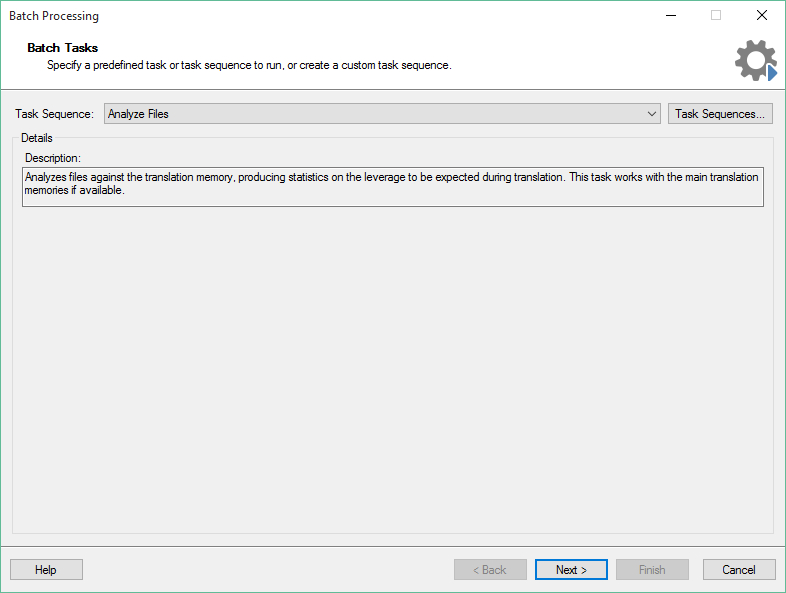

Batch Tasks Overview
====================

This section gives an overview of what batch tasks in Trados Studio are and what they are used for.

What are Batch Tasks?
----------------------

Batch tasks are used to process one or many project files in Trados Studio. There are several built-in batch tasks, for example, for analysing and pre-translating files. Batch tasks are most frequently applied to the bilingual SDL XLIFF files, but can also be used to process native file formats (for example, DOCX or PPTX). Batch tasks are typically used to:
* Alter the content of files (for example, the **Pre-translate Files** task inserts matches from a translation memory into the selected files).
* Read the content of files and compile a report (e.g. the **Analyze Files** task that determines the translation memory leverage for selected files).
* Extract content from the selected files to write them into another file format (for example, the **Export for External Review**) task that generated bilingual Microsoft Word tables from SDL XLIFF files.
  
The only standard batch task that works directly on the native files is the **Convert to Translatable Format** task, which converts native files (for example, DOCX) to SDL XLIFF.

Batch tasks are shown the Trados Studio user interface with a name and a description, for example:

Batch tasks are then applied to one or multiple files, e.g.:

