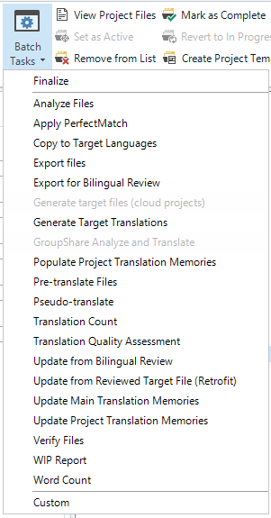
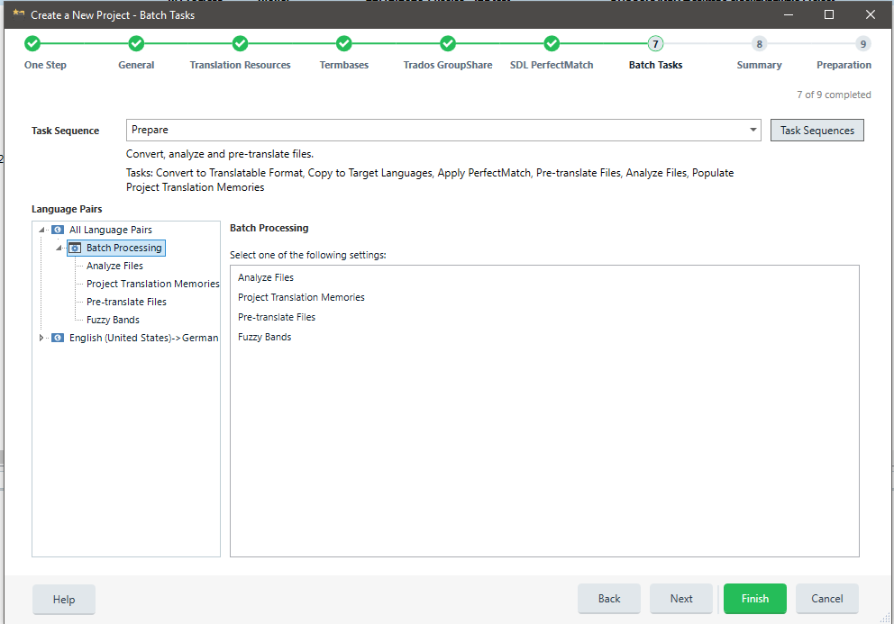
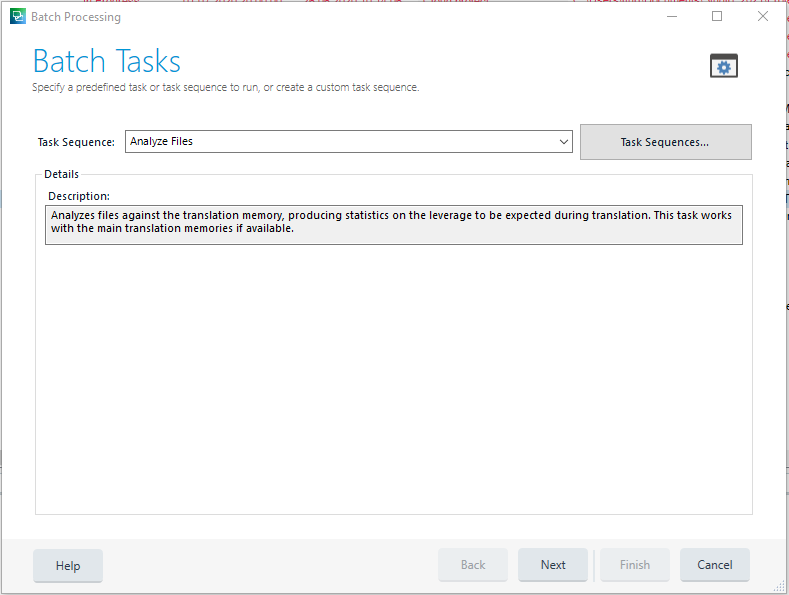
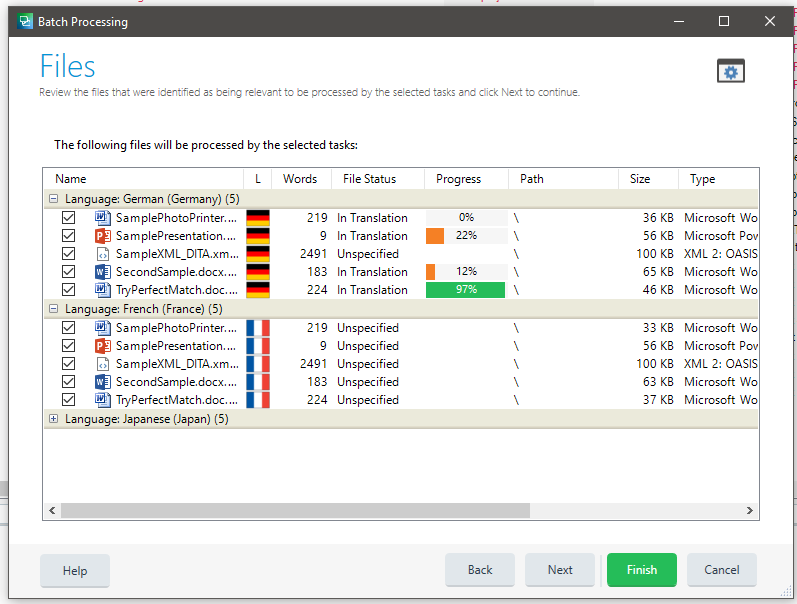
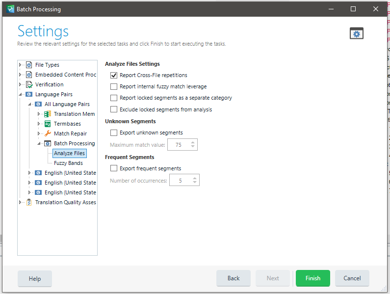
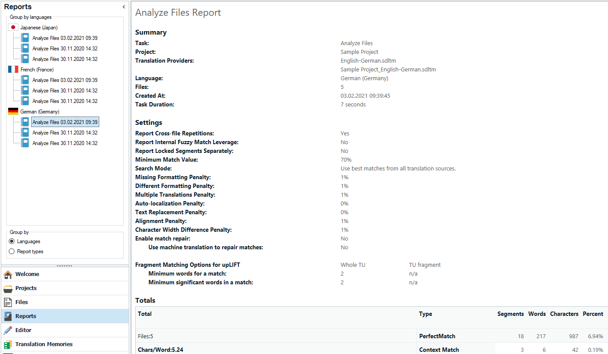

# Batch Tasks Overview

This section provides an overview of batch tasks in Var:ProductName and their main use cases.

## What Are Batch Tasks?

Batch tasks process one or multiple project files in Var:ProductName. Several built-in tasks are available, such as analyzing and pre-translating files. Batch tasks are most commonly applied to bilingual SDLXliff files, but they can also process native file formats (for example, DOCX or PPTX).

Batch tasks are typically used to:
* Modify file content (for example, the **Pre-translate Files** task inserts translation memory matches into selected files).
* Read file content and compile a report (for example, the **Analyze Files** task determines translation memory leverage for selected files).
* Extract content and generate another file format (for example, the **Export for External Review** task generates bilingual Microsoft Word tables from SDLXliff files).

The only standard batch task that works directly on native files is the **Convert to Translatable Format** task, which converts native files (for example, DOCX) to SDLXliff.

## Running Batch Tasks

End users can run batch tasks by selecting them from a list in the Var:ProductName user interface.

Batch tasks are also commonly executed when creating a project. In this case, tasks are applied to project files in sequence.

## Viewing Task Information

Batch tasks are shown in the Var:ProductName user interface with a name and description.

Batch tasks are then applied to one or multiple files.

## Configuring Settings

Batch tasks can include settings that you configure through a property page. For example, the analysis task includes a setting that determines whether cross-file repetitions are reported.

## Reviewing Reports

Batch tasks can also generate reports that users can view and print. For the analysis task, the report includes values such as no matches, fuzzy matches, exact matches, and repetitions.

