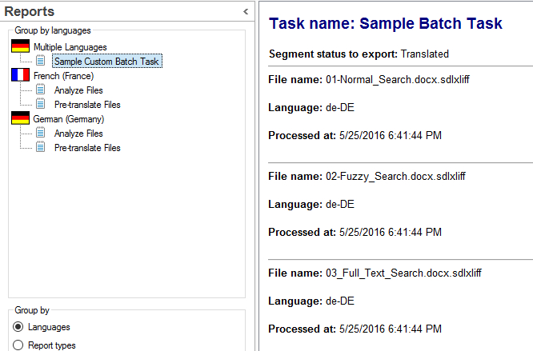

# Rendering the Task Report
Learn how to configure and render the report for your custom batch task in Var:ProductName.

## How to Render the Task Report XML with XSLT

To add a report, follow these steps:

1. Construct an XML string for the report content during the application logic implementation.
2. Call the **CreateReport()** method and pass the XML string as the report content.

To render the report XML in Var:ProductName:

1. Develop a matching XSL stylesheet. 
[!code-xml[ReportXSLT](code_samples/Stylesheet.xsl)]		

2. Add the stylesheet to your project.
3. Ensure the stylesheet is included as an embedded resource in your Visual Studio project file.

***

When rendered in Var:ProductName, the report appears as shown below:

