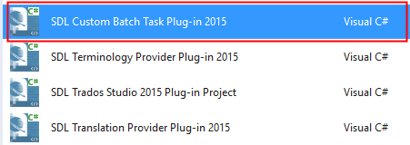
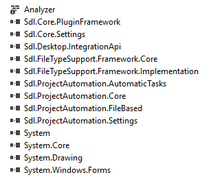
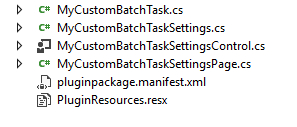
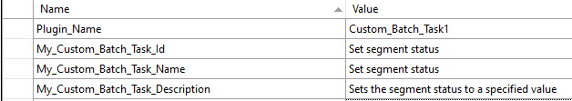
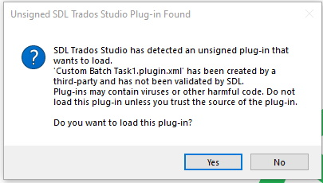
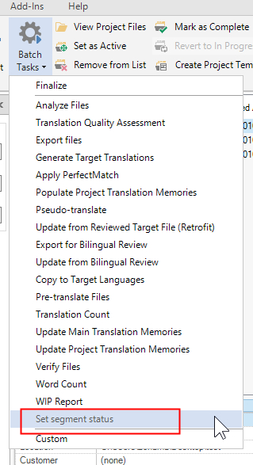
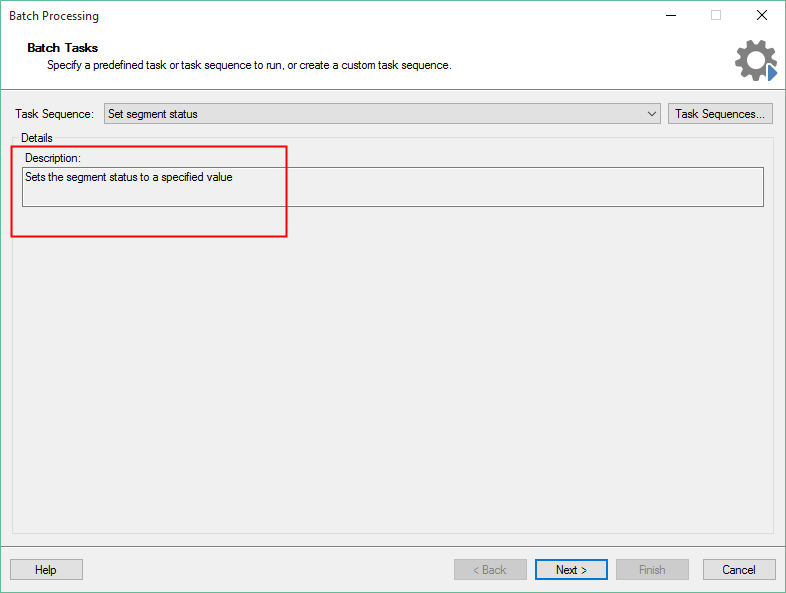

# Setting Up the Visual Studio Project
Learn how to set up a batch task plug-in project in Var:ProductName. This guide helps you create a plug-in that compiles and implements an empty batch task visible in Var:ProductName. Initially, the plug-in does not contain application logic or perform any tasks.

## How to Create the Visual Studio Project
Ensure that you have installed the Visual Studio extension Var:ProductName templates. Then open Var:VisualStudioEdition. When you create a new project, you see the following options:

Use these templates to set up the skeleton of a Var:ProductName plug-in project. Select **Custom Batch Task (2021)**.

## The Plug-in Skeleton
The plug-in template adds the required references to your project:

It also adds the following skeleton classes:

## The Plug-in Declaration: ID, Name, Description
Open the **MyCustomBatchTask.cs** class. This class contains the plug-in declaration, including the plug-in name and description that are visible in Var:ProductName:
# [Plug-in Declaration](#tab/tabid-1)
[!code-csharp[MyCustomBatchTask](code_samples/MyCustomBatchTask.cs#L16-L20)]
***
Give the batch task plug-in a new name, ID, and description. Instead of setting these values directly in this class, enter the strings in the **PluginResources.resx** file:

> [!NOTE]
> You also declare what kind of files the batch task works on here. Most batch tasks are used to process bilingual SDLXliff files, not native files such as DOCX or PPTX. This also applies to our sample implementation.

In this class, you also reference the settings page that allows users to configure batch task settings through the plug-in UI:
# [Plug-in Declaration](#tab/tabid-1)
[!code-csharp[MyCustomBatchTask](code_samples/MyCustomBatchTask.cs#L24-L26)]
***

## The Plug-in Build Folder
Sign your assembly, and then build it. The project is automatically configured to build the plug-in file into the folder: <em> Var:PluginPackedPath </em>. After building, you should find the file *Custom Batch Task1.sdlplugin*. Now start Var:ProductName. Because the plug-in is not yet officially signed by RWS, you see the following message when the application starts:

For now, ignore this message. Click **Yes** to ensure that Var:ProductName extracts the plug-in file. After Studio starts, you should find the sub-folder *Custom Batch Task1* under <em> Var:PluginUnpackedPath </em>. This sub-folder contains the unpacked plug-in assemblies.

In the batch tasks list of Var:ProductName, you see the name of your newly compiled plug-in:

When you select your sample batch task, you see the following window with the plug-in description:

At this point, your batch task is not doing anything yet, but you have successfully integrated your plug-in into Var:ProductName. In the following pages, you will enhance this basic plug-in with additional functionality. Close Var:ProductName and go back to your Microsoft Visual Studio project.
