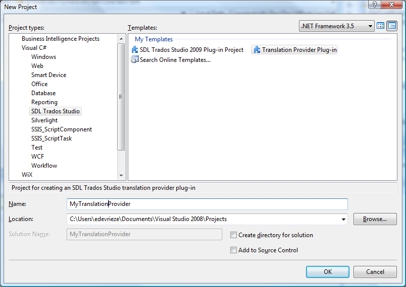

Building a Plug-in
====
This section focuses on how to create a new third-party plug-in for SDL Trados Studio using one of the standard Visual Studio project templates and provides some information on how this works under the hood.

> [!NOTE]
> This content may be out-of-date. To check the latest information on this topic, inspect the libraries using the Visual Studio Object Browser.


Building a Plug-in
----
Since  Trados Studio is a Microsoft .NET application, third-party plug-ins should be developed using Microsoft Visual Studio (version 2010). The Trados Studio SDK comes with a number of Visual Studio project templates which give you a quick start to creating various types of plug-ins.

In this topic, we will be creating a Translation Provider plug-in s an example. We will only focus on the aspects that are common to all types of plug-ins.

Make sure you have the following installed on your development machine:

* Trados Studio
* Trados Studio SDK
* Microsoft Visual Studio 2010


Start Visual Studio and click New Project. Select the Trados Studio > Translation Provider project type.





This particular project template already contains stubs for all the classes you will have to implement to create a translation provider. We'll ignore these for now and focus on the common aspects of third-party plug-in projects.

Open `PluginProperties.cs`, which is located next to the `AssemblyInfo.cs` file in the Properties folder. This contains a single `Plugin` attribute, which is what fundamentally makes this project a plug-in project. "Plugin_Name" is a resource string defined in `PluginResources.resx`.

# [C#](#tab/tabid-1)
```cs
[assembly: Sdl.Core.PluginFramework.Plugin("Plugin_Name")]
```
***

Open the `PluginResources.resx` file. You'll see that this contains a string value called "Plugin_Name". This defines the name of the plug-in assembly and will be preset to the name of the Visual Studio project. This is the name that will show up in the Trados Studio plug-in management dialog. Any localizable strings referred to from the plug-in attribute or extension attributes should be defined in `PluginResources.resx`. This ".resx" file will be compiled into a ".resources" file and will be deployed outside of the plug-in assembly itself, so the host application can access the information within it without having to load the plug-in assembly itself.

Every third-party plug-in has to be deployed using a Plug-in Package (*.sdlplugin). This is an OPC-based file format, essentially a ZIP file, that contains the plug-in assembly, plug-in manifest file and the plug-in resources file. All Visual Studio project templates that come with the Trados Studio SDK are configured to automatically create a plug-in package when the project is built. One essential piece of information required in order to do this is the plug-in package manifest, which is defined in the file `pluginpackage.manifest.xml` that was part of the project template.

```
<?xml version="1.0" encoding="utf-8"?>
<PluginPackage xmlns="http://www.sdl.com/Plugins/PluginPackage/1.0">
  <PlugInName>MyTranslationProvider</PlugInName>
  <Version>1.0</Version>
  <Description>MyTranslationProvider</Description>
  <Author></Author>
  <RequiredProduct name="SDLTradosStudio" minversion="9.1" />
</PluginPackage>
```

The plug-in package manifest defines a couple of pieces of essential information:

* **PlugInName**: the friendly name of the plugin. This can be different to the name of the plug-in defined in PluginResources.resx``, because a plug-in package can in theory contain multiple plug-ins.
* **Version**: the version of the plug-in package. This is important because it will be used to detect updated packages. For more information, see [Plug-in Deployment](plugin_deployment.md).
* **Description**: description of the plug-in package.
* **Author**: the name of the plug-in author
* **RequiredProduct**: this indicates which product this plug-in supports. This must include the minimum version and can optionally include a maximum version.


Now build the project and have a look in the project output folder. notice the following:

* The plug-in assembly, `MyTranslationProvider.dll`
* A `Plugins` folder, which contains:
    * The plug-in manifest, `MyTranslationProvider.plugin.xml`, which lists information about all the extension classes. the plug-in contains.
    * The neutral plug-in resources file `MyTranslationProvider.plugin.resources`, which contains all the localizable strings and images referred to within the plug-in manifest. This was compiled from `PluginResources.resx`.
* The plug-in package, `MyTranslationProvider.sdlplugin` which contains all of the above, together with the plug-in package manifest.
Now, we are ready to deploy the plug-in package in Trados Studio. See [Plug-in Deployment](plugin_deployment.md).
