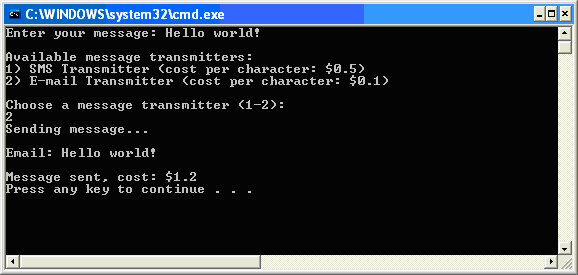

# Extensions and Extension Points
Var:ProductName provides a predefined set of extension points. You can add custom functionality by defining plug-in extensions that target those points.

### Extensions
An extension is a unit of logic that provides functionality for Var:ProductName through a specific extension point.
To create an extension:
1. Create a class in your plug-in assembly. 
2. Decorate the class with the attribute that identifies the extension point it is targeting. 
3. Implement the interface that is required by the extension point.

### Extension Points
An extension point is a location in Var:ProductName where extensions can be added.
To define an extension point:
1. Create a class in your plug-in assembly and derive it from the [ExtensionAttribute](../../api/core/Sdl.Core.PluginFramework.ExtensionAttribute.yml) base. 
2. Decorate the class with the [ExtensionPointInfoAttribute](../../api/core/Sdl.Core.PluginFramework.ExtensionPointInfoAttribute.yml) attribute.
3. Make sure the class has a default parameterless constructor. This is required because the [plugin manifest generator](the_plugin_manifest_generator.md) uses XML serialization to save attribute information.
    
Other plug-in developers can create extensions for the extension points you define by following the procedure described under [Extensions](#extensions).

The [ExtensionAttribute](../../api/core/Sdl.Core.PluginFramework.ExtensionAttribute.yml) class defines the properties that plug-in developers can provide with their extensions:
* **Id**: A unique identifier for the extension.
* **Name**: A friendly name for the extension.
* **Description**: A description of the extension.
* **Icon**: An optional icon representing the extension.

The [ExtensionPointInfoAttribute](../../api/core/Sdl.Core.PluginFramework.ExtensionPointInfoAttribute.yml) class specifies the name and type of the extension point:
* **Name**: Can be used by a plug-in manager UI to represent the extension point.
* **Type**: Can be static or dynamic, depending on whether one or more extensions can be enabled or disabled without restarting the application.

#### Example: Defining an Extension Point
This article uses a message transmitter example to demonstrate the concepts. The host application must be able to use pluggable message transmitters defined in plug-ins.

First, define an extension point:

# [C#](#tab/tabid-1)
[!code-csharp[MessageTransmitterAttribute](code_samples/MessageTransmitterAttribute.cs#L9-L45)]
***
 

The message transmitter attribute allows plug-in developers to annotate message transmitter extension classes so they are recognized by the extension point as valid message transmitter implementations.

This example defines an extra property, `CostPerCharacter`, which indicates the cost in dollars for each character sent in a message.

All these properties are extracted to the plug-in manifest file by the plug-in manifest generator. As a result, the host application can access the values without creating an instance of the actual transmitters or loading the plug-in assembly. Because the plug-in manifest generator uses XML serialization to save attribute information, the attribute must have a default, parameterless constructor.

Next, define which functionality an extension class must provide to be accepted as a valid message transmitter by the host application. This is done by defining an interface:

# [C#](#tab/tabid-1)
[!code-csharp[IMessageTransmitter](code_samples/IMessageTransmitter.cs#L7-L10)]
***
 

This simple interface contains one method, `SendMessage`, which is called by the host application to send a message.

#### Example: Creating Extensions for an Extension Point
Define a message transmitter that sends messages by email: the `EmailMessageTransmitter` class.

# [C#](#tab/tabid-1)
[!code-csharp[EmailMessageTransmitter](code_samples/EmailMessageTransmitter.cs#L7-L20)]
***
 

The `EmailMessageTransmitter` class implements the `IMessageTransmitter` interface. In addition, the class is annotated with the `MessageTransmitter` extension attribute, which was defined earlier and provides an ID, name, description, and cost per character.

Similar to the email transmitter, an SMS message transmitter can be defined in the same way. This can be done in the same plug-in project, because a plug-in project can contain multiple extensions.

# [C#](#tab/tabid-1)
[!code-csharp[SMSMessageTransmitter](code_samples/SMSMessageTransmitter.cs#L7-L29)]
***

### Auxiliary Extension Attributes
In some cases, you might need to add extra metadata to an extension implementation beyond what is defined in the extension attribute, and it might be impractical to add those properties to the extension attribute itself.

For example, consider a plug-in user action. The extension attribute for the action can define a name, icon, and tooltip, but you also need to specify which menus, toolbars, and context menus make the action available. For these cases, the plug-in framework provides auxiliary extension attributes.

You can only apply one extension attribute to an extension implementation: this is the attribute that uniquely identifies the extension point the extension implementation is targeting. On top of this, you can decorate the implementation class with as many auxiliary extension attributes as you like.

An auxiliary extension attribute needs to derive from the [AuxiliaryExtensionAttribute](../../api/core/Sdl.Core.PluginFramework.AuxiliaryExtensionAttribute.yml) base class. For instance, we can define a `ToolBarLocation` auxiliary attribute, which has a `ToolBarId` property that can be used to specify on which tool bar the action should appear. For menus, we can define a similar `MenuLocation` attribute:

# [C#](#tab/tabid-1)
[!code-csharp[AdvancedPluginFramework](./code_samples/AdvancedPluginFramework.cs#L56-L64)]
***
 

Now the plug-in action definition can be written like this:

# [C#](#tab/tabid-1)
[!code-csharp[AdvancedPluginFramework](./code_samples/AdvancedPluginFramework.cs#L70-L79)]
***
 

The collection of all auxiliary attributes for an extension can be retrieved using the `AuxiliaryExtensionAttributes` property.

### Sortable Extension Points
The order in which extensions are processed for a particular extension point is essentially random. However, it is a fairly common requirement for extensions to have a certain order and for extensions themselves to be able to specify where they want to "appear" relative to the other extensions for that extension point. An example of this are menu item extensions: when creating a new menu item extension, there is clearly the need to specify where that menu item should appear relative to other menu items.

In order to solve this common use case, the plug-in framework provides the [SortableExtensionAttribute](../../api/core/Sdl.Core.PluginFramework.Util.SortableExtensionAttribute.yml) extension attribute class. This attribute extends the standard [ExtensionAttribute](../../api/core/Sdl.Core.PluginFramework.ExtensionAttribute.yml) by adding two additional properties: `InsertBefore` and `InsertAfter`. Extensions for an extension point that derives from [SortableExtensionAttribute](../../api/core/Sdl.Core.PluginFramework.Util.SortableExtensionAttribute.yml) can use these properties to specify the Id of other extensions they want to appear before or after. In addition to single Ids, these properties also accept multiple comma-separated Ids.

You can use the [SortedObjectRegistry<TSortableExtensionAttribute, TExtensionType>](../../api/core/Sdl.Core.PluginFramework.Util.SortedObjectRegistry-2.yml) class to create instances of all extensions for a sortable extension point and sort these according to the values of the `InsertBefore` and `InsertAfter` properties.

If you need more control when ordering extensions, you can use the [TopologicalSort< T>](../../api/core/Sdl.Core.PluginFramework.Util.TopologicalSort-1.yml) class, which implements the sorting algorithm. You then need to provide wrapper objects that implement [ITopologicalSortable](../../api/core/Sdl.Core.PluginFramework.Util.ITopologicalSortable.yml) for each extension.

### Compile-time Extension Validation
To catch as many developer errors as possible at compile time, the plug-in framework provides a mechanism for extension point developers to validate extension definitions during build.

Every [ExtensionAttribute](../../api/core/Sdl.Core.PluginFramework.ExtensionAttribute.yml) and [AuxiliaryExtensionAttribute](../../api/core/Sdl.Core.PluginFramework.AuxiliaryExtensionAttribute.yml) has validation methods which are called during the build process. These methods then have the ability to report errors and warnings, which will be displayed in Visual Studio as standard compiler errors.

**Extension Attribute Validation**

When developing an extension point, this method can be overridden to perform additional validation.

**Auxiliary Extension Attribute Validation**

The [AuxiliaryExtensionAttribute](../../api/core/Sdl.Core.PluginFramework.AuxiliaryExtensionAttribute.yml) type also has a `Validate` method, which by default doesn't do any special validation. Extension point developers can override this method to perform additional validation for an auxiliary extension attribute.

#### Example: Compile-time Extension Validation
In our message transmitter example, the extension point checks whether the extension implements the IMessageTransmitter interface. If an extension does not implement this interface, an error will be generated at compile time. 

# [C#](#tab/tabid-1)
[!code-csharp[MessageTransmitterAttribute](code_samples/MessageTransmitterAttribute.cs#L32-L44)]
***

### Consuming extensions using the PluginRegistry and ObjectRegistry
The [IPluginRegistry](../../api/core/Sdl.Core.PluginFramework.IPluginRegistry.yml) object is the main object used by a host application or component to access and instantiate available plug-ins.

The [PluginManager](../../api/core/Sdl.Core.PluginFramework.PluginManager.yml) static class, which is the entry point to the plug-in framework object model, provides various ways to create instances of the [IPluginRegistry](../../api/core/Sdl.Core.PluginFramework.IPluginRegistry.yml) object. By default, plug-ins are installed in the applications installation directory and plug-in manifest and resource files are installed in a "plugins" subdirectory. In order to access these plugins, you can use the `DefaultPluginRegistry` property, which returns an [IPluginRegistry](../../api/core/Sdl.Core.PluginFramework.IPluginRegistry.yml) instance, that has been configured to load plug-ins from that default location.

You can easily instantiate a list of all the extension implementations registered with a particular extension point using the [ObjectRegistry<TExtensionAttribute, TExtensionType>](../../api/core/Sdl.Core.PluginFramework.ObjectRegistry-2.yml) class. This is a generic class accepting two template parameters:

* `TExtensionAttribute`: The extension attribute type defining the extension point.
* `TExtensionType`: The common interface that all extensions for this extension point must implement.
The `CreateObjects` method simply instantiates all the extension implementations and returns them in a typed array.

For sortable extension points, you can use the corresponding [SortedObjectRegistry<TSortableExtensionAttribute, TExtensionType>](../../api/core/Sdl.Core.PluginFramework.Util.SortedObjectRegistry-2.yml) class.

#### Example: Using the PluginRegistry
Returning to the message transmitter example, the next step is to write custom code that sends a message by using a message transmitter. The user can select which transmitter to use.

Message transmitters are defined in plug-ins. To use them, several steps are required.
First, get the extension point from the plug-in registry. An extension point is represented by the [IExtensionPoint](../../api/core/Sdl.Core.PluginFramework.IExtensionPoint.yml) interface and provides access to all extensions discovered for that extension point. The desired extension point is identified by passing `MessageTransmitterAttribute` as the template parameter:

# [C#](#tab/tabid-1)
[!code-csharp[HostApplication](code_samples/HostApplication.cs#L17-L18)]
***
 

Second, prompt the user to enter a message:

# [C#](#tab/tabid-1)
[!code-csharp[HostApplication](code_samples/HostApplication.cs#L24-L25)]
***
 

Next, list all available message transmitters, along with their name and cost per character. This is done by iterating over the Extensions collection of the extension point, which contains [IExtension](../../api/core/Sdl.Core.PluginFramework.IExtension.yml) objects. These provide access to the extension attribute used to annotate the corresponding extension implementation classes. The name and cost per character can be retrieved from `MessageTransmitterAttribute`:

# [C#](#tab/tabid-1)
[!code-csharp[HostApplication](code_samples/HostApplication.cs#L31-L45)]
***
 

Now get the extension object corresponding to the user's choice, and retrieve the extension attribute instance:

# [C#](#tab/tabid-1)
[!code-csharp[HostApplication](code_samples/HostApplication.cs#L51-L51)]
***
 

At this point we are ready to create the actual message transmitter implementation, using the [IExtension](../../api/core/Sdl.Core.PluginFramework.IExtension.yml) object:

# [C#](#tab/tabid-1)
[!code-csharp[HostApplication](code_samples/HostApplication.cs#L55-L56)]
***
 

Finally, call the SendMessage method to send the message:

# [C#](#tab/tabid-1)
[!code-csharp[HostApplication](code_samples/HostApplication.cs#L59-L59)]
***
 

The application produces the following output:

#### Example: Using the ObjectRegistry
In the example above, we explicitly went through the plug-in registry object model to illustrate how the various classes interact. As an easier alternative, we can quickly create a list of extension implementation objects using the [ObjectRegistry<TExtensionAttribute, TExtensionType>](../../api/core/Sdl.Core.PluginFramework.ObjectRegistry-2.yml) :

# [C#](#tab/tabid-1)
[!code-csharp[HostApplication](code_samples/HostApplication.cs#ObjectRegistry)]
***
