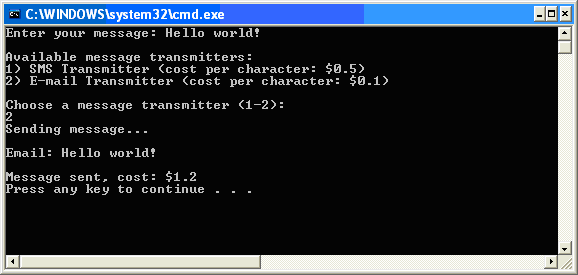

Extensions and extension points
====
<var:ProductName> offers a predefined set of extension points. Your plug-ins can add custom functionality to <var:ProductName> by defining extensions that target these extension points.

### Extensions
An extension is an individual unit of logic that provides functionality for <var:ProductName> through a specific extension point. 
You can create an extension by following the steps below:
1. Create a class in your plug-in assembly. 
2. Decorate the class with the attribute that identifies the extension point it is targeting. 
3. Implement the interface that is required by the extension point.

### Extension points
An extension point is a point in <var:ProductName> that allows adding extensions to it. 
You can define an extension point by following the steps below:  
1. Create a class in your plug-in assembly and derive it from the [ExtensionAttribute](../../api/core/Sdl.Core.PluginFramework.ExtensionAttribute.yml) base. 
2. Decorate the class with the [ExtensionPointInfoAttribute](../../api/core/Sdl.Core.PluginFramework.ExtensionPointInfoAttribute.yml) attribute.
3. Make sure that the class has a default parameterless constructor. This is needed because the [plugin manifest generator](the_plugin_manifest_generator.md) uses XML serialization to save attribute information.
    
Other plug-in developers can create extensions for the extension points you define, by following the procedure described under [Extensions](#extensions).

The [ExtensionAttribute](../../api/core/Sdl.Core.PluginFramework.ExtensionAttribute.yml) class defines the properties that plug-in developers can provide with their extensions:
* *Id*: A unique id for the extension
* *Name*: A friendly name for the extension.
* *Description*: A description of the extension.
* *Icon*: An optional icon representing the extension.

The [ExtensionPointInfoAttribute](../../api/core/Sdl.Core.PluginFramework.ExtensionPointInfoAttribute.yml) class specifies the name and type of the extension point: 
* The name can be used by a plug-in manager UI to represent the extension point. 
* The type can be either static or dynamic, referring to whether this extension point allows enabling or disabling of one or more of its extensions without having to restart the application.

#### Example: Defining an extension point
We will demonstrate the various topics presented in this article using a message transmitter example. Our requirement is that the host application is able to use pluggable message transmitters that are defined in plug-ins.

First, we need to define an extension point:

# [C#](#tab/tabid-1)
[!code-csharp[MessageTransmitterAttribute](code_samples/MessageTransmitterAttribute.cs#L9-L45)]
***
 

The purpose of the message transmitter attribute is to allow plug-in developers to use it to annotate their message transmitter extension classes, to make them known as message transmitter implementations to the extension point.

Note that we have defined an extra property, CostPerCharacter, which indicates the cost in dollars for each character sent in a message.

Since all these properties will be extracted to the plug-in manifest file by the plug-in manifest generator, the host application will be able to access their values without having to create an instance of the actual transmitters or even load the plug-in assembly. Since the plug-in manifest generator uses XML serialization to save the attribute information, the attribute has have a default, parameterless constructor.

We still have to define which functionality is required from an extension class to be accepted as a valid message transmitter by the host application. This is done by defining an interface:

# [C#](#tab/tabid-1)
[!code-csharp[IMessageTransmitter](code_samples/IMessageTransmitter.cs#L7-L10)]
***
 

This simple interface contains one method, SendMessage, to be called by the host application to send the message.

#### Example: Creating extensions for an extension point
Let's define a message transmitter which transmits messages by email, the `EmailMessageTransmitter` class:

# [C#](#tab/tabid-1)
[!code-csharp[EmailMessageTransmitter](code_samples/EmailMessageTransmitter.cs#L7-L20)]
***
 

The `EmailMessageTransmitter` class implements the `IMessageTransmitter` interface. On top of that, the class is annotated with the extension attribute, `MessageTransmitter`, which we defined earlier, providing an id, a name, a description and the cost per character when sending messages using this transmitter.

Similar to the email transmitter, we also define an SMS message transmitter in exactly the same way. We can do this within the same plug-in project, because a plug-in project can contain multiple extensions. 

# [C#](#tab/tabid-1)
[!code-csharp[SMSMessageTransmitter](code_samples/SMSMessageTransmitter.cs#L7-L29)]
***

### Auxiliary Extension Attributes
In some cases, you might need to add some extra metadata to a certain extension implementation, on top of what is defined in the extension attribute and it might be impractical to add these properties to the extension attribute itself.

An example of this is for instance a plug-in user action. The extension attribute for the action can define name, icon, tooltip etc, but you also need to specify on which menus, toolbars and context menus this user action will be available. For cases like this, the plug-in framework provides auxiliary extension attributes.

You can only apply one extension attribute to an extension implementation: this is the attribute that uniquely identifies the extension point the extension implementation is targeting. On top of this, you can decorate the implementation class with as many auxiliary extension attributes as you like.

An auxiliary extension attribute needs to derive from the [AuxiliaryExtensionAttribute](../../api/core/Sdl.Core.PluginFramework.AuxiliaryExtensionAttribute.yml) base class. For instance, we can define a `ToolBarLocation` auxiliary attribute, which has a `ToolBarId` property that can be used to specify on which tool bar the action should appear. For menus, we can define a similar `MenuLocation` attribute:

# [C#](#tab/tabid-1)
[!code-csharp[AdvancedPluginFramework](./code_samples/AdvancedPluginFramework.cs#L56-L64)]
***
 

Now the plug-in action definition can be written like this:

# [C#](#tab/tabid-1)
[!code-csharp[AdvancedPluginFramework](./code_samples/AdvancedPluginFramework.cs#L70-L79)]
***
 

The collection of all auxiliary attributes for an extension can be retrieved using the `AuxiliaryExtensionAttributes` property.

### Sortable Extension Points
The order in which extensions are processed for a particular extension point is essentially random. However, it is a fairly common requirement for extensions to have a certain order and for extensions themselves to be able to specify where they want to "appear" relative to the other extensions for that extension point. An example of this are menu item extensions: when creating a new menu item extension, there is clearly the need to specify where that menu item should appear relative to other menu items.

In order to solve this common use case, the plug-in framework provides the [SortableExtensionAttribute](../../api/core/Sdl.Core.PluginFramework.Util.SortableExtensionAttribute.yml) extension attribute class. This attribute extends the standard [ExtensionAttribute](../../api/core/Sdl.Core.PluginFramework.ExtensionAttribute.yml) by adding two additional properties: `InsertBefore` and `InsertAfter`. Extensions for an extension point that derives from [SortableExtensionAttribute](../../api/core/Sdl.Core.PluginFramework.Util.SortableExtensionAttribute.yml) can use these properties to specify the Id of other extensions they want to appear before or after. In addition to single Ids, these properties also accept multiple comma-separated Ids.

You can use the [SortedObjectRegistry<TSortableExtensionAttribute, TExtensionType>](../../api/core/Sdl.Core.PluginFramework.Util.SortedObjectRegistry-2.yml) class to create instances of all extensions for a sortable extension point and sort these according to the values of the `InsertBefore` and `InsertAfter` properties.

In case you want more control when ordering extensions, you can use the [TopologicalSort< T>](../../api/core/Sdl.Core.PluginFramework.Util.TopologicalSort-1.yml) class, which implements the sorting algorithm. You then need to provide wrapper objects that implement [ITopologicalSortable](../../api/core/Sdl.Core.PluginFramework.Util.ITopologicalSortable.yml) for each extension.

### Compile-time extension validation
In order to catch as many developer errors as possible at compile-time, the plug-in framework provides a mechanism for extension point developers to validate extension definitions at compile-time.

Every [ExtensionAttribute](../../api/core/Sdl.Core.PluginFramework.ExtensionAttribute.yml) and [AuxiliaryExtensionAttribute](../../api/core/Sdl.Core.PluginFramework.AuxiliaryExtensionAttribute.yml) has validation methods which are called during the build process. These methods then have the ability to report errors and warnings, which will be displayed in Visual Studio as standard compiler errors.

**Extension Attribute Validation**

The [ExtensionAttribute](../../api/core/Sdl.Core.PluginFramework.ExtensionAttribute.yml) type has a `Validate` method, which by default validates that the user has specified values for the `Id` and the `Name` property. When developing and extension point, this method can be overridden to perform additional validation.

**Auxiliary Extension Attribute Validation**

The [AuxiliaryExtensionAttribute](../../api/core/Sdl.Core.PluginFramework.AuxiliaryExtensionAttribute.yml) type also has a `Validate` method, which by default doesn't do any special validation. Extension point developers can override this method to perform additional validation for an auxiliary extension attribute.

#### Example: Compile-time extension validation
In our message transmitter example, the extension point checks whether the extension implements the IMessageTransmitter interface. If an extension does not implement this interface, an error will be generated at compile time. 

# [C#](#tab/tabid-1)
[!code-csharp[MessageTransmitterAttribute](code_samples/MessageTransmitterAttribute.cs#L32-L44)]
***

### Consuming extensions using the PluginRegistry and ObjectRegistry
The [IPluginRegistry](../../api/core/Sdl.Core.PluginFramework.IPluginRegistry.yml) object is the main object that can be used by the host application or component in order to access and instantiate the available plug-ins.

The [PluginManager](../../api/core/Sdl.Core.PluginFramework.PluginManager.yml) static class, which is the entry point to the plug-in framework object model, provides various ways to create instances of the [IPluginRegistry](../../api/core/Sdl.Core.PluginFramework.IPluginRegistry.yml) object. By default, plug-ins are installed in the applications installation directory and plug-in manifest and resource files are installed in a "plugins" subdirectory. In order to access these plugins, you can use the `DefaultPluginRegistry` property, which returns an [IPluginRegistry](../../api/core/Sdl.Core.PluginFramework.IPluginRegistry.yml) instance, that has been configured to load plug-ins from that default location.

You can easily instantiate a list of all the extension implementations registered with a particular extension point using the [ObjectRegistry<TExtensionAttribute, TExtensionType>](../../api/core/Sdl.Core.PluginFramework.ObjectRegistry-2.yml) class. This is a generic class accepting two template parameters:

* `TExtensionAttribute`: The extension attribute type defining the extension point.
* `TExtensionType`: The common interface that all extensions for this extension point must implement.
The `CreateObjects` method simply instantiates all the extension implementations and returns them in a typed array.

For sortable extension points, you can use the corresponding [SortedObjectRegistry<TSortableExtensionAttribute, TExtensionType>](../../api/core/Sdl.Core.PluginFramework.Util.SortedObjectRegistry-2.yml) class.

#### Example: Using the PluginRegistry 
Returning to our message transmitter example, we want to write some custom code that sends a message using a message transmitter. Also, we will let the user select the transmitter they would like to use. 

Message transmitters are defined in plugins. In order to use them we need to do several things. 
First, we get the extension point from the plug-in registry. An extension point is represented by the [IExtensionPoint](../../api/core/Sdl.Core.PluginFramework.IExtensionPoint.yml) interface and provides access to all extensions discovered for that extension point. We identify our desired extension point by passing `MessageTransmitterAttribute` as the template parameter:

# [C#](#tab/tabid-1)
[!code-csharp[HostApplication](code_samples/HostApplication.cs#L17-L18)]
***
 

Second, prompt the user to enter a message:

# [C#](#tab/tabid-1)
[!code-csharp[HostApplication](code_samples/HostApplication.cs#L24-L25)]
***
 

Next, list all the available message transmitters, along with their name and the cost per character. This is done by iterating over the Extensions collection of the extension point, which contains [IExtension](../../api/core/Sdl.Core.PluginFramework.IExtension.yml) objects. These provide access to the extension attribute that was used to annotate the respective extension implementation classes. The name and cost per character can be retreived from that `MessageTransmitterAttribute`:

# [C#](#tab/tabid-1)
[!code-csharp[HostApplication](code_samples/HostApplication.cs#L31-L45)]
***
 

Now get the extension object corresponding to the user's choice, and also get hold of the extension attribute instance:

# [C#](#tab/tabid-1)
[!code-csharp[HostApplication](code_samples/HostApplication.cs#L51-L51)]
***
 

At this point we are ready to create the actual message transmitter implementation, using the [IExtension](../../api/core/Sdl.Core.PluginFramework.IExtension.yml) object:

# [C#](#tab/tabid-1)
[!code-csharp[HostApplication](code_samples/HostApplication.cs#L55-L56)]
***
 

Finally, call the SendMessage method to send the message:

# [C#](#tab/tabid-1)
[!code-csharp[HostApplication](code_samples/HostApplication.cs#L59-L59)]
***
 

The application produces the following output:

#### Example: Using the ObjectRegistry
In the example above, we explicitly went through the plug-in registry object model to illustrate how the various classes interact. As an easier alternative, we can quickly create a list of extension implementation objects using the [ObjectRegistry<TExtensionAttribute, TExtensionType>](../../api/core/Sdl.Core.PluginFramework.ObjectRegistry-2.yml) :

# [C#](#tab/tabid-1)
[!code-csharp[HostApplication](code_samples/HostApplication.cs#ObjectRegistry)]
***