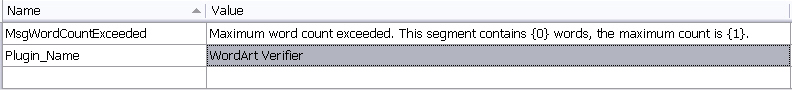

# Add a Resources File

In this step, you add a resource file to the project that contains the message strings shown to end users in the Var:ProductName UI.

The verification plug-in outputs error messages when it identifies a problem. Although a resources file is not required, it is the recommended way to store these message strings. Start by adding a resources file, for example **Resources.resx**, to your project.

Include the following strings in the resources file:

- A message that states the maximum word count configured in the plug-in UI and the number of words actually found in the target segment.
- The name of the plug-in that detected the problem. This helps when users run several verifiers at the same time, such as the QA Checker, Generic Tag Verification, and the sample WordArt checker. By including the verifier name, users can identify which plug-in generated the error. In the **Messages** window of Var:ProductName, users can also sort error messages by plug-in name.

The following example shows a verification message that the sample plug-in might generate:

The resources file should look like this:

>[!NOTE]
>
> This content may be out of date. To verify the latest information on this topic, inspect the libraries in the Visual Studio Object Browser.
