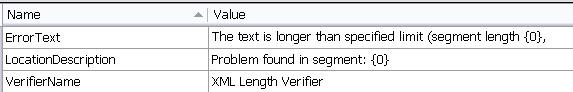
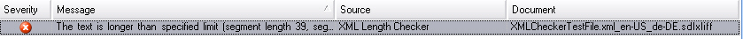

# Add a Resources File

In this step, you add a resources file that stores the strings shown to users in the Var:ProductName user interface.

Add a resources file to your project, for example `StringResources.resx`. To clearly report length-limit violations, include message strings that provide the following information:

- The actual length limit specified in the `maxlength` attribute.
- The target segment text that exceeds the specified length limit.
- The name of the plug-in that detected the problem. This helps when users run several verifiers at the same time, such as the QA Checker, Generic Tag Verification, and the sample length checker. By including the verifier name, users can identify which plug-in generated the error. In the **Messages** window of Var:ProductName, users can also sort error messages by plug-in name.

The resources file should look like this:

The following example shows an error message that the sample plug-in might generate:

>[!NOTE]
>
> This content may be out of date. To verify the latest information on this topic, inspect the libraries in the Visual Studio Object Browser.
