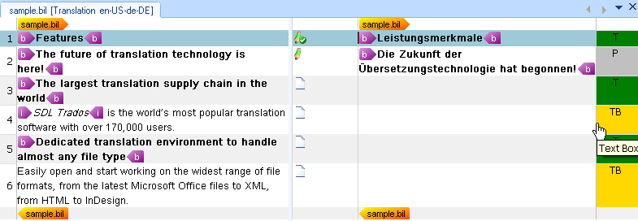

# Adding Context Information

This section explains how to extract useful context information from a BIL file.

## About Contexts

Translators often need to know whether a segment appears in a heading, paragraph, or another document element. In the BIL sample format, a `unit` can contain a `type` element that identifies this context:

```xml
<type spec="Heading"/>
```

Var:ProductName can display this information in a column next to the target segments. In this section, you enhance the parser so that Var:ProductName shows the `type` element information in the editor.

The following example shows how the translation environment can display context information. Each context cell contains a display code, which abbreviates the full context, for example **T** for **Topic**. You can also assign a different color to each context type to help translators identify them quickly.



The API lets you create custom context information from the BIL file or use standard context types. These standard types cover common document elements such as titles, paragraphs, and text boxes.

For simplicity, this example uses three mapping scenarios. The following table lists the BIL type values and the corresponding standard context types:

| BIL Type | Standard Context Type |
|-----------|-----------------------|
| Heading  | Topic                 |
| Box      | Text Box              |

For this implementation, assume that when a unit in the BIL file does not contain a `type` element, the parser uses the standard **paragraph** context type.

In addition to the `type` element, you can use context information to store the unique ID of each unit in the BIL file. The `unit` element contains this value in its `id` attribute. Do not display this ID to end users because it is not relevant during translation. Instead, store it in the intermediary SDLXLIFF file so that the writer class can reference it later when it generates the target BIL file. For more information, see [Adding the File Writer Class](adding_the_file_writer_class.md). You can store this kind of hidden information as metadata in the context properties.

You can add metadata to more than contexts. You can also apply it to inline tags, structure tags, placeables, and other objects.

## Extend the Helper Function for Creating Paragraph Units

First, add the following to the `CreateParagraphUnit()` helper function:

# [C#](#tab/tabid-1)
```cs
// create paragraph unit context
string id = xmlUnit.SelectSingleNode("./@id").InnerText;
if(xmlUnit.SelectSingleNode("type/@spec")!=null)
{
    string spec = xmlUnit.SelectSingleNode("type/@spec").InnerText;

    paragraphUnit.Properties.Contexts=CreateContext(spec, id);
} else {
    paragraphUnit.Properties.Contexts = CreateContext("Paragraph", id);
}
```

This condition checks whether a `type` element is available. If it is, the code passes the `spec` attribute value to a helper function that returns the appropriate context properties object. If the `type` element is missing, the helper function creates a standard paragraph context instead. The code also reads the `id` attribute from the current `unit` element and passes it to the same helper function.

The complete `CreateParagraphUnit()` helper function should look like this:

# [C#](#tab/tabid-2)
```cs
// helper function for creating paragraph units
private IParagraphUnit CreateParagraphUnit(XmlNode xmlUnit)
{
    // create paragraph unit object
    IParagraphUnit paragraphUnit = ItemFactory.CreateParagraphUnit(LockTypeFlags.Unlocked);


    // create segment pair object
    ISegmentPairProperties segmentPairProperties = ItemFactory.CreateSegmentPairProperties();  
    // assign the appropriate confirmation level to the segment pair            
    segmentPairProperties.ConfirmationLevel=CreateConfirmationLevel(xmlUnit.Attributes["status"].Value);

    // add source segment to paragraph unit
    ISegment srcSegment = CreateSegment(xmlUnit.SelectSingleNode("source/seg"), segmentPairProperties);            
    paragraphUnit.Source.Add(srcSegment);

    // add target segment to paragraph unit if available
    if(xmlUnit.SelectSingleNode("target/seg") != null)            
    {
        ISegment trgSegment = CreateSegment(xmlUnit.SelectSingleNode("target/seg"), segmentPairProperties);
        paragraphUnit.Target.Add(trgSegment);
    }

    // create paragraph unit context
    string id = xmlUnit.SelectSingleNode("./@id").InnerText;
    if(xmlUnit.SelectSingleNode("type/@spec")!=null)
    {
        string spec = xmlUnit.SelectSingleNode("type/@spec").InnerText;

        paragraphUnit.Properties.Contexts=CreateContext(spec, id);
    } else {
        paragraphUnit.Properties.Contexts = CreateContext("Paragraph", id);
    }
    // extract comment (if applicable)
    if(xmlUnit.SelectSingleNode("comment")!=null)
    {
        paragraphUnit.Properties.Comments = CreateComment(xmlUnit.SelectSingleNode("comment").InnerText);
    }

    return paragraphUnit;
}
```

## Add the Helper Function to Create the Context Properties

Before you implement the new context helper function, add a reference to the `System.Drawing` library. This library lets you assign different background colors to context types, which makes them easier for end users to distinguish.

Also add the following namespace to your class so that you can access the standard context types that the API provides: `Sdl.FileTypeSupport.Framework.Core.Utilities.NativeApi`

This function uses the properties factory to create a context properties object and a context information object. By default, it assigns the [Paragraph](../../api/filetypesupport/Sdl.FileTypeSupport.Framework.Core.Utilities.NativeApi.StandardContextTypes.yml#Sdl_FileTypeSupport_Framework_Core_Utilities_NativeApi_StandardContextTypes_Paragraph) value from the [StandardContextTypes](../../api/filetypesupport/Sdl.FileTypeSupport.Framework.Core.Utilities.NativeApi.StandardContextTypes.yml) collection. It also sets [ContextPurpose](../../api/filetypesupport/Sdl.FileTypeSupport.Framework.NativeApi.ContextPurpose.yml) to [Information](../../api/filetypesupport/Sdl.FileTypeSupport.Framework.NativeApi.ContextPurpose.yml#fields), which means the context helps users but does not affect TM matching. The function then uses a switch statement to map the `spec` attribute value from the `type` element to the corresponding standard context type and assigns a background color.

The second context info object (`contextID`) that is added to the context properties contains the unit ID. This information should remain hidden from end users, so the code stores it through the [MetaData](../../api/filetypesupport/Sdl.FileTypeSupport.Framework.NativeApi.IMetaDataContainer.yml#Sdl_FileTypeSupport_Framework_NativeApi_IMetaDataContainer_MetaData) property. In this case, the `Add()` method requires two string parameters: the key and the value.

# [C#](#tab/tabid-3)
```cs
private IContextProperties CreateContext(string spec, string unitID)
{
    // context info for type information, e.g. heading, paragraph, etc.
    IContextProperties contextProperties = PropertiesFactory.CreateContextProperties();
    IContextInfo contextInfo = PropertiesFactory.CreateContextInfo(StandardContextTypes.Paragraph);
    contextInfo.Purpose = ContextPurpose.Information;

    // add unit id as metadata
    IContextInfo contextId = PropertiesFactory.CreateContextInfo("UnitId");
    contextId.SetMetaData("UnitID", unitID);

    switch (spec)
    {
        case "Heading":
            contextInfo = PropertiesFactory.CreateContextInfo(StandardContextTypes.Topic);
            contextInfo.DisplayColor = Color.Green;
            break;
        case "Box":
            contextInfo = PropertiesFactory.CreateContextInfo(StandardContextTypes.TextBox);
            contextInfo.DisplayColor = Color.Gold;
            break;
        case "Paragraph":
            contextInfo = PropertiesFactory.CreateContextInfo(StandardContextTypes.Paragraph);
            contextInfo.DisplayColor = Color.Silver;
            break;
        default:
            break;
    }

    contextProperties.Contexts.Add(contextInfo);
    contextProperties.Contexts.Add(contextId);

    return contextProperties;
}
```
>[!NOTE]
>
> This content may be out of date. To verify the latest information on this topic, inspect the libraries in the Visual Studio Object Browser.
