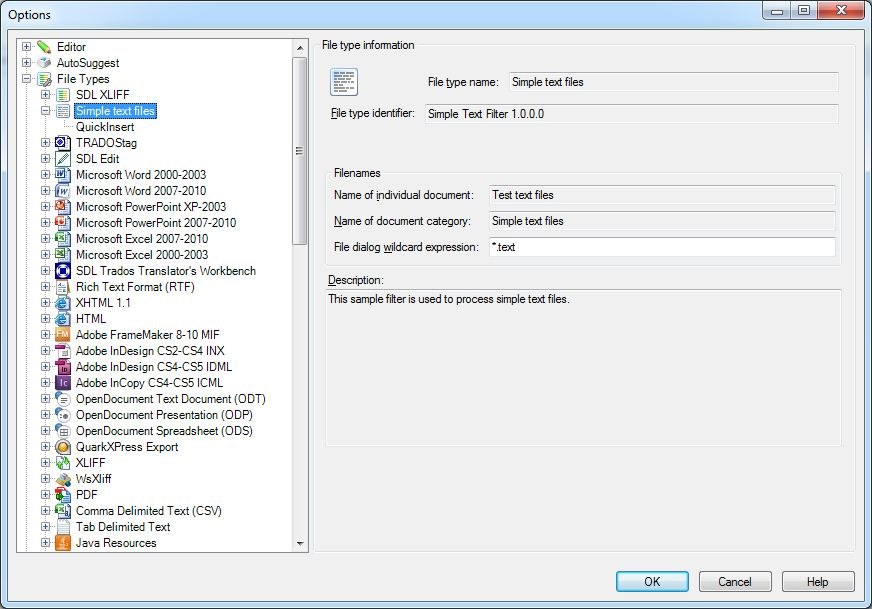

Adding the File Type Component Builder
==

Add the File Type Component Builder to your project. This is the implementation of the interface [IFileTypeComponentBuilder](../../api/filetypesupport/Sdl.FileTypeSupport.Framework.IntegrationApi.IFileTypeComponentBuilder.yml). and that is used to define the new file type plug-in, so that it can be used in <Var:ProductName>.

Add the File Type Information
Your File Type Component Builder needs to contain information such as the file type plug-in version number, the extension of the files that this file type plug-in applies to, etc. This kind of information is what end users see in the **Options** dialog box of <Var:ProductName> under **File Types**.

The implementation of [IFileTypeComponentBuilder](../../api/filetypesupport/Sdl.FileTypeSupport.Framework.IntegrationApi.IFileTypeComponentBuilder.yml) also reference each file type plug-in component, e.g. the file sniffer class, the file parser class, etc. If you fail to reference a file type plug-in component in the file type definition, the component cannot be used in <Var:ProductName>. The File Type Component Builder thereby fully reflects the component structure of the file type plug-in. At this point, we would like to underline the importance of sub-dividing your file type plug-in into distinct components, as each component performs a different, even if sometimes similar, task.

Let us start by adding the general file type information to the implementation of [IFileTypeComponentBuilder](../../api/filetypesupport/Sdl.FileTypeSupport.Framework.IntegrationApi.IFileTypeComponentBuilder.yml) as shown below:

```cs
/// <summary>
/// Returns a file type information object.
/// </summary>
/// <param name="name">The <see cref="IFileTypeDefinition"/> will pass "" as the name for this parameter</param>
/// <returns>an SimpleText file type information object</returns>
public virtual IFileTypeInformation BuildFileTypeInformation(string name)
{
    var info = this.FileTypeManager.BuildFileTypeInformation();

    info.FileTypeDefinitionId = new FileTypeDefinitionId("Simple Text Filter 1.0.0.0");
    info.FileTypeName = new LocalizableString("Simple text files");
    info.FileTypeDocumentName = new LocalizableString("Test text files");
    info.FileTypeDocumentsName = new LocalizableString("Simple text files");
    info.Description = new LocalizableString("This sample filter is used to process simple text files.");
    info.FileDialogWildcardExpression = "*.text";
    info.DefaultFileExtension = "text";
    info.Icon = new IconDescriptor(PluginResources.SimpleTextIcon);

    info.WinFormSettingsPageIds = new string[]
    {
        "SimpleText_Settings",
        "QuickInserts_Settings",
    };

    return info;
}
```

After adding the file type information above, the corresponding file type plug-in would be shown to the end user in the **Options** dialog box as illustrated below. Your example file type plug-in will be listed under **File Types**, however, of course it does not implement any functionality yet. Below you see an example of how the information entered in the File Type Component Builder is presented to the user through the UI of <Var:ProductName>:



Of course, a File Type Component Builder file is a lot more comprehensive than what is shown here. As we develop the actual file type plug-in components, we will add the corresponding component references to the File Type Component Builder file step-by-step.

>**NOTE**
>
> This content may be out-of-date. To check the latest information on this topic, inspect the libraries using the Visual Studio Object Browser.