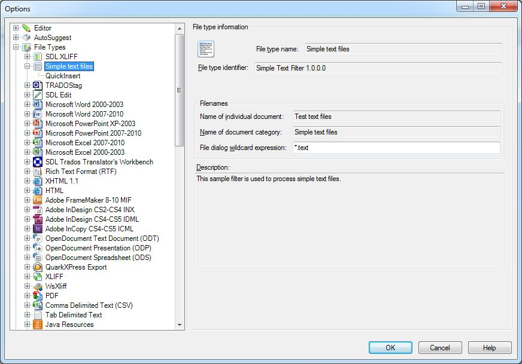

# Adding the File Type Component Builder

Add a File Type Component Builder to your project. Implement [IFileTypeComponentBuilder](../../api/filetypesupport/Sdl.FileTypeSupport.Framework.IntegrationApi.IFileTypeComponentBuilder.yml) to define your file type plug-in so that Var:ProductName can load it.

## Add the file type information

Your File Type Component Builder defines metadata such as the plug-in version and the file extensions that the plug-in supports. Var:ProductName displays this information in **Options** under **File Types**.

Your implementation of [IFileTypeComponentBuilder](../../api/filetypesupport/Sdl.FileTypeSupport.Framework.IntegrationApi.IFileTypeComponentBuilder.yml) also registers each file type plug-in component, such as the file sniffer class and the file parser class. If you do not register a component in the file type definition, Var:ProductName cannot use it. The File Type Component Builder reflects the structure of your file type plug-in, so keep the components distinct and focused.

Start by adding the general file type information to your implementation of [IFileTypeComponentBuilder](../../api/filetypesupport/Sdl.FileTypeSupport.Framework.IntegrationApi.IFileTypeComponentBuilder.yml):

# [C#](#tab/tabid-1)
```cs
/// <summary>
/// Returns a file type information object.
/// </summary>
/// <param name="name">The <see cref="IFileTypeDefinition"/> passes an empty string for this parameter.</param>
/// <returns>A SimpleText file type information object.</returns>
public virtual IFileTypeInformation BuildFileTypeInformation(string name)
{
    var info = this.FileTypeManager.BuildFileTypeInformation();

    info.FileTypeDefinitionId = new FileTypeDefinitionId("Simple Text Filter 1.0.0.0");
    info.FileTypeName = new LocalizableString("Simple text files");
    info.FileTypeDocumentName = new LocalizableString("Test text files");
    info.FileTypeDocumentsName = new LocalizableString("Simple text files");
    info.Description = new LocalizableString("This sample filter is used to process simple text files.");
    info.FileDialogWildcardExpression = "*.text";
    info.DefaultFileExtension = "text";
    info.Icon = new IconDescriptor(PluginResources.SimpleTextIcon);

    info.WinFormSettingsPageIds = new string[]
    {
        "SimpleText_Settings",
        "QuickInserts_Settings",
    };

    return info;
}
```
***

After you add this information, Var:ProductName lists the file type plug-in in **Options** under **File Types**, as shown in the following example. At this stage, the example plug-in appears in the UI but does not provide any functionality yet.



The File Type Component Builder contains more than the metadata shown here. As you develop the file type plug-in components, add the corresponding component references to the File Type Component Builder step by step.

>[!NOTE]
>
> This content may be out-of-date. To check the latest information on this topic, inspect the libraries using the Visual Studio Object Browser.
