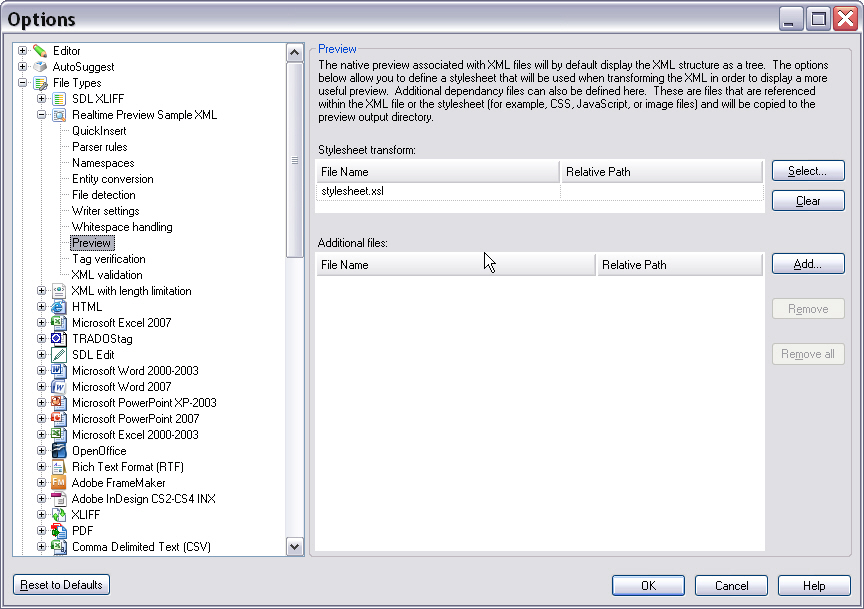
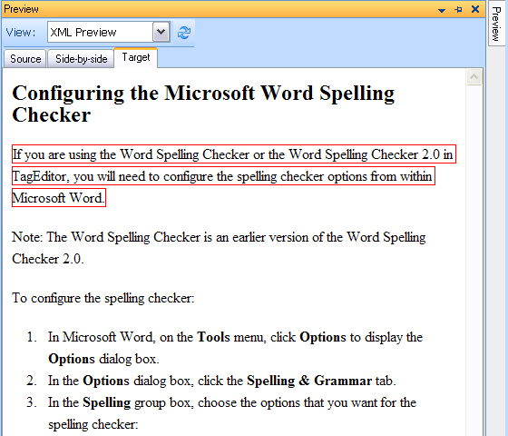

# Appendix: Real-time preview for XML files

This article explains how to use XSLT stylesheets to implement a real-time preview for custom XML documents.

## Real-time preview for XML through XSLT

For XML files, you do not need to develop a real-time preview component. Instead, add a suitable XSLT stylesheet to your custom XML file type settings. Var:ProductName then embeds the stylesheet code in the settings bundle for your custom XML file type.

The SDK sample folder **Realtime XML Preview** contains the following files:

- A sample XML source file to translate (**sample.xml**)
- An XSL stylesheet (**stylesheet.xsl**)

The sample XML file looks as shown below:

# [Xml](#tab/tabid-1)
```xml
<?xml version="1.0" encoding="UTF-8"?>
<document>
<title>Configuring the Microsoft Word Spelling Checker</title>

<para>If you are using the Word Spelling Checker or the Word Spelling Checker 2.0 in TagEditor, you will need to configure the spelling checker options from within Microsoft Word.
</para>

<para>Note: The Word Spelling Checker is an earlier version of the Word Spelling Checker 2.0.</para>
<para>To configure the spelling checker:</para>
<list>
<item>In Microsoft Word, on the <emphasis>Tools</emphasis> menu, click <emphasis>Options</emphasis> to display the <emphasis>Options</emphasis> dialog box.</item>
<item>In the <emphasis>Options</emphasis> dialog box, click the <emphasis>Spelling &amp; Grammar</emphasis> tab.</item>
<item>In the <emphasis>Spelling</emphasis> group box, choose the options that you want for the spelling checker:</item>
<item>Select the <emphasis>Check Spelling as you type</emphasis> check box for automatic correction of misspellings as you type.</item>
<item>Select <emphasis>Always suggest corrections</emphasis> to have Microsoft Word suggest corrections to misspellings.</item>
<item>Select <emphasis>Suggest from main dictionary only</emphasis> if you do not want Word to suggest spellings from any open <emphasis>Custom</emphasis> dictionaries.</item>
<item>Select <emphasis>Ignore words in UPPERCASE</emphasis> to skip words containing uppercase characters only, for example, acronyms.</item>
<item>Select <emphasis>Ignore Internet and file addresses</emphasis> if you do not want Word to check Internet addresses, file names or email addresses.</item>
</list>
</document>
```

The following XSL code transforms the sample XML file:

# [Xml](#tab/tabid-1)
```xml
<?xml version="1.0"?>
<xsl:stylesheet xmlns:xsl="http://www.w3.org/1999/XSL/Transform" version="1.0">
<xsl:output method="html" indent="yes" encoding="utf-16"/> 
<xsl:template match="/"> 
  <html>
    <body bgcolor="white">      
      <xsl:apply-templates select="/document"/>
    </body>
  </html>    
</xsl:template> 
<!-- ***********************************************************************-->
<xsl:template match="title">
  <h2><xsl:value-of select="."/></h2>
</xsl:template>

<xsl:template match="para">
  <p><xsl:value-of select="."/></p>
</xsl:template>

<xsl:template match="list">
  <ol><xsl:apply-templates select="item"/></ol>
</xsl:template>

<xsl:template match="item">
  <li><xsl:apply-templates/></li>
</xsl:template>

<xsl:template match="emphasis">
  <b><xsl:value-of select="."/></b>
</xsl:template>
<!-- ***********************************************************************-->
</xsl:stylesheet>
```

You can embed the XSL stylesheet in the settings bundle through the File Type Manager UI. Select the corresponding file type, then add the XSL file in the **Preview** section, as shown in the following illustration:



After you embed the XSL file in the settings bundle, you can open the real-time preview during translation:



You can also export the settings bundle for your custom XML file type as **.sdlftsettings** and distribute it to other users.

>[!NOTE]
>
> This content may be out-of-date. To check the latest information on this topic, inspect the libraries using the Visual Studio Object Browser.
