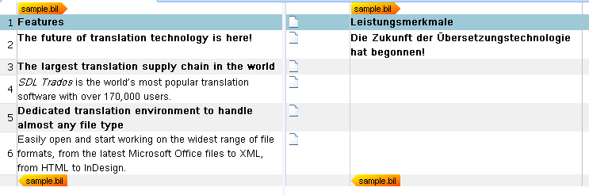
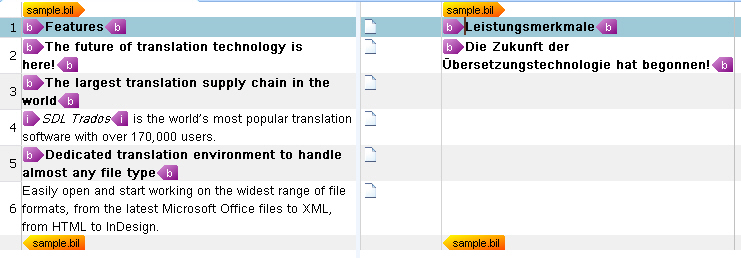

# Applying Character Formatting

This section explains how to enrich the editor display in Var:ProductName with character formatting.

## Apply Character Formatting

The inline tags in the sample format make it easy to determine which character formatting to apply. Display formatting in an intermediary SDLXLIFF document is optional and does not affect the generated BIL target file. However, it helps translators recognize the intended formatting more easily. You can also hide inline tags and show only the formatting they represent. This approach lets translators apply formatting to the corresponding text in the target segment instead of transferring tags.

First, add the following namespace to your parser class: `Sdl.FileTypeSupport.Framework.Formatting`.

Then update the `CreateTagPair()` helper function so that it generates tag pairs and applies the appropriate formatting at the same time. Use a `switch` statement to select the correct formatting based on the element name:

# [C#](#tab/tabid-1)
```cs
// apply character formatting to the start tag
IFormattingGroup formattingGroup = PropertiesFactory.FormattingItemFactory.CreateFormatting();
startTag.Formatting = new FormattingGroup();
switch (item.Name)
{
    case "b":
        formattingGroup.Add(new Bold(true));
        break;
    case "i":
        formattingGroup.Add(new Italic(true));
        break;
    case "u":
        formattingGroup.Add(new Underline(true));
        break;
    default:
        break;
}
```

The complete `CreateTagPair()` helper function should look like this. When you set [CanHide](../../api/filetypesupport/Sdl.FileTypeSupport.Framework.NativeApi.IAbstractInlineTagProperties.yml#Sdl_FileTypeSupport_Framework_NativeApi_IAbstractInlineTagProperties_CanHide) to `true`, Var:ProductName hides the actual tags by default. Users can still toggle tag display at runtime.

# [C#](#tab/tabid-2)
```cs
private ITagPair CreateTagPair(XmlNode item)
{
    // create the start and the end tag
    IStartTagProperties startTag = PropertiesFactory.CreateStartTagProperties(item.Name);

    // apply character formatting to the start tag
    IFormattingGroup formattingGroup = PropertiesFactory.FormattingItemFactory.CreateFormatting();
    startTag.Formatting = new FormattingGroup();
    switch (item.Name)
    {
        case "b":
            formattingGroup.Add(new Bold(true));
            break;
        case "i":
            formattingGroup.Add(new Italic(true));
            break;
        case "u":
            formattingGroup.Add(new Underline(true));
            break;
        default:
            break;
    }
    startTag.Formatting = formattingGroup;

    startTag.DisplayText=item.Name;
    startTag.CanHide = true;
    IEndTagProperties endTag = PropertiesFactory.CreateEndTagProperties(item.Name);
    endTag.DisplayText=item.Name;
    endTag.CanHide = true;

    // create a tag pair out of the start and the end tag
    ITagPair tagPair = ItemFactory.CreateTagPair(startTag, endTag);

    // add text enclosed in the tag pair
    tagPair.Add(CreateText(item.InnerText));

    return tagPair;
}
```

When you build the project at this point, the intermediary SDLXLIFF document should look like this:



The following example shows the intermediary SDLXLIFF file when users choose to display inline tags at runtime:




## See Also

- [Processing Inline Tags](processing_inline_tags.md)

>[!NOTE]
>
> This content may be out of date. To verify the latest information on this topic, inspect the libraries in the Visual Studio Object Browser.
