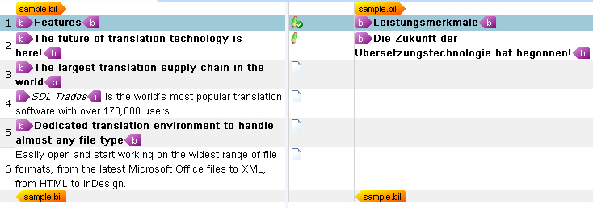

Applying the Segment Pair Confirmation Levels
==

In this chapter you will learn how to process the BIL unit status information of a given BIL file and apply it to the corresponding segment pair status used by the SDL XLIFF format.

Process the Segment Pair Status
--

<Var:ProductName> applies various confirmation levels to segment pairs, e.g. draft, translated, approved, etc. Below you see a list of the available confirmation level values that are used in the SDL XLIFF format:


The status attribute of the unit element is the direct equivalent to the segment pair object in <Var:ProductName>. To keep things simple let us assume that units in a BIL file contain the following status values, which can be mapped to the SDL XLIFF confirmation levels as outlined below:

|BIL          | SDL XLIFF   |
| ----------- | ----------- |
| new         | unspecified |
| fuzzy       | draft       |
| exact	      | translated  |


You can apply the appropriate status value to a segment pair object through the [ConfirmationLevel](../../api/filetypesupport/Sdl.FileTypeSupport.Framework.NativeApi.ISegmentPairProperties.yml#Sdl_FileTypeSupport_Framework_NativeApi_ISegmentPairProperties_ConfirmationLevel) property. First, enhance the ```CreateParagraphUnit()``` helper function by adding the following line, which calls another helper function that maps the confirmation level values.

```cs
segmentPairProperties.ConfirmationLevel = CreateConfirmationLevel(xmlUnit.Attributes["status"].Value);
```

The complete ```CreateParagraphUnit()``` function should look as shown below:

```cs
// helper function for creating paragraph units
private IParagraphUnit CreateParagraphUnit(XmlNode xmlUnit)
{
    // create paragraph unit object
    IParagraphUnit paragraphUnit = ItemFactory.CreateParagraphUnit(LockTypeFlags.Unlocked);


    // create segment pair object
    ISegmentPairProperties segmentPairProperties = ItemFactory.CreateSegmentPairProperties();  
    // assign the appropriate confirmation level to the segment pair            
    segmentPairProperties.ConfirmationLevel=CreateConfirmationLevel(xmlUnit.Attributes["status"].Value);

    // add source segment to paragraph unit
    ISegment srcSegment = CreateSegment(xmlUnit.SelectSingleNode("source/seg"), segmentPairProperties);            
    paragraphUnit.Source.Add(srcSegment);

    // add target segment to paragraph unit if available
    if(xmlUnit.SelectSingleNode("target/seg") != null)            
    {
        ISegment trgSegment = CreateSegment(xmlUnit.SelectSingleNode("target/seg"), segmentPairProperties);
        paragraphUnit.Target.Add(trgSegment);
    }

    #region "context"
    // create paragraph unit context
    string id = xmlUnit.SelectSingleNode("./@id").InnerText;
    if(xmlUnit.SelectSingleNode("type/@spec")!=null)
    {
        string spec = xmlUnit.SelectSingleNode("type/@spec").InnerText;

        paragraphUnit.Properties.Contexts=CreateContext(spec, id);
    } else {
        paragraphUnit.Properties.Contexts = CreateContext("Paragraph", id);
    }
    #endregion

    #region "comments"
    // extract comment (if applicable)
    if(xmlUnit.SelectSingleNode("comment")!=null)
    {
        paragraphUnit.Properties.Comments = CreateComment(xmlUnit.SelectSingleNode("comment").InnerText);
    }
    #endregion

    return paragraphUnit;
}
```

Now add the helper function that uses a switch statement to map the BIL status values to the SDL XLIFF confirmation levels:

```cs
private ConfirmationLevel CreateConfirmationLevel(string BilStatus)
{
    ConfirmationLevel sdlxliffLevel = ConfirmationLevel.Unspecified;

    switch (BilStatus)
    {
        case "new":
            sdlxliffLevel = ConfirmationLevel.Unspecified;
            break;
        case "fuzzy":
            sdlxliffLevel = ConfirmationLevel.Draft;
            break;
        case "exact":
            sdlxliffLevel = ConfirmationLevel.Translated;
            break;
        default:
            sdlxliffLevel = ConfirmationLevel.Unspecified;
            break;
    }

    return sdlxliffLevel;
}
```
After making the above additions to the parser class, the SDL XLIFF document should look in <Var:ProductName> as shown below. Note that the confirmation levels are visualized through different icons, which are displayed between the source and the target segments.



>**NOTE**
>
> This content may be out-of-date. To check the latest information on this topic, inspect the libraries using the Visual Studio Object Browser.