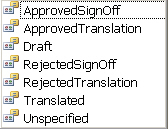
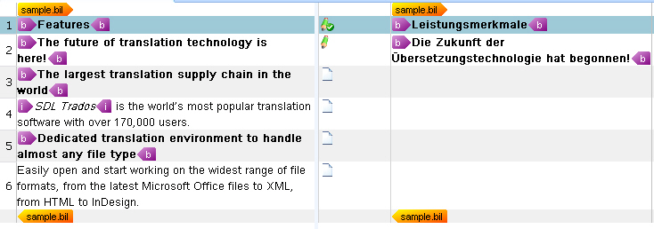

# Applying the Segment Pair Confirmation Levels

This section explains how to process BIL unit status information and apply it to the corresponding segment pair status in SDLXLIFF.

## Process the Segment Pair Status

Var:ProductName applies confirmation levels to segment pairs, such as `draft`, `translated`, and `approved`. The following image shows the confirmation level values that SDLXLIFF uses:



The `status` attribute of the `unit` element maps directly to the segment pair status in Var:ProductName. For simplicity, assume that units in a BIL file contain the following status values, which map to SDLXLIFF confirmation levels as shown here:

| BIL | SDLXLIFF |
| --- | --- |
| `new` | `unspecified` |
| `fuzzy` | `draft` |
| `exact` | `translated` |


Apply the correct status value to a segment pair through the [ConfirmationLevel](../../api/filetypesupport/Sdl.FileTypeSupport.Framework.NativeApi.ISegmentPairProperties.yml#Sdl_FileTypeSupport_Framework_NativeApi_ISegmentPairProperties_ConfirmationLevel) property. First, update the `CreateParagraphUnit()` helper function by adding the following line, which calls another helper function to map the confirmation level values:

# [C#](#tab/tabid-1)
```cs
segmentPairProperties.ConfirmationLevel = CreateConfirmationLevel(xmlUnit.Attributes["status"].Value);
```

The complete `CreateParagraphUnit()` function should look like this:

# [C#](#tab/tabid-2)
```cs
// helper function for creating paragraph units
private IParagraphUnit CreateParagraphUnit(XmlNode xmlUnit)
{
    // create paragraph unit object
    IParagraphUnit paragraphUnit = ItemFactory.CreateParagraphUnit(LockTypeFlags.Unlocked);


    // create segment pair object
    ISegmentPairProperties segmentPairProperties = ItemFactory.CreateSegmentPairProperties();  
    // assign the appropriate confirmation level to the segment pair            
    segmentPairProperties.ConfirmationLevel=CreateConfirmationLevel(xmlUnit.Attributes["status"].Value);

    // add source segment to paragraph unit
    ISegment srcSegment = CreateSegment(xmlUnit.SelectSingleNode("source/seg"), segmentPairProperties);            
    paragraphUnit.Source.Add(srcSegment);

    // add target segment to paragraph unit if available
    if(xmlUnit.SelectSingleNode("target/seg") != null)            
    {
        ISegment trgSegment = CreateSegment(xmlUnit.SelectSingleNode("target/seg"), segmentPairProperties);
        paragraphUnit.Target.Add(trgSegment);
    }

    // create paragraph unit context
    string id = xmlUnit.SelectSingleNode("./@id").InnerText;
    if(xmlUnit.SelectSingleNode("type/@spec")!=null)
    {
        string spec = xmlUnit.SelectSingleNode("type/@spec").InnerText;

        paragraphUnit.Properties.Contexts=CreateContext(spec, id);
    } else {
        paragraphUnit.Properties.Contexts = CreateContext("Paragraph", id);
    }
    // extract comment (if applicable)
    if(xmlUnit.SelectSingleNode("comment")!=null)
    {
        paragraphUnit.Properties.Comments = CreateComment(xmlUnit.SelectSingleNode("comment").InnerText);
    }

    return paragraphUnit;
}
```

Now add the helper function that uses a switch statement to map the BIL status values to SDLXLIFF confirmation levels:

# [C#](#tab/tabid-3)
```cs
private ConfirmationLevel CreateConfirmationLevel(string BilStatus)
{
    ConfirmationLevel sdlxliffLevel = ConfirmationLevel.Unspecified;

    switch (BilStatus)
    {
        case "new":
            sdlxliffLevel = ConfirmationLevel.Unspecified;
            break;
        case "fuzzy":
            sdlxliffLevel = ConfirmationLevel.Draft;
            break;
        case "exact":
            sdlxliffLevel = ConfirmationLevel.Translated;
            break;
        default:
            sdlxliffLevel = ConfirmationLevel.Unspecified;
            break;
    }

    return sdlxliffLevel;
}
```

After you add this code to the parser class, the SDLXLIFF document in Var:ProductName should look like this. Var:ProductName displays the confirmation levels as icons between the source and target segments.



>[!NOTE]
>
> This content may be out of date. To verify the latest information on this topic, inspect the libraries in the Visual Studio Object Browser.
