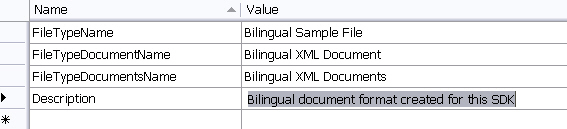
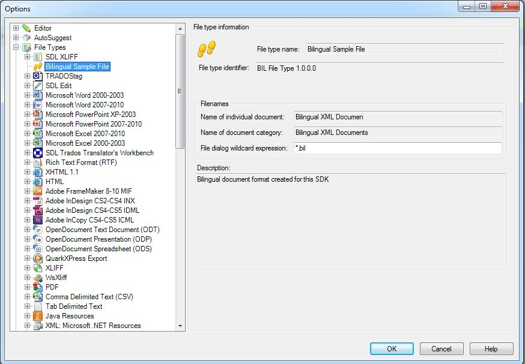

# Adding the File Type Component Builder

Add the File Type Component Builder to your project by explicitly implementing the [IFileTypeComponentBuilder](../../api/filetypesupport/Sdl.FileTypeSupport.Framework.IntegrationApi.IFileTypeComponentBuilder.yml) interface.

# [C#](#tab/tabid-1)
```cs
public class SimpleTextFilterComponentBuilder : IFileTypeComponentBuilder
```

The component builder contains the complete implementation of the File Type Component Builder. It declares and defines the new file type plug-in to the framework, enabling it to work in Var:ProductName.

## Add File Type Information

Your File Type Component Builder requires information such as the file type plug-in version number and the file extension that the plug-in applies to. Var:ProductName displays this information to users in the **Options** dialog box under **File Types**.

Add a resources file to your assembly and name it **Resources.resx**. Enter general information strings such as the file type version and description into this resources file. Reference these strings (and the embedded assembly icon) in the [IFileTypeComponentBuilder](../../api/filetypesupport/Sdl.FileTypeSupport.Framework.IntegrationApi.IFileTypeComponentBuilder.yml) implementation. The following image shows example strings for the resources file:



The [IFileTypeComponentBuilder](../../api/filetypesupport/Sdl.FileTypeSupport.Framework.IntegrationApi.IFileTypeComponentBuilder.yml) implementation references each component of your file type plug-in, such as file sniffers and file parsers. If you fail to reference a component in the file type definition, Var:ProductName cannot use that component's functionality. The File Type Component Builder fully reflects your plug-in's component structure.

Divide your file type plug-in into distinct components, where each component performs a different task. You can also store runtime-configurable plug-in settings in the File Type Component Builder file.

The following example shows how to add the general file type information to the [IFileTypeComponentBuilder](../../api/filetypesupport/Sdl.FileTypeSupport.Framework.IntegrationApi.IFileTypeComponentBuilder.yml) implementation:

# [C#](#tab/tabid-2)
```cs
/// <summary>
/// Returns a file type information object.
/// </summary>
/// <param name="name">The <see cref="IFileTypeDefinition"/> will pass "" as the name for this parameter</param>
/// <returns>an SimpleText file type information object</returns>
public IFileTypeInformation BuildFileTypeInformation(string name)
{
    var info = this.FileTypeManager.BuildFileTypeInformation();

    info.FileTypeDefinitionId = new FileTypeDefinitionId("BIL File Type 1.0.0.0");
    info.FileTypeName = new LocalizableString("Bilingual Sample File");
    info.FileTypeDocumentName = new LocalizableString("Bilingual XML Documen");
    info.FileTypeDocumentsName = new LocalizableString("Bilingual XML Documents");
    info.Description = new LocalizableString("Bilingual document format created for this SDK");
    info.FileDialogWildcardExpression = "*.bil";
    info.DefaultFileExtension = "bil";
    info.Icon = new IconDescriptor(PluginResources.bil);
    info.Enabled = true;

    return info;
}
```

If you add the File Type Component Builder to Var:ProductName, it appears in the **Options** dialog box under **File Types**. The following image illustrates how Var:ProductName presents the file type information to users:



The File Type Component Builder is more comprehensive than the example shown above. As you develop each component of your sample file type plug-in, add the corresponding component references to the File Type Component Builder file incrementally.

> [!NOTE]
> This content may be out-of-date. To check the latest information on this topic, inspect the libraries using the Visual Studio Object Browser.
