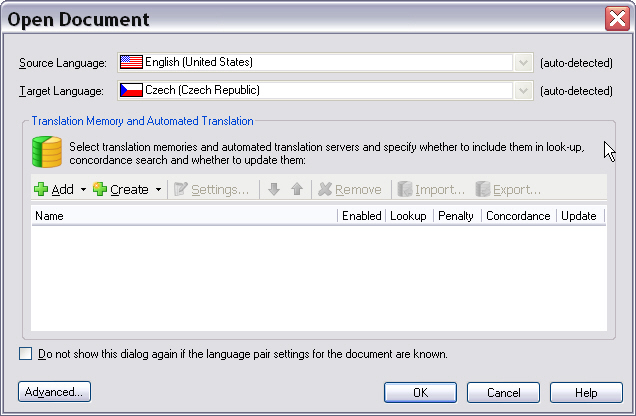

# Implementing the File Sniffer

Implement the functionality to determine whether a given BIL file is valid and can be processed by your sample file type plug-in.

## Identify File Validation Criteria

You can use the file extension (specified in the File Type Component Builder) to determine whether a file can be processed. However, file extensions alone are unreliable. A matching extension doesn't guarantee the file is valid, and different file types may share the same extension.

Implement a more reliable validation criterion. For XML files, the root element provides reliable validation. In this case, the root element is `bilingualdocument`. If a document contains this root element, consider it valid. Otherwise, the file type plug-in should inform the user that the file is not supported.

Implement the validation functionality in a distinct file sniffer component.

## Add the File Sniffer Class

Create a new class called **BilSniffer.cs** and implement the [INativeFileSniffer](../../api/filetypesupport/Sdl.FileTypeSupport.Framework.NativeApi.INativeFileSniffer.yml) interface. Although you're developing a bilingual file type plug-in (not a native file type plug-in), you must use this interface. The sniffer component determines file validity based on file-specific (native) criteria, such as the root element in this example.

The interface implements a [Sniff](../../api/filetypesupport/Sdl.FileTypeSupport.Framework.NativeApi.INativeFileSniffer.yml#Sdl_FileTypeSupport_Framework_NativeApi_INativeFileSniffer_Sniff_System_String_Sdl_Core_Globalization_Language_Sdl_Core_Globalization_Codepage_Sdl_FileTypeSupport_Framework_NativeApi_INativeTextLocationMessageReporter_Sdl_Core_Settings_ISettingsGroup_) method that returns a [SniffInfo](../../api/filetypesupport/Sdl.FileTypeSupport.Framework.NativeApi.SniffInfo.yml) object. You can use this object to set whether a file is supported or not. The following shows the minimum code required for a file sniffer component:

# [C#](#tab/tabid-1)
```cs
using Sdl.Core.Settings;
using Sdl.FileTypeSupport.Framework.NativeApi;
using Sdl.Core.Globalization;

namespace Sdk.Snippets.Bilingual
{
    class BilSniffer : INativeFileSniffer
    {

        public SniffInfo Sniff(
            string nativeFilePath,
            Language language,
            Codepage suggestedCodepage,     
            INativeTextLocationMessageReporter messageReporter,
             ISettingsGroup settingsGroup)

        {
            SniffInfo fileInfo = new SniffInfo();    
            return fileInfo;
        }
    }
}
```
# [C#](#tab/tabid-1)
```cs
using Sdl.Core.Settings;
using Sdl.FileTypeSupport.Framework.NativeApi;
using Sdl.Core.Globalization;

namespace Sdk.Snippets.Bilingual
{
    class BilSniffer : INativeFileSniffer
    {
        public SniffInfo Sniff(
            string nativeFilePath,
            Language language,
            Codepage suggestedCodepage,     
            INativeTextLocationMessageReporter messageReporter,
            ISettingsGroup settingsGroup)
        {
            SniffInfo fileInfo = new SniffInfo();    
            return fileInfo;
        }
    }
}
```

## Implement the Sniffer Logic

Implement the logic to determine whether a given file is supported. If you have specific settings for the file sniffer, populate them using the `ISettingsGroup` passed to the Sniff method. See [The File Sniffer](the_file_sniffer.md) for more details.

The file sniffer reads the root element name from the document. In this sample format, the root element also contains the source and target language attributes:

# [Xml](#tab/tabid-2)
```xml
<bilingualdocument source-language="en-US" target-language="de-DE">
```

Add the root element name, source language attribute name, and target language attribute name as constants to your sniffer class:

# [C#](#tab/tabid-3)
```cs
static string _BilingualDocument = "bilingualdocument";
static string _SourceLanguage = "source-language";
static string _TargetLanguage = "target-language";
```

The [Sniff](../../api/filetypesupport/Sdl.FileTypeSupport.Framework.NativeApi.INativeFileSniffer.yml#Sdl_FileTypeSupport_Framework_NativeApi_INativeFileSniffer_Sniff_System_String_Sdl_Core_Globalization_Language_Sdl_Core_Globalization_Codepage_Sdl_FileTypeSupport_Framework_NativeApi_INativeTextLocationMessageReporter_Sdl_Core_Settings_ISettingsGroup_) method calls two helper functions to read the root element name and source/target language values. The [IsSupported](../../api/filetypesupport/Sdl.FileTypeSupport.Framework.NativeApi.SniffInfo.yml#Sdl_FileTypeSupport_Framework_NativeApi_SniffInfo_IsSupported) property is set to True or False based on the result from the `IsFileSupported()` helper function:

# [C#](#tab/tabid-4)
```cs
public SniffInfo Sniff(string nativeFilePath, Language suggestedSourceLanguage, 
    Codepage suggestedCodepage, INativeTextLocationMessageReporter messageReporter, 
    ISettingsGroup settingsGroup)
{
    SniffInfo info = new SniffInfo();

    if (System.IO.File.Exists(nativeFilePath))
    {
        // call method to check if file is supported
        info.IsSupported = IsFileSupported(nativeFilePath);
        // call method to determine the file language pair
        GetFileLanguages(ref info, nativeFilePath);
    }
    else
    {
        info.IsSupported = false;
    }

    return info;
}
```

The `IsFileSupported()` helper function receives the file name and path. It loads the document into an XML DOM object to determine the root element and returns True or False:

# [C#](#tab/tabid-5)
```cs
private bool IsFileSupported(string nativeFilePath)
{
    bool result = false;
    XmlDocument doc = new XmlDocument();
    doc.Load(nativeFilePath);
    if (doc.DocumentElement.Name == _BilingualDocument)
    {
        result = true;
    }

    return result;
}
```

The `GetFileLanguages()` helper function retrieves the file info object, file name, and path. It loads the document into an XML DOM object to read the source and target language attribute values. It then sets the detected source and target language properties with the values retrieved from the root element attributes.

In this example, the root element attributes clearly state the source and target language, so set the [DetectionLevel](../../api/filetypesupport/Sdl.FileTypeSupport.Framework.NativeApi.DetectionLevel.yml) property to [Certain](../../api/filetypesupport/Sdl.FileTypeSupport.Framework.NativeApi.DetectionLevel.yml#fields). For document types where languages must be determined using heuristics, set the detection level to [Likely](../../api/filetypesupport/Sdl.FileTypeSupport.Framework.NativeApi.DetectionLevel.yml#fields) or [Guess](../../api/filetypesupport/Sdl.FileTypeSupport.Framework.NativeApi.DetectionLevel.yml#fields):

# [C#](#tab/tabid-6)
```cs
private void GetFileLanguages(ref SniffInfo info, string nativeFilePath)
{
    XmlDocument doc = new XmlDocument();
    doc.Load(nativeFilePath);
    if (doc.DocumentElement.HasAttributes)
    {
        XmlAttribute source = doc.DocumentElement.Attributes[_SourceLanguage];
        if (source != null)
        {
            info.DetectedSourceLanguage =
                new Sdl.FileTypeSupport.Framework.Pair<Language, DetectionLevel>(new Language(source.Value),
                    DetectionLevel.Certain);
        }

        XmlAttribute target = doc.DocumentElement.Attributes[_TargetLanguage];
        if (source != null)
        {
            info.DetectedTargetLanguage =
                new Sdl.FileTypeSupport.Framework.Pair<Language, DetectionLevel>(new Language(target.Value),
                    DetectionLevel.Certain);
        }
    }
}
```

When the detection level is set to [Certain](../../api/filetypesupport/Sdl.FileTypeSupport.Framework.NativeApi.DetectionLevel.yml#fields), the language dropdown lists in the **Open Document** dialog are disabled and cannot be changed by the user. Otherwise, users can change the proposed language combination as needed.



When the sniffer programmatically determines the language pair, users don't need to manually select the source/target language combination when opening the file. Var:ProductName displays the language pair in the status bar:


> [!NOTE]
> If the sniffer determines that the file is not supported, inform the user. See [User Communication Through Messaging](user_communication_through_messaging.md) for information on how to provide users with details about why a file cannot be processed.

## Add the Component Reference to the Component Builder

Reference the file sniffer component in the File Type Component Builder by adding the following code to your [IFileTypeComponentBuilder](../../api/filetypesupport/Sdl.FileTypeSupport.Framework.IntegrationApi.IFileTypeComponentBuilder.yml) implementation. If you fail to reference this component, it will not be used by the file type plug-in, even if the sniffer is implemented in the assembly.

# [C#](#tab/tabid-7)
```cs
public INativeFileSniffer BuildFileSniffer(string name)
{
    return new BilSniffer();
}
```

## Putting It All Together

The complete sniffer class should look as follows:

# [C#](#tab/tabid-8)
```cs
using System;
using System.Collections.Generic;
using System.Linq;
using System.Text;
using System.Xml;
using Sdl.FileTypeSupport.Framework.NativeApi;
using Sdl.Core.Globalization;
using Sdl.Core.Settings;

namespace Sdk.FileTypeSupport.Samples.Bil
{
    class BilSniffer : INativeFileSniffer
    {
        static string _BilingualDocument = "bilingualdocument";
        static string _SourceLanguage = "source-language";
        static string _TargetLanguage = "target-language";

        public SniffInfo Sniff(string nativeFilePath, Language suggestedSourceLanguage, 
            Codepage suggestedCodepage, INativeTextLocationMessageReporter messageReporter, 
            ISettingsGroup settingsGroup)
        {
            SniffInfo info = new SniffInfo();

            if (System.IO.File.Exists(nativeFilePath))
            {
                // call method to check if file is supported
                info.IsSupported = IsFileSupported(nativeFilePath);
                // call method to determine the file language pair
                GetFileLanguages(ref info, nativeFilePath);
            }
            else
            {
                info.IsSupported = false;
            }

            return info;
        }

        private bool IsFileSupported(string nativeFilePath)
        {
            bool result = false;
            XmlDocument doc = new XmlDocument();
            doc.Load(nativeFilePath);
            if (doc.DocumentElement.Name == _BilingualDocument)
            {
                result = true;
            }

            return result;
        }

        private void GetFileLanguages(ref SniffInfo info, string nativeFilePath)
        {
            XmlDocument doc = new XmlDocument();
            doc.Load(nativeFilePath);
            if (doc.DocumentElement.HasAttributes)
            {
                XmlAttribute source = doc.DocumentElement.Attributes[_SourceLanguage];
                if (source != null)
                {
                    info.DetectedSourceLanguage =
                        new Sdl.FileTypeSupport.Framework.Pair<Language, DetectionLevel>(new Language(source.Value),
                            DetectionLevel.Certain);
                }

                XmlAttribute target = doc.DocumentElement.Attributes[_TargetLanguage];
                if (source != null)
                {
                    info.DetectedTargetLanguage =
                        new Sdl.FileTypeSupport.Framework.Pair<Language, DetectionLevel>(new Language(target.Value),
                            DetectionLevel.Certain);
                }
            }
        }
    }
}
```

## See Also

- [User Communication Through Messaging](user_communication_through_messaging.md)

> [!NOTE]
> This content may be out-of-date. To check the latest information on this topic, inspect the libraries using the Visual Studio Object Browser.
