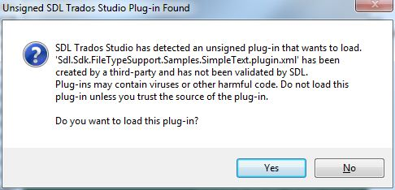
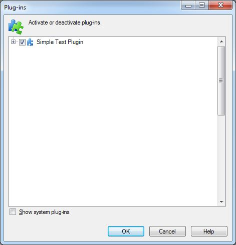

# Build the file type plug-in

This article explains how to build a file type plug-in and how Var:ProductName packages it.

## The plug-in package

When you build the project, Visual Studio generates an `.sdlplugin` file. In this example, the output file is `Sdl.Sdk.FileTypeSupport.Samples.SimpleText.sdlplugin`. The build places that file in your output folder.

An `.sdlplugin` file is a ZIP archive that contains the plug-in components, such as the plug-in assembly, resources file, and manifest. In this example, the package contains the following files:

- The plug-in assembly, for example `Sdl.Sdk.FileTypeSupport.Samples.SimpleText.dll`.
- The plug-in manifest, for example `Sdl.Sdk.FileTypeSupport.Samples.SimpleText.plugin.xml`. The build process generates this manifest. It lists the extension classes in the plug-in and declares the assembly and extension classes to Var:ProductName. If you delete this `.xml` file, Var:ProductName no longer loads the plug-in.
- The plug-in resources file, for example `Sdl.Sdk.FileTypeSupport.Samples.SimpleText.plugin.resources`. This file contains the localizable strings and images referenced in the plug-in manifest. The build compiles it from `PluginResources.resx`. For more information, see [The Resources File](the_resources_file.md).

## The plug-in package path

For Var:ProductName to detect and extract the plug-in package, the following folders must exist:

- `Var:PluginPackedPath`
- `Var:PluginUnpackedPath`

Place the `.sdlplugin` file in the `Packages` subfolder, and then start Var:ProductName. During startup, Var:ProductName automatically extracts the package contents to the `Unpacked` subfolder.

The package folder does not need to match your build output path, but using it as the build output path is convenient because the build writes the `.sdlplugin` file directly to the required location. After you create the plug-in from the empty template, you can already build the project, although it will not provide any functionality yet.

When Var:ProductName starts, it loads the unpacked plug-in and displays the following message. Click **Yes** to load the plug-in. Var:ProductName shows this message for plug-ins that RWS has not certified and that could therefore be unsafe. You can avoid this prompt by submitting your plug-in to RWS for certification.



>[!NOTE]
>
> If a user clicks **No** when Var:ProductName displays the plug-in security message during startup, the application does not load the plug-in.


After Var:ProductName loads the plug-in, open **Tools** > **Plug-ins** to confirm that the application added it. The **Plug-ins** dialog box should list your new plug-in:




## The plug-in manifest

The plug-in package requires a manifest file named `pluginpackage.manifest.xml`. The project template includes this file. If the manifest is missing, the build cannot create the plug-in package.

The following example shows the manifest for the sample plug-in:

```xml
<?xml version="1.0" encoding="utf-8"?>
<PluginPackage xmlns="http://www.sdl.com/Plugins/PluginPackage/1.0">
  <PlugInName>Sdl.Sdk.FileTypeSupport.Samples.SimpleText</PlugInName>
  <Version>1.0</Version>
  <Description>Sdl.Sdk.FileTypeSupport.Samples.SimpleText</Description>
  <Author></Author>
  <RequiredProduct name="TradosStudio" minversion="19.0" />
</PluginPackage>
```

The manifest contains the following elements:

- **PlugInName**: Specifies the friendly name of the plug-in. This value can differ from the plug-in name defined in `PluginResources.resx` because one plug-in package can theoretically contain multiple plug-ins.
- **Version**: Specifies the version of the plug-in package. Var:ProductName uses this value to detect package updates during startup.
- **Description**: Describes the plug-in package.
- **Author**: Identifies the plug-in developer.
- **RequiredProduct**: Specifies the RWS product version required to run the plug-in. You must provide a minimum version, and you can optionally provide a maximum version.

## Build and debug suggestions

Use the following suggestions to simplify building and debugging your plug-in:

- Configure the solution and project to start Var:ProductName by default.
- Configure the project output path to the Var:ProductName plug-in package directory. This setting deploys your plug-in automatically. Var:PluginPackedPath stores the package directory path.
- Delete the previous unpacked version of your plug-in during the build. This step ensures that Var:ProductName uses the latest version. You can do this with a post-build event.

```txt
rmdir /S /Q "Var:PluginUnpackedPath \Sdl.Sdk.FileTypeSupport.Samples.Bil"
```

## See also

- [Creating a New Project](creating_a_new_project.md)

>[!NOTE]
>
> This content may be out-of-date. To check the latest information on this topic, inspect the libraries using the Visual Studio Object Browser.

