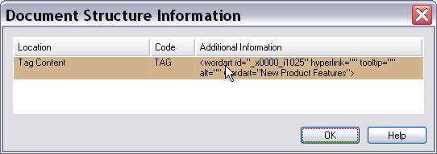

Introduction
===

This guide will walk you step by step through the creation of a C# project in <Var:VisualStudioEdition> for developing a simple bilingual verification plug-in.

Imagine that you need to translate Microsoft Word 2007 documents that contain WordArt objects. Let us assume that the translations for these WordArt objects should not exceed a certain number of words. The purpose is, for example, to keep headlines and slogans as short, crisp and catchy as possible.

The scenario for our sample project is to enhance the standard Microsoft Word 2007 File Type Component Builder to include a bilingual verification plug-in that points out any WordArt translations that exceed a specified maximum word count. The maximum word count needs to be user-definable.

The illustration above shows what the sample document looks like in <Var:ProductName>. Note that in the above example the first and the last segment were extracted from WordArt objects.

The document structure column on the right-hand side contains the context info **TAG**, which indicates that the corresponding segment does not occur in a normal paragraph. By double-clicking the **TAG** display code you raise a **Document Structure Information** window, which contains more details such as the information that the current **TAG** text is a WordArt object. The following chapters contain a step-by-step guide on how to implement a simple bilingual verification plug-in in C# that performs a word count check in particular for WordArt objects.

See Also
--

[What is the Verification Framework?](what_is_the_verification_framework.md)

[Create a New Project](create_a_new_bil_project.md)

>[!NOTE]
>
> This content may be out-of-date. To check the latest information on this topic, inspect the libraries using the Visual Studio Object Browser.