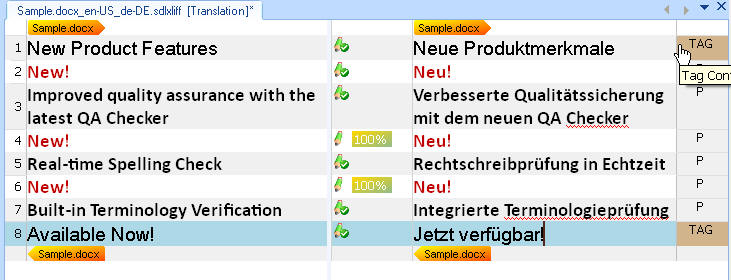
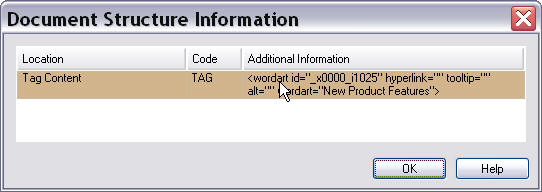

# Introduction

This guide steps you through creating a C# project in Var:VisualStudioEdition to develop a simple bilingual verification plug-in.

## Scenario

You're translating Microsoft Word 2007 documents that contain WordArt objects. You need to ensure WordArt translations don't exceed a specified word count. This keeps headlines and slogans short, crisp, and catchy.

This sample project enhances the standard Microsoft Word 2007 File Type Component Builder with a bilingual verification plug-in. The plug-in identifies any WordArt translations that exceed a user-definable maximum word count.

The illustration shows the sample document in Var:ProductName. The first and last segments were extracted from WordArt objects.

The document structure column on the right displays the context info **TAG**, which indicates that the segment does not occur in a normal paragraph. Double-click the **TAG** display code to open a **Document Structure Information** window with more details, such as information that identifies the current **TAG** text as a WordArt object.

The following chapters step you through implementing a simple bilingual verification plug-in in C# that performs a word count check specifically for WordArt objects.

## See Also

- [What is the Verification Framework?](what_is_the_verification_framework.md)
- [Create a New Project](create_a_new_bil_project.md)

> [!NOTE]
> This content may be out-of-date. To check the latest information on this topic, inspect the libraries using the Visual Studio Object Browser.
