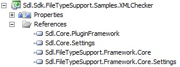

# Create a New Project

Learn how to properly set up a project for developing a verification plug-in that works on the native file format.

## Create the Project

Launch Var:VisualStudioEdition and create a new Var:ProductName Plug-in Project. Give it an appropriate name, such as `Sdl.Sdk.FileTypeSupport.Samples.XMLChecker`.

For instructions on creating a Var:ProductName Plug-in Project, see the [Building a Plug-in](../../articles/gettingstarted/building_a_plugin.md) article in the **Getting Started** section.

A Var:ProductName Plug-in Project produces a Plug-in Package (`*.sdlplugin`). You must manually deploy or copy this package to the Var:ProductName Plug-in Packages directory so that Var:ProductName can use the plug-in. For deployment instructions, see the [Plug-in Deployment](../../articles/gettingstarted/plugin_deployment.md) article in the **Getting Started** section.

## Add the Required References

Add references from the File Type Support Framework APIs. These references are contained in the following assemblies:

- **Sdl.FileTypeSupport.Framework.Core.dll** — The main reference to the File Type Support Framework API
- **Sdl.FileTypeSupport.Framework.Core.Settings.dll**

Add references from the Core APIs:

- **Sdl.Core.Settings.dll**
- **Sdl.Core.PluginFramework.dll**

By default, these files are in the Var:ProductName installation folder (usually *Var:InstallationFolder*). Set the **Copy Local** property for these references to True.

> [!NOTE]
> This content may be out-of-date. To check the latest information on this topic, inspect the libraries using the Visual Studio Object Browser.
