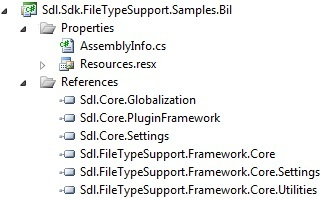

# Creating a New Project

Learn how to properly set up a project for developing a bilingual file type plug-in.

## Create the Project

Launch Var:VisualStudioEdition and create a new Var:ProductName Plug-in Project. Give it an appropriate name, such as `Sdl.Sdk.FileTypeSupport.Samples.Bil`.

For instructions on creating a Var:ProductName Plug-in Project, see the [Creating a New Project](creating_a_new_project.md) and [Build the File Type Plug-in](build_the_file_type_plug_in.md) topics.

## Add the Required References

Add references from the File Type Support Framework APIs. These references are contained in the following assemblies:

- **Sdl.FileTypeSupport.Framework.Core.dll** — The main reference to the File Type Support Framework API
- **Sdl.FileTypeSupport.Framework.Core.Settings.dll**
- **Sdl.FileTypeSupport.Framework.Core.Utilities.dll**

Add references from the Core APIs:

- **Sdl.Core.Globalization.dll**
- **Sdl.Core.PluginFramework.dll**
- **Sdl.Core.Settings.dll**

By default, these files are in the Var:ProductName installation folder (usually *Var:InstallationFolder*). Set the **Copy Local** property for these references to True.

Generate a key to sign the assembly. For debugging, set **SDLTradosStudio.exe** as the external application.

## Add the Required Resources

Add a resources file (`Resources.resx`) to the project's properties. Use this resources file for storing file type plug-in information that Var:ProductName displays in the user interface.

Add an icon to the project. Find a suitable icon file (`Bil.ico`) in the **Sdl.Sdk.FileTypeSupport.Samples.Bil** folder of the SDK sample projects. Set the **Build Action** property for the icon file to **Embedded Resource**. Users see this icon in the **Options** dialog box of Var:ProductName.

> [!NOTE]
> This content may be out-of-date. To check the latest information on this topic, inspect the libraries using the Visual Studio Object Browser.
