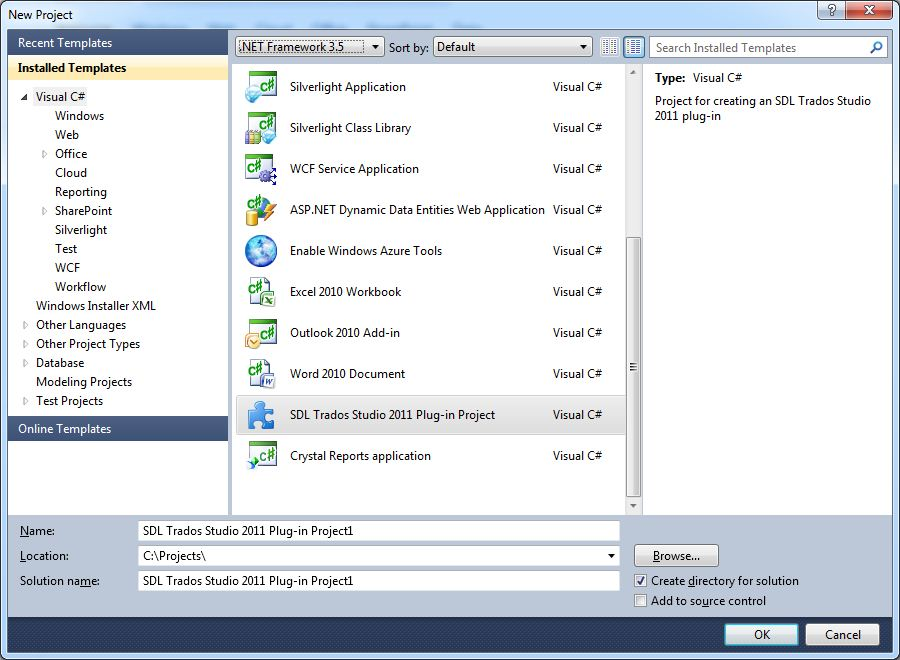
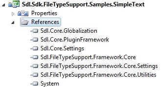

# Creating a new project

This article shows how to set up a project for developing a file type plug-in.

## Create the project

Before you start developing plug-ins for Var:ProductName, make sure that you installed the SDK on your development computer. The SDK installer adds new templates to Visual Studio, as shown in the following screenshot. For the plug-in type covered in this article, use the **Var:ProductName Plug-in Project** template.

By default, Visual Studio assigns a name such as **Var:ProductName Plug-in Project1**. For this sample, rename the project to **Sdl.Sdk.FileTypeSupport.Samples.SimpleText**.

## Add the required references

The plug-in template already includes a reference to **Sdl.Core.PluginFramework.dll**. For this file type plug-in, also add a reference to **Sdl.FileTypeSupport.Framework.Core.dll**. To support the functionality in this example, add the following libraries that integrate with Var:ProductName:

* **Sdl.FileTypeSupport.Framework.Core.Settings.dll**
* **Sdl.Core.Settings.dll**
* **Sdl.Core.Globalization.dll**
* **Sdl.FileTypeSupport.Framework.Core.Utilities**

You can find these files in the Var:ProductName installation folder, that is, `Var:InstallationFolder`. Set the **Copy Local** property for these references to **True**.

>[!NOTE]
>
> Sign the assembly. Otherwise, Var:ProductName might not load your plug-in.

## See also

- [What is the Verification Framework?](what_is_the_verification_framework.md)

>[!NOTE]
>
> This content may be out-of-date. To check the latest information on this topic, inspect the libraries using the Visual Studio Object Browser.
