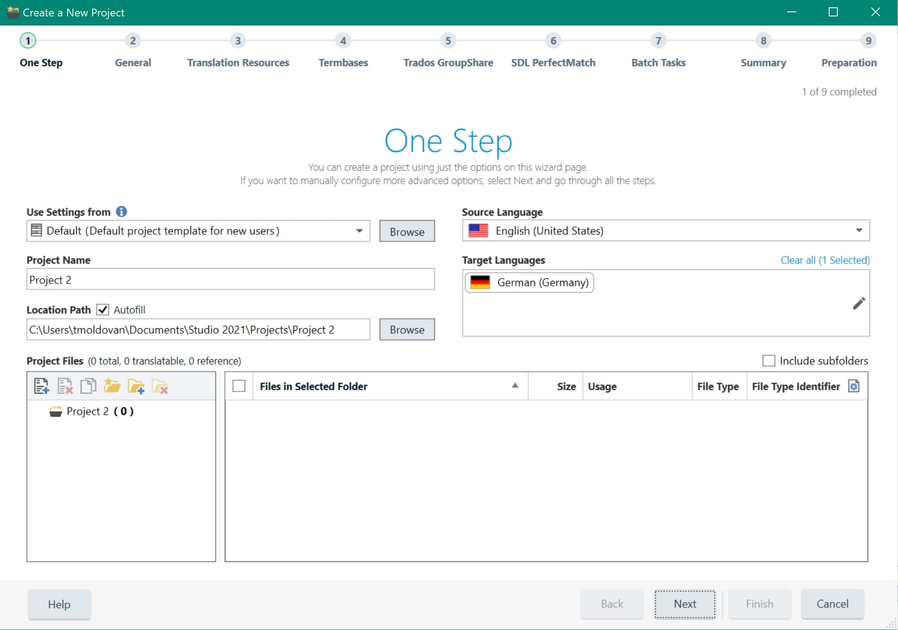
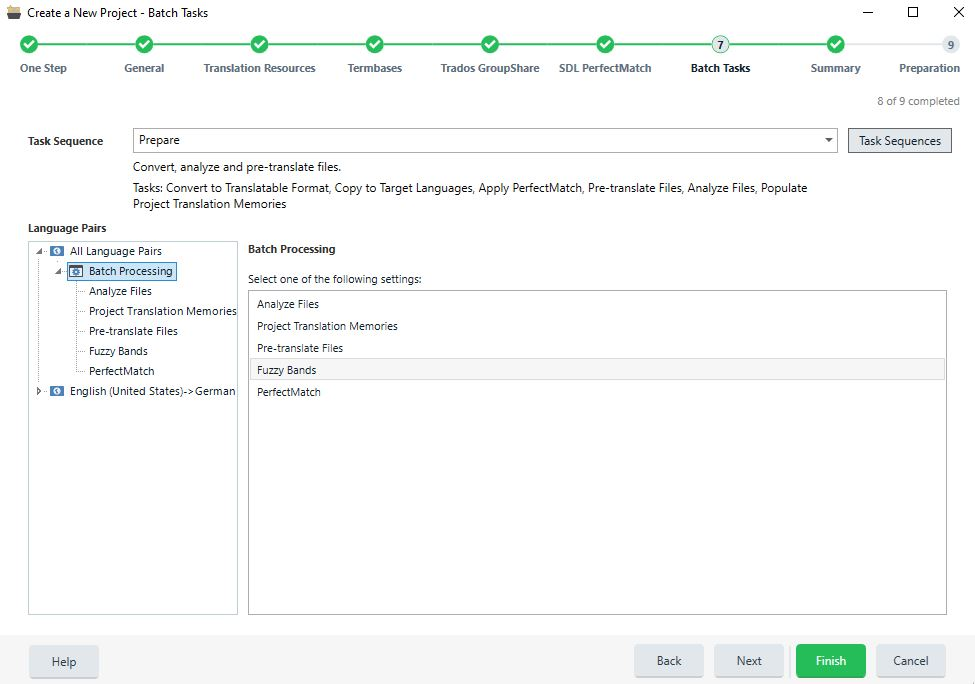

# Creating projects

Var:ProductName lets translators and project managers create projects for multi-file jobs. Use a project when you need to process many files, assign work to multiple roles, or prepare content for one or more target languages.

Project creation is wizard-based. In the wizard, users can specify the main project settings:

* Project name
* Due date
* Files
* Target language(s)
* Translation memories and termbases

The project wizard processes files through a task sequence. A task sequence includes tasks such as word count and file analysis. It also includes the task that converts source files into the intermediate format, such as SDLXliff. Run that conversion before translation or analysis.

Entering general project information in the project wizard.

Applying a batch task sequence to all project files.

## See also

[Merging files](merging_files.md)
