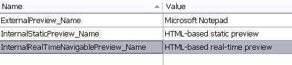

Modifying the File Type Component Builder
===

The real-time preview is dynamic, i.e. it interacts with the editor. When users select a segment in the real-time preview, the corresponding segment in the editor gets highlighted automatically. Also, when users confirm a segment in the editor of Var:ProductName the real-time preview is updated accordingly. Like all other preview types, the real-time preview needs to be referenced in the File Type Component Builder.

Add the Real-Time Preview Name to the Resources
--

To implement the real-time preview we first need to make a few additions to the File Type Component Builder. In the first step, define the preview name in the resources file. This is the name that will be shown later in the combo box of the internal preview window of Var:ProductName. Add the following entires to the resources file, which are going to be referenced in the File Type Component Builder later:




Add the Internal Real-time Preview Set
In the next step add the following preview set object node for the internal real-time preview into the File Type Component Builder (e.g. below the internal preview set, see chapter [Modifying the File Type Component Builder](static_modifying_the_file_type_component_builder.md)). Note how the object references the preview name that you previously defined in the resources file. After adding the real-time preview set to the File Type Component Builder, the preview name will already be listed in the combo box of the preview window. However, of course, the real-time preview will not be functional yet. Note that we will make another addition to the File Type Component Builder later, when we reference the (yet-to-be-created) preview control (see chapter [Adding a Preview UI Control](adding_a_preview_ui_control.md))

# [C#](#tab/tabid-1)
```cs
IPreviewSet internalRealPreviewSet = previewFactory.CreatePreviewSet();
internalRealPreviewSet.Id = new PreviewSetId("InternalRealTimePreview");
internalRealPreviewSet.Name = new LocalizableString(Resources.InternalRealTimeNavigablePreview_Name);

IControlPreviewType sourceControlPreviewType2 = previewFactory.CreatePreviewType<IControlPreviewType>() as IControlPreviewType;
if (sourceControlPreviewType2 != null)
{
    sourceControlPreviewType2.SourceGeneratorId = new GeneratorId("RealTimePreview");
    sourceControlPreviewType2.SingleFilePreviewControlId = new PreviewControlId("InternalNavigablePreview");
    internalRealPreviewSet.Source = sourceControlPreviewType2;
}

IControlPreviewType targetControlPreviewType2 = previewFactory.CreatePreviewType<IControlPreviewType>() as IControlPreviewType;
if (targetControlPreviewType2 != null)
{
    targetControlPreviewType2.TargetGeneratorId = new GeneratorId("RealTimePreview");
    targetControlPreviewType2.SingleFilePreviewControlId = new PreviewControlId("InternalNavigablePreview");
    internalRealPreviewSet.Target = targetControlPreviewType2;
}
previewFactory.GetPreviewSets(null).Add(internalRealPreviewSet);
```
***

See Also
--


[Adding a Preview Controller](adding_a_preview_controller.md)

>[!NOTE]
>
> This content may be out-of-date. To check the latest information on this topic, inspect the libraries using the Visual Studio Object Browser.
