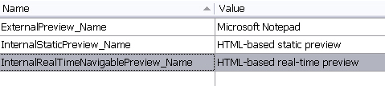

# Modifying the file type component builder

The real-time preview interacts with the editor. When users select a segment in the real-time preview, Var:ProductName highlights the corresponding segment in the editor. When users confirm a segment in the editor, the real-time preview updates accordingly.

Like the other preview types, the real-time preview must be referenced in the File Type Component Builder.

## Add the real-time preview name to the resources

Start by defining the preview name in the resources file. Var:ProductName displays this name in the internal preview window combo box. The File Type Component Builder references these resource entries later.



## Add the internal real-time preview set

Next, add the following preview set object for the internal real-time preview to the File Type Component Builder. You can place it below the internal preview set. See [Modifying the File Type Component Builder](static_modifying_the_file_type_component_builder.md).

This object references the preview name that you defined in the resources file. After you add the real-time preview set, Var:ProductName lists the preview name in the Preview window combo box. The real-time preview still does not work yet, because the preview control has not been added. You will add that reference later. See [Adding a Preview UI Control](adding_a_preview_ui_control.md).

# [C#](#tab/tabid-1)
```cs
IPreviewSet internalRealPreviewSet = previewFactory.CreatePreviewSet();
internalRealPreviewSet.Id = new PreviewSetId("InternalRealTimePreview");
internalRealPreviewSet.Name = new LocalizableString(Resources.InternalRealTimeNavigablePreview_Name);

IControlPreviewType sourceControlPreviewType2 = previewFactory.CreatePreviewType<IControlPreviewType>() as IControlPreviewType;
if (sourceControlPreviewType2 != null)
{
    sourceControlPreviewType2.SourceGeneratorId = new GeneratorId("RealTimePreview");
    sourceControlPreviewType2.SingleFilePreviewControlId = new PreviewControlId("InternalNavigablePreview");
    internalRealPreviewSet.Source = sourceControlPreviewType2;
}

IControlPreviewType targetControlPreviewType2 = previewFactory.CreatePreviewType<IControlPreviewType>() as IControlPreviewType;
if (targetControlPreviewType2 != null)
{
    targetControlPreviewType2.TargetGeneratorId = new GeneratorId("RealTimePreview");
    targetControlPreviewType2.SingleFilePreviewControlId = new PreviewControlId("InternalNavigablePreview");
    internalRealPreviewSet.Target = targetControlPreviewType2;
}
previewFactory.GetPreviewSets(null).Add(internalRealPreviewSet);
```
## See also

- [Adding a Preview Controller](adding_a_preview_controller.md)

>[!NOTE]
>
> This content may be out-of-date. To check the latest information on this topic, inspect the libraries using the Visual Studio Object Browser.
