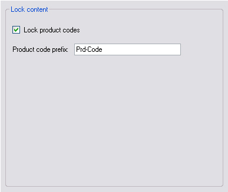

# Extending the Configuration Options

Enhance your file type plug-in with another configuration option.

## Add Another File Type Plug-in Option

Consider that the product code prefix may vary from file to file. Rather than hard-coding the prefix, implement it as a runtime configuration option. This requires additions to the filter settings, the control UI, and the file parser component.

## Extend the File Type Settings

Before adding the new option to the UI control, add it to the filter settings. The new setting should follow the same pattern as existing settings—add a settings key, a default value, and an accessor property. Update the `ResetToDefaults`, `PopulateFromSettingsBundle`, and `SaveToSettingsBundle` methods to handle the new setting. See **Putting It All Together** for an example.

## Extend the UI Control

Extend the file type plug-in settings UI by adding a new text field called `txt_PrdCodePrefix`:



Add a helper function that enables or disables the text field depending on whether the `cb_LockPrdCodes` check box is checked:

# [C#](#tab/tabid-1)
```cs
private void txt_PrdCodePrefix_TextChanged(object sender, EventArgs e)
{
    _userSettings.PrdCodesPrefix = txt_PrdCodePrefix.Text;
}
```

# [C#](#tab/tabid-2)
```cs
public void UpdateControl()
{
    cb_LockPrdCodes.Checked = _userSettings.LockPrdCodes;
    txt_PrdCodePrefix.Text = _userSettings.PrdCodesPrefix;
}
```

## Modify the File Parser

Modify the file parser component to use the configurable product code prefix property instead of a hard-coded string. First, add a new global property to the file parser class:

# [C#](#tab/tabid-3)
```cs
public string PrdCodesPrefix
{
    get;
    set;
}
```

In the `InitializeSettings` method, read this property from the user settings to initialize the file parser class:

# [C#](#tab/tabid-4)
```cs
public void InitializeSettings(Sdl.Core.Settings.ISettingsBundle settingsBundle, string configurationId)
{
    UserSettingsExtended userSettings = new UserSettingsExtended();
    userSettings.PopulateFromSettingsBundle(settingsBundle, configurationId);
    LockPrdCodes = userSettings.LockPrdCodes;
    PrdCodesPrefix = userSettings.PrdCodesPrefix;
}
```

In the `ProcessLine()` function, change the `else if` condition from:

# [C#](#tab/tabid-5)
```cs
else if (sLine.StartsWith("Prd-Code") && LockPrdCodes==true)
```

to:

# [C#](#tab/tabid-6)
```cs
else if (sLine.StartsWith(PrdCodePrefix) && LockPrdCodes==true)
```

After rebuilding your project, the file type plug-in implements the second configuration option and applies it during parsing.

## Putting It All Together

Your extended `UserSettings` class should now look as follows:

# [C#](#tab/tabid-7)
```cs
using Sdl.FileTypeSupport.Framework.Core.Settings;
using Sdl.Core.Settings;

namespace Sdk.FileTypeSupport.Samples.SimpleText
{
    /// <summary>
    /// This class is used to actually store the settings to the settings bundle, which
    /// is physically saved in an *.sdlproj or in an *.sdltpl file.
    /// </summary>
    public class UserSettingsExtended : FileTypeSettingsBase
    {
        private const string SettingsLockPrdCodes = "LockPrdCodes";
        private const string SettingsPrdCodesPrefix = "PrdCodesPrefix";

        private const bool DefaultLockPrdCodes = true;
        private const string DefaultPrdCodePrefix = "Prd-Code";

        private bool _lockPrdCodes;
        private string _prdCodesPrefix;

        public bool LockPrdCodes
        {
            get { return _lockPrdCodes; }
            set
            {
                _lockPrdCodes = value;
                OnPropertyChanged("LockPrdCodes");
            }
        }

        public string PrdCodesPrefix
        {
            get { return _prdCodesPrefix; }
            set
            {
                _prdCodesPrefix = value;
                OnPropertyChanged("PrdCodesPrefix");
            }
        }

        public UserSettingsExtended()
        {
            ResetToDefaults();
        }

        /// <summary>
        /// Define the default value, which is Enabled, as the product code strings should
        /// not be exposed to translation by default.
        /// </summary>
        public override sealed void ResetToDefaults()
        {
            LockPrdCodes = DefaultLockPrdCodes;
            PrdCodesPrefix = DefaultPrdCodePrefix;
        }

        /// <summary>
        /// This method is used to load the setting from the settings bundle,
        /// which is physically stored in an XML-compliant *.sdlproj or *.sdltpl file.
        /// </summary>
        /// <param name="settingsBundle"></param>
        /// <param name="configurationId"></param>
        public override void PopulateFromSettingsBundle(ISettingsBundle settingsBundle, string filterDefinitionId)
        {
            ISettingsGroup settingsGroup = settingsBundle.GetSettingsGroup(filterDefinitionId);
            LockPrdCodes = GetSettingFromSettingsGroup(settingsGroup, SettingsLockPrdCodes, DefaultLockPrdCodes);
            PrdCodesPrefix = GetSettingFromSettingsGroup(settingsGroup, SettingsPrdCodesPrefix, DefaultPrdCodePrefix);
        }

        /// <summary>
        /// This method is used to store the settings as configured in the plug-in UI
        /// in the settings bundle, which means that the settings are physically written
        /// into the XML-compliant *.sdlproj or *.sdltpl file.
        /// </summary>
        /// <param name="settingsBundle"></param>
        /// <param name="configurationId"></param>
        public override void SaveToSettingsBundle(ISettingsBundle settingsBundle, string filterDefinitionId)
        {
            ISettingsGroup settingsGroup = settingsBundle.GetSettingsGroup(filterDefinitionId);
            UpdateSettingInSettingsGroup(settingsGroup, SettingsLockPrdCodes, LockPrdCodes, DefaultLockPrdCodes);
            UpdateSettingInSettingsGroup(settingsGroup, SettingsPrdCodesPrefix, PrdCodesPrefix, DefaultPrdCodePrefix);
        }
    }
}
```

Your extended `SettingsUI` class should now look as follows:

# [C#](#tab/tabid-8)
```cs
using System;
using System.Collections.Generic;
using System.ComponentModel;
using System.Drawing;
using System.Data;
using System.Linq;
using System.Text;
using System.Windows.Forms;
using Sdl.FileTypeSupport.Framework.Core.Settings;

namespace Sdk.FileTypeSupport.Samples.SimpleText.WinUI
{
    /// <summary>
    /// Implements the user interface for the file type definition.
    /// </summary>
    public partial class SettingsUIExtended : UserControl, IFileTypeSettingsAware<UserSettingsExtended>
    {
        /// <summary>
        /// Create a settings object based on the UserSettings class. 
        /// </summary>
        private UserSettingsExtended _userSettings;

        /// <summary>
        /// Initialize the user interface control by setting it to the
        /// setting value stored in the settings bundle.
        /// </summary>
        public SettingsUIExtended()
        {
            InitializeComponent();
        }

        /// <summary>
        /// Reset the user interface control to its default value, which is
        /// checked, i.e. the product lock option should be enabled
        /// by default.
        /// </summary>
        public void UpdateControl()
        {
            cb_LockPrdCodes.Checked = _userSettings.LockPrdCodes;
            txt_PrdCodePrefix.Text = _userSettings.PrdCodesPrefix;
        }

        /// <summary>
        /// Save the settings based on the value of the check box.
        /// The setting is saved through the UserSettings class, which
        /// handles the plug-in settings bundle.
        /// </summary>
        /// <param name="sender"></param>
        /// <param name="e"></param>
        private void cb_LockPrdCodes_CheckedChanged(object sender, EventArgs e)
        {
            _userSettings.LockPrdCodes = cb_LockPrdCodes.Checked;

            if (cb_LockPrdCodes.Checked)
                txt_PrdCodePrefix.Enabled = true;
            else
                txt_PrdCodePrefix.Enabled = false;
        }

        private void txt_PrdCodePrefix_TextChanged(object sender, EventArgs e)
        {
            _userSettings.PrdCodesPrefix = txt_PrdCodePrefix.Text;
        }

        /// <summary>
        /// Implementation of IFileTypeSettingsAware allowing the Filter Framework
        /// to pass through the user settings so that we can initialize the UI.
        /// </summary>
        public UserSettingsExtended Settings
        {
            get
            {
                return _userSettings;
            }
            set
            {
                _userSettings = value;
                UpdateControl();
            }
        }
    }
}
```

> [!NOTE]
> This content may be out-of-date. To check the latest information on this topic, inspect the libraries using the Visual Studio Object Browser.
