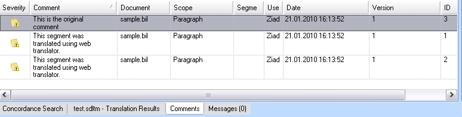

# Extracting Comments

Extract comments from a given BIL file and add them to the intermediary (SDLXliff) document.

## About Comments

A unit in a BIL file can contain one or more comments, for example:

# [Xml](#tab/tabid-1)
```xml
<comment>This segment was translated using web translator.</comment>
```

## Extend the Helper Function for Creating Paragraph Units

Add the following to the `CreateParagraphUnit()` helper function:

# [C#](#tab/tabid-2)
```cs
// extract comment (if applicable)
if(xmlUnit.SelectSingleNode("comment")!=null)
{
    paragraphUnit.Properties.Comments = CreateComment(xmlUnit.SelectSingleNode("comment").InnerText);
}
```

This condition checks whether a `comment` element exists in the unit and passes the comment text to a separate helper function.

The complete `CreateParagraphUnit()` helper function looks as follows:

# [C#](#tab/tabid-3)
```cs
// helper function for creating paragraph units
private IParagraphUnit CreateParagraphUnit(XmlNode xmlUnit)
{
    // create paragraph unit object
    IParagraphUnit paragraphUnit = ItemFactory.CreateParagraphUnit(LockTypeFlags.Unlocked);

    // create segment pair object
    ISegmentPairProperties segmentPairProperties = ItemFactory.CreateSegmentPairProperties();  
    // assign the appropriate confirmation level to the segment pair            
    segmentPairProperties.ConfirmationLevel=CreateConfirmationLevel(xmlUnit.Attributes["status"].Value);

    // add source segment to paragraph unit
    ISegment srcSegment = CreateSegment(xmlUnit.SelectSingleNode("source/seg"), segmentPairProperties);            
    paragraphUnit.Source.Add(srcSegment);

    // add target segment to paragraph unit if available
    if(xmlUnit.SelectSingleNode("target/seg") != null)            
    {
        ISegment trgSegment = CreateSegment(xmlUnit.SelectSingleNode("target/seg"), segmentPairProperties);
        paragraphUnit.Target.Add(trgSegment);
    }

    // create paragraph unit context
    string id = xmlUnit.SelectSingleNode("./@id").InnerText;
    if(xmlUnit.SelectSingleNode("type/@spec")!=null)
    {
        string spec = xmlUnit.SelectSingleNode("type/@spec").InnerText;
        paragraphUnit.Properties.Contexts=CreateContext(spec, id);
    }
    else
    {
        paragraphUnit.Properties.Contexts = CreateContext("Paragraph", id);
    }

    // extract comment (if applicable)
    if(xmlUnit.SelectSingleNode("comment")!=null)
    {
        paragraphUnit.Properties.Comments = CreateComment(xmlUnit.SelectSingleNode("comment").InnerText);
    }

    return paragraphUnit;
}
```

## Add a Helper Function for Generating Comments

The following helper function generates comments in the intermediary (SDLXliff) file. When generating a comment through the properties factory, provide these parameters:

- Comment text
- User who added the comment (this example uses a hard-coded string for simplicity)
- [Severity](../../api/filetypesupport/Sdl.FileTypeSupport.Framework.NativeApi.IComment.yml#Sdl_FileTypeSupport_Framework_NativeApi_IComment_Severity) level (set to `Medium`)

# [C#](#tab/tabid-4)
```cs
private ICommentProperties CreateComment(string commentText)
{
    ICommentProperties commentProperties = PropertiesFactory.CreateCommentProperties();
    IComment comment = PropertiesFactory.CreateComment(commentText, "SDK Sample", Severity.Medium);
    commentProperties.Add(comment);

    return commentProperties;
}
```

In Var:ProductName, comments appear in the **Comments** window. Double-click a comment to navigate directly to the corresponding paragraph unit or segment pair in the editor.



> [!NOTE]
> This content may be out-of-date. To check the latest information on this topic, inspect the libraries using the Visual Studio Object Browser.
