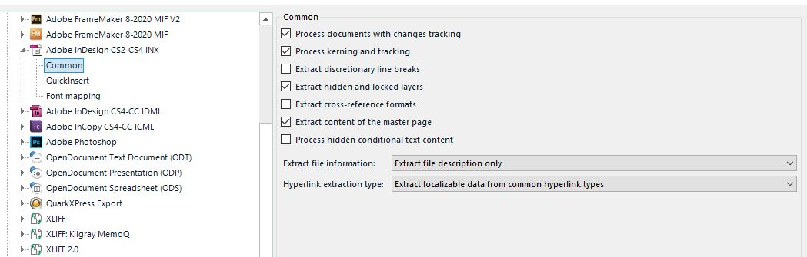

File type settings
=====
Each file format has its particular features, for example, MS PowerPoint files can contain speaker notes, which is a feature specific to this document format. Users may be required to translate speaker notes, or they may have to exclude them from translation, depending on the specific project requirements. A file type plug-in can be equipped with a special settings UI, which allows users to configure settings at runtime. That way, they can determine, for example, whether the file type plug-in should extract speaker notes text from the MS PowerPoint file and make them available for translation/editing in the intermediary format (e.g. SDL XLIFF) or not.

The more complex a file format is, the more likely it is to require the configuration of settings at runtime. Below are a few examples of file type settings used in Trados Studio 2017:

* Styles that should be treated as non-translatable in Microsoft Word files
* Extracting the document properties of Microsoft Word files for editing
* Extracting Web addresses found in an Adobe InDesign (INX) file for editing
* Extracting hidden conditional text found in an Adobe InDesign (INX) file for editing
etc.
If your file type plug-in processes a file format that might potentially require users to extract or hide certain content on a case-by-case basis, you need to implement a user interface that exposes the required settings, which can then be configured by the users at runtime. Below you see an example of a settings page for the standard Adobe InDesign (INX) file type plug-in currently used in Trados Studio 2017.

The settings page for the Adobe InDesign INX file type plug-in

The settings are initially persisted in the default Project Template **Default.sdltpl** file, when edited without a project being open. Under Windows Vista or 7, this is usually located at: c:\Users\UserName\Documents\SDL Trados Studio\Project Templates\Default.sdltpl (provided SDL Trados Studio 2017 is installed on your machine). A copy of these settings is made when a new project is created and the settings (for the open project) are then persisted in the project file (*.sdlproj)

For example, when you create a project with the name of, say, **Project 1**, the project file will be located at: c:\Users\UserName\Documents\SDL Trados Studio\Projects\Project 1\Project 1.sdlproj, assuming the default location for the project. The non-default settings for all file types will be stored in this project file (i.e. only settings which have been changed for file types are stored).

You can also export or import settings from the default template using the UI

There would be problems when a user tries to open an intermediary (SDL XLIFF) file which was generated by a file type plug-in whose binaries are not available on the machine on which the file is to be translated or edited. It would be possible to open the intermediary file and translate/edit it, however, it would not be possible to generate, for example, the native target file, previews, etc., because the binaries required to perform these functions are not accessible.