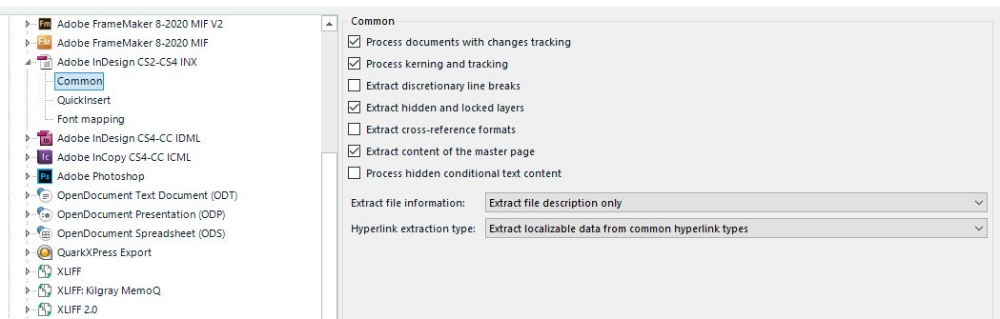

# File type settings

Many file formats include features that require configuration at runtime. For example, Microsoft PowerPoint files can contain speaker notes. Depending on the project requirements, users may need to translate those notes or exclude them from translation. A file type plug-in can provide a settings UI so users can decide how the plug-in handles that content in the intermediary format, such as SDLXliff.

## When to expose settings

The more complex a file format becomes, the more likely it needs runtime settings. Common examples in Var:ProductName include:

- Treating specific Word styles as non-translatable
- Extracting Word document properties for editing
- Extracting web addresses from Adobe InDesign (INX) files for editing
- Extracting hidden conditional text from Adobe InDesign (INX) files for editing

If your file type plug-in must let users extract or hide content on a case-by-case basis, provide a user interface for those settings. The standard Adobe InDesign (INX) file type plug-in in Var:ProductName uses this approach.

The settings page for the Adobe InDesign INX file type plug-in

## How settings are stored

When users edit settings without an open project, Var:ProductName stores them in the default project template, **Default.sdltpl**. By default, this file resides here:

*c:\Users\UserName\Documents\Var:StudioDocumentsFolderName\Project Templates\Default.sdltpl*

When a user creates a project, Var:ProductName copies the template settings into the project file. By default, the project file resides here:

*c:\Users\UserName\Documents\Var:StudioDocumentsFolderName\Projects\Project 1\Project 1.sdlproj*

The project file stores only file type settings that differ from the default template.

You can also import or export settings through the UI.

## Dependency requirements

If a user opens an intermediary SDLXliff file that a file type plug-in created, the machine must have the plug-in binaries installed. Without those binaries, users can still open and edit the intermediary file, but they cannot generate the native target file or previews.

## See also

- [Implementing the Settings UI](implementing_the_settings_ui.md)
- [Implementing the UI Controller Class](implementing_the_ui_controller_class.md)
