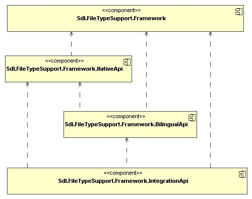

# File Type Support Framework overview

The `Var:ProductName` File Type Support Framework 2 API is a core part of `Var:ProductName`. It lets developers build file type plug-ins that extract translatable text from formats such as Microsoft Word, HTML, XML, and plain text. The framework then converts the extracted source text, and optionally target text, into an intermediate bilingual format that is compatible with OASIS XLIFF and extended by [SDLXliff](#sdlxliff).

This intermediate format stores source and target text together with markup and tags discovered by the file filter. Tags can be paired tags or placeholder tags, which translators can move, delete, or clone when appropriate. The format can also contain structure tags that represent fixed, non-translatable elements from the original file and must remain intact. Other applications, such as the editor and translation memory subsystems, also use this framework to read and update the same structures.

The core APIs of the File Type Support Framework are provided by the following `Var:DotNetVersion` assemblies:

The following list summarizes each assembly:

* [Sdl.FileTypeSupport.Framework](../../api/filetypesupport/Sdl.FileTypeSupport.Framework.yml): Provides the basic data types shared across all modules, such as the `FrameworkException` base class and the `Language` and `Codepage` classes.
* [Sdl.FileTypeSupport.Framework.NativeApi](../../api/filetypesupport/Sdl.FileTypeSupport.Framework.NativeApi.yml): Provides the interfaces required to build file type plug-in components that convert native files into streams of localizable content, such as tags and text. It also includes abstract base classes and helper types for implementations.
* [Sdl.FileTypeSupport.Framework.BilingualApi](../../api/filetypesupport/Sdl.FileTypeSupport.Framework.BilingualApi.yml): Provides the interfaces for the bilingual object model and for components that operate on that model. It also includes abstract base classes and helper types.
* [Sdl.FileTypeSupport.Framework.IntegrationApi](../../api/filetypesupport/Sdl.FileTypeSupport.Framework.IntegrationApi.yml): Provides the interfaces that expose File Type Support Framework functionality to integrating applications.

# Native and bilingual content

Depending on the conversion phase, the framework can process filtered content in two ways:

* As a stream of monolingual native content items, such as tags and text.
* As bilingual content in an object model that contains source and target language content and is delivered as a stream of paragraph units.

Native components read and write content in a single language, either source or target, from and to the original native file format. They also perform related preprocessing and postprocessing tasks.

The bilingual content model supports processing during localization. In this model, the framework can associate localization-specific information directly with the content, including segment boundaries, word counts, and translation memory matches.

Specialized converters handle the transition between native and bilingual processing. Converting from native to bilingual content builds source-language paragraph units from the content stream. Converting from bilingual back to native content turns source- or target-language annotated data into a content stream.

# File type plug-in

A file type plug-in is a set of components that work together on native documents. A **File Type Component Builder** defines which components are used for each task and how they are connected.

A file type plug-in typically performs the following actions:

* Reading the native file content and converting it into the source language representation of a bilingual content model, which can then be processed for translation (extraction).
* Converting back the source or target language of a bilingual content model into the source or target language version of the original (native) file type (generation).

These processing paths can be combined when converting to and from the original file type. The File Type Component Builder specifies which native and bilingual components are applied during conversion. When the framework reads a native file, it applies native processing components before bilingual components. When it converts bilingual content back to native format, it applies bilingual components before native components.

# Bilingual file formats

The framework can also read and write data stored in bilingual formats. It treats bilingual file types like any other file type, but processes their data directly in the bilingual content model.

By building file type plug-ins for bilingual formats, you can support formats such as partially translated TTX, ITD, BIF, Workbench RTF, generic XLIFF, or custom formats used to store multilingual content.

At the time of writing, standard file type plug-ins are available for TTX, ITD, and XLIFF.

The framework also uses a default bilingual file format to serialize the full bilingual content model during localization.

# SDLXliff

This file format is fully based on, and compliant with, the OASIS XLIFF 1.2 standard. SDLXliff can store all metadata available in the File Type Support Framework bilingual content model. It uses standard XLIFF constructs whenever possible and valid XLIFF extension points when it needs to store additional information.

The SDL extensions to the XLIFF 1.2 schema are defined in a separate schema file. The framework embeds that schema as a resource in the assembly and uses it to validate XLIFF files when the file type plug-in enables validation.

The SDLXliff file type plug-in is defined in the `Sdl.FileTypeSupport.Bilingual.SdlXliff` assembly. The framework treats it like any other file type plug-in, so applications should not need to reference this assembly directly.

>[!NOTE]
>
> This content may be out-of-date. To check the latest information on this topic, inspect the libraries using the Visual Studio Object Browser.

