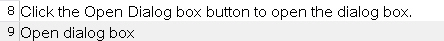
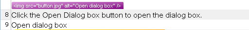

# Handling Tags During Segmentation

Learn how to process tags that appear at the beginning or end of a segment.

## Change the Way Segmentation Treats Tags

Tags such as **IMG** may appear at the front or after a segment. When a tag is leading or trailing, you should display as few tags as possible to keep the editor view clean. By default, `Var:ProductName` hides leading and trailing tags in the editor, but displays the segment content.

For example, this leading **IMG** tag would not display in the editor view, but the sub-segment content would:

# [HTML](#tab/tabid-1)
```html
 Click the Open Dialog box button to open the dialog box.
```

Output in the `Var:ProductName` editor:



To display all content, select **All content** from the **Display** dropdown list. The leading tag then appears in a separate row:



You can change this default behavior using the [SegmentationHint](../../api/filetypesupport/Sdl.FileTypeSupport.Framework.NativeApi.IStartTagProperties.yml#Sdl_FileTypeSupport_Framework_NativeApi_IStartTagProperties_SegmentationHint) property on the placeable properties object. By default, this property is set to [Undefined](../../api/filetypesupport/Sdl.FileTypeSupport.Framework.NativeApi.SegmentationHint.yml#fields), which applies the default segmentation behavior: leading and trailing tags remain hidden. `Var:ProductName` minimizes tag display to be more translator-friendly.

Set the segmentation hint property to [Include](../../api/filetypesupport/Sdl.FileTypeSupport.Framework.NativeApi.SegmentationHint.yml#fields) to ensure tags display in the same segment as the text:

# [C#](#tab/tabid-2)
```cs
placeProperties.SegmentationHint = SegmentationHint.Include;
```

You can also use [IncludeWithText](../../api/filetypesupport/Sdl.FileTypeSupport.Framework.NativeApi.SegmentationHint.yml#fields), which shows tags only if they contain localizable text. For example, the **IMG** tag displays if it has localizable text in the **ALT** property, but hides if the **ALT** attribute is missing.

## See Also

- [Processing Placeholder Tags](processing_placeholder_tags.md)

> [!NOTE]
> This content may be out-of-date. To check the latest information on this topic, inspect the libraries using the Visual Studio Object Browser.

