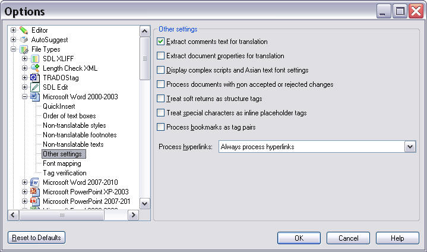
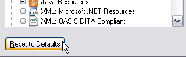

# Implement the UI Controller Class

Implement a class that controls the actual plug-in user interface.

## Settings Page Scenarios

A settings page for the plug-in user interface must handle these scenarios:

- The user clicks **Reset to Defaults**, restoring all control elements to their default settings
- The user clicks **OK**, saving the settings
- The user navigates to another settings page, which should save changes to form control elements
- The user clicks **Cancel**, discarding all changes to control settings

The settings page does not implement its own **OK**, **Cancel**, or **Reset** buttons. Instead, it uses the control elements provided by the framework's dialog box.

Below is an example of a settings page as implemented for a default file type in `Var:ProductName`:



## Implement the Settings Page Class

Add a class called, for example, **SettingsPage.cs** to your project. This class is referenced from the File Type Component Builder file (see [Create a New File Type Component Builder](create_new_file_type_component_builder.md)). It is not the UI class itself that is referenced. Without this reference, the plug-in UI would not be recognized or displayed by `Var:ProductName`.

This class acts as an intermediary between the plug-in UI (see [Implement the User Interface](implement_the_user_interface_bil.md)) and the class that stores and retrieves settings to/from the settings bundle (see [Loading and Saving the Settings](loading_and_saving_the_settings_bil.md)).

This class requires the following namespaces:

- `Sdl.FileTypeSupport.Framework.Core.Settings`
- `Sdl.Core.Settings`
- `Sdl.Core.PluginFramework`

This component must derive from the `AbstractFileTypeSettingsPage` class, which provides methods for setting the plug-in UI according to the settings class values.

## Reset to Default Settings

The `ResetToDefaults` method is triggered when the user clicks **Reset to Defaults** in the user interface:



Override this method to call the base class to ensure settings reset correctly, then update the UI:

# [C#](#tab/tabid-1)
```cs
public override void ResetToDefaults()
{
    base.ResetToDefaults();
    Control.UpdateControl();
}
```

## Reload the Settings

When the user navigates back to the plug-in settings page, ensure the plug-in UI displays the most up-to-date settings from the settings bundle. Override the `Refresh` method to call the base class first to ensure settings reload correctly, then update the UI:

# [C#](#tab/tabid-2)
```cs
public override void Refresh()
{
    base.Refresh();
    Control.UpdateControl();
}
```

## Declare the Class in the File Type Component Builder

To make the plug-in settings UI visible in `Var:ProductName`, the File Type Component Builder file must include the settings page IDs. Open the **.sdlfiletype** file in a text editor, search for `WinFormSettingsPageIds`, and add the node to the list:


# [Xml](#tab/tabid-3)
```xml
<property name="WinFormSettingsPageIds">
  <list>
      <value>SimpleText_Settings</value>
        <value>QuickInserts_Settings</value>
    </list>
</property>
```

## Putting It All Together

The complete class should now look as follows:

# [C#](#tab/tabid-4)
```cs
using System;
using System.Collections.Generic;
using System.Linq;
using System.Text;
using Sdl.Core.Settings;
using Sdl.FileTypeSupport.Framework.Core.Settings;

namespace Sdk.FileTypeSupport.Samples.WordArtVerifier
{
    /// <summary>
    /// This class controls the plug-in user interface. It controls what happens when the user
    /// clicks the button to reset control elements to their default values. This class is referenced
    /// in the file type definition. Without this reference in the SDLFILETYPE file, the plug-in
    /// user interface would not be available to the end user.
    /// </summary>
    [FileTypeSettingsPage(Id="WordArtVerifier_Settings", Name="Settings_Name",
        Description="Settings_Description")]
    class SettingsPage : AbstractFileTypeSettingsPage<SettingsUI, VerifierSettings>
    {
        /// <summary>
        /// Triggered when the user clicks the Reset to Defaults button in Trados Studio.
        /// Restores the default check box state (verification enabled) and the default
        /// maximum word count, which is 3.
        /// </summary>
        public override void ResetToDefaults()
        {
            base.ResetToDefaults();
            Control.UpdateControl();
        }

        /// <summary>
        /// Triggered when the user opens the plug-in UI. The controls (the check box and the
        /// maximum word count text field) are set according to the values stored in the
        /// settings bundle.
        /// </summary>
        public override void Refresh()
        {
            base.Refresh();
            Control.UpdateControl();
        }
    }
}
```

## See Also

- [Implement the User Interface](implement_the_user_interface_bil.md)
- [Loading and Saving the Settings](loading_and_saving_the_settings_bil.md)

> [!NOTE]
> This content may be out-of-date. To check the latest information on this topic, inspect the libraries using the Visual Studio Object Browser.
