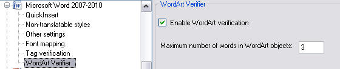

# Implement the User Interface

Add a user interface to your plug-in through which end users can configure verification settings at runtime.

## Add a User Control

Implement the graphical user interface by adding a user control, for example **SettingsUI.cs**. This is the interface users see when configuring the file type plug-in in `Var:ProductName` through **File** > **Options** > **File Types**. Our simple bilingual verifier implements two settings:

- Enable or disable the word count check
- Specify the maximum number of words

Add a check box named `cb_CheckWordArt` to the user control. Also add a text field control named `txt_MaxWordCount` where users enter the maximum number of words allowed for WordArt objects. Set the default value to 3.

The user control should look as follows:



Switch to the code view of your user control. Your class requires this namespace:

- `Sdl.FileTypeSupport.Framework.Core.Settings`

## The Settings Bundle

Each plug-in uses a settings bundle to store and retrieve settings. A separate class called `VerifierSettings` handles this mechanism (see [Loading and Saving the Settings](loading_and_saving_the_settings_bil.md)). Create an object based on the `VerifierSettings` class to access the plug-in properties:

# [C#](#tab/tabid-1)
```cs
VerifierSettings _settings;
```

## Initialize the Plug-in User Interface

When the user opens the plug-in user interface, set the control element according to what is stored in the settings bundle. Use the `_settings` object (declared previously) to handle this:

# [C#](#tab/tabid-2)
```cs
public VerifierSettings Settings
{
    get
    {
        return _settings;
    }
    set
    {
        _settings = value;
        UpdateControl();
    }
}
```

During initialization, the `UpdateControl` method is invoked. It sets the check box state (checked or unchecked) to the value of the `CheckWordArt` member in the `VerifierSettings` class. It also retrieves the other setting, the maximum word count (`MaxWordCount`):

# [C#](#tab/tabid-3)
```cs
public void UpdateControl()
{
    cb_CheckWordArt.Checked = _settings.CheckWordArt;
    txt_MaxWordCount.Text = _settings.MaxWordCount.ToString();
}
```

## Save the Settings to the Settings Bundle

When the user opens the plug-in UI, changes the check box setting, and clicks **OK**, save the setting to the settings bundle.

The first setting to save is the check box state (checked or unchecked). The `CheckWordArt` property is set to True or False according to the check box:

# [C#](#tab/tabid-4)
```cs
private void cb_CheckWordArt_CheckedChanged(object sender, EventArgs e)
{
    _settings.CheckWordArt = cb_CheckWordArt.Checked;
}
```

The second setting is the maximum word count, entered into the UI as a string. Convert the text value to an integer and set the `MaxWordCount` property of the `VerifierSettings` class if the value is greater than zero:

# [C#](#tab/tabid-5)
```cs
private void txt_MaxWordCount_TextChanged(object sender, EventArgs e)
{
    int tempvalue = 0;
    Int32.TryParse(txt_MaxWordCount.Text, out tempvalue);
    if (tempvalue > 0)
    {
        _settings.MaxWordCount = tempvalue;
    }
}
```

## Putting It All Together

The complete class should look as follows:

# [C#](#tab/tabid-6)
```cs
using System;
using System.Collections.Generic;
using System.ComponentModel;
using System.Drawing;
using System.Data;
using System.Linq;
using System.Text;
using System.Windows.Forms;
using Sdl.FileTypeSupport.Framework.Core.Settings;

namespace Sdk.FileTypeSupport.Samples.WordArtVerifier
{
    /// <summary>
    /// Implements the user interface through which the verification plug-in settings are
    /// configured: the maximum word count and enabling/disabling verification.
    /// </summary>
    public partial class SettingsUI : UserControl, IFileTypeSettingsAware<VerifierSettings>
    {
        /// <summary>
        /// Create a settings object based on the VerifierSettings class. 
        /// </summary>
        VerifierSettings _settings;

        /// <summary>
        /// Initialize the user interface control by setting it to the value
        /// stored in the settings bundle.
        /// </summary>
        public SettingsUI()
        {
            InitializeComponent();
        }

        /// <summary>
        /// Reset the user interface control to its default value: checked,
        /// which enables verification functionality by default.
        /// </summary>
        public void UpdateControl()
        {
            cb_CheckWordArt.Checked = _settings.CheckWordArt;
            txt_MaxWordCount.Text = _settings.MaxWordCount.ToString();
        }

        /// <summary>
        /// Save the settings based on the check box value. The setting is saved through
        /// the VerifierSettings class, which handles the plug-in settings bundle.
        /// </summary>
        /// <param name="sender"></param>
        /// <param name="e"></param>
        private void cb_CheckWordArt_CheckedChanged(object sender, EventArgs e)
        {
            _settings.CheckWordArt = cb_CheckWordArt.Checked;
        }

        /// <summary>
        /// Save the settings based on the maximum word count text field value. Note that the
        /// word count is a string value that must be converted to an integer. The setting is
        /// saved through the VerifierSettings class, which handles the plug-in settings bundle.
        /// </summary>
        /// <param name="sender"></param>
        /// <param name="e"></param>
        private void txt_MaxWordCount_TextChanged(object sender, EventArgs e)
        {
            int tempvalue = 0;
            Int32.TryParse(txt_MaxWordCount.Text, out tempvalue);
            if (tempvalue > 0)
            {
                _settings.MaxWordCount = tempvalue;
            }
        }

        /// <summary>
        /// Implementation of IFileTypeSettingsAware allowing the Filter Framework
        /// to pass through the user settings so that we can initialize the UI.
        /// </summary>
        public VerifierSettings Settings
        {
            get
            {
                return _settings;
            }
            set
            {
                _settings = value;
                UpdateControl();
            }
        }
    }
}
```

## See Also

- [Implement the UI Controller Class](implement_the_ui_controller_class_bil.md)
- [Loading and Saving the Settings](loading_and_saving_the_settings_bil.md)

> [!NOTE]
> This content may be out-of-date. To check the latest information on this topic, inspect the libraries using the Visual Studio Object Browser.
