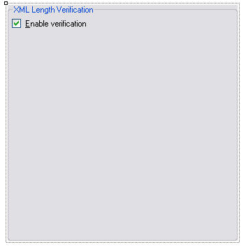

Implement the User Interface
==

In this chapter you will learn how to implement the user interface of your verification plug-in.

Add a User Control
--

Implement the graphical user interface by adding a user control, which you can name, e.g. **SettingsUI.cs**. This is the interface that users will see when configuring the file type plug-in in <Var:ProductName> through, e.g. **Tools** > **Options** > **File Types**. Our simple native verifier will only implement one setting, through which users can configure whether to enable the verification function or to disable it. Therefore, you only need to add one check box to the user control, which we call ```cb_Enabled```.

The user interface should look as shown below:



Next, switch to the code view of your newly added user control. This class needs to use the following namespace:

* **Sdl.FileTypeSupport.Framework.Core.Settings**

The Settings Bundle
--

Each plug-in uses a settings bundle to store and retrieve settings. The mechanism for doing that is provided in a separate class called ```VerifierSettings```, which we will implement later (see [Loading and Saving the Settings](loading_and_saving_the_settings_native.md)). Within the controller UI component, we need to create an object based on the ```VerifierSettings``` class:

```cs
VerifierSettings _settings;
```

Initialize the Plug-in User Interface
--

When the user raises the plug-in user interface, the control element should be set according to what is stored in the settings bundle, which is handled through the ```_settings``` object (which we declared previously).

```cs
public VerifierSettings Settings
{
    get
    {
        return _settings;
    }
    set
    {
        _settings = value;
        UpdateControl();
    }
}
```


During initialization the UpdateControl method is invoked, which sets the state of the check box (checked or unchecked) to the value of the ```Enabled``` member of the ```VerifierSettings``` class as shown below:


```cs
public void UpdateControl()
{
    cb_Enable.Checked = _settings.Enable;
}
```

Save the Settings to the Settings Bundle
--

Conversely, the user interface needs to save the check box setting to the settings bundle, e.g. when the user raises the plug-in UI, changes the check box setting, and then clicks **OK** to apply the changed setting to the settings bundle:


```cs
private void cb_Enable_CheckedChanged(object sender, EventArgs e)
{
    _settings.Enable = cb_Enable.Checked;
}
```
Putting it all Together
--

If you put it all together, the ```SettingsUI``` class should look as shown below:

```cs
using System;
using System.Collections.Generic;
using System.ComponentModel;
using System.Drawing;
using System.Data;
using System.Linq;
using System.Text;
using System.Windows.Forms;
using Sdl.FileTypeSupport.Framework.Core.Settings;

namespace Sdl.Sdk.FileTypeSupport.Samples.XMLChecker
{
    /// <summary>
    /// Implements the user interface through which the verification plug-in can be enabled or disabled.
    /// </summary>
    #region ClassDeclaration
    public partial class SettingsUI : UserControl, IFileTypeSettingsAware<VerifierSettings>
    #endregion
    {
        /// <summary>
        /// Create a settings object based on the VerifierSettings class. 
        /// </summary>
        #region "SettingsObject"
        VerifierSettings _settings;
        #endregion 

        /// <summary>
        /// Initalize the user interface control by setting it to the
        /// setting value stored in the settings bundle.
        /// </summary>
        public SettingsUI()
        {
            InitializeComponent();
        }

        /// <summary>
        /// Reset the user interface control to its default value, which is
        /// checked, i.e. the verification functionality should be enabled
        /// by default.
        /// </summary>
        #region "UpdateControl"
        public void UpdateControl()
        {
            cb_Enable.Checked = _settings.Enable;
        }
        #endregion

        /// <summary>
        /// Save the settings based on the value of the the check box.
        /// The setting is saved through the VerifierSettings class, which
        /// handles the plug-in settings bundle.
        /// </summary>
        /// <param name="sender"></param>
        /// <param name="e"></param>
        #region "SaveSetting"
        private void cb_Enable_CheckedChanged(object sender, EventArgs e)
        {
            _settings.Enable = cb_Enable.Checked;
        }
        #endregion

        #region "Initialize"
        public VerifierSettings Settings
        {
            get
            {
                return _settings;
            }
            set
            {
                _settings = value;
                UpdateControl();
            }
        }
        #endregion
    }
}
```

See Also
--

**Other Resources**

[Implement the UI Controller Class](implement_the_ui_controller_class_native.md)

[Loading and Saving the Settings](loading_and_saving_the_settings_native.md)

>**NOTE**
>
> This content may be out-of-date. To check the latest information on this topic, inspect the libraries using the Visual Studio Object Browser.