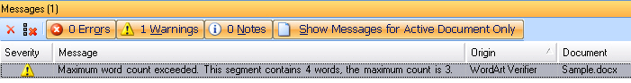

# Implement the Verification Logic

Implement the actual verification logic of the bilingual verification plug-in.

## Add the Main Verifier Class

Start by adding a class called, for example, **VerifierMain.cs** to your project. The class requires the following namespaces:

- `Sdl.FileTypeSupport.Framework.NativeApi`
- `Sdl.FileTypeSupport.Framework.BilingualApi` — Provides access to functionality for processing bilingual documents
- `Sdl.FileTypeSupport.Framework.IntegrationApi`
- `Sdl.Core.Settings` — Provides programmatic access to settings bundles

Your class must implement these interfaces:

- [IBilingualVerifier](../../api/filetypesupport/Sdl.FileTypeSupport.Framework.BilingualApi.IBilingualVerifier.yml) — Provides methods for handling bilingual documents
- [ISettingsAware](../../api/filetypesupport/Sdl.FileTypeSupport.Framework.IntegrationApi.ISettingsAware.yml) — Provides functionality for initializing plug-in settings

Add the following boolean and integer properties. These programmatically represent the plug-in settings, which are set by the class implemented previously (see [Loading and Saving the Settings](loading_and_saving_the_settings_bil.md)):

# [C#](#tab/tabid-1)
```cs
public bool CheckWordArt
{
    get;
    set;
}

public int MaxWordCount
{
    get;
    set;
}
```

## Initialize Settings

Implement the `InitializeSettings` method of the `ISettingsAware` interface. Call the `VerifierSettings` class and use the `PopulateFromSettingsBundle` method to retrieve the setting from the stored settings bundle. Provide the settings bundle object and the file type ID (here *Word 2007 v 2.0.0.0 WordArt Verifier*) as parameters. *Word 2007 v 2.0.0.0 WordArt Verifier* is the file type ID of the new file type that you will create (see [Create a New File Type Component Builder](create_new_file_type_component_builder.md)). The `CheckWordArt` and `MaxWordCount` properties are then set according to the values retrieved from the settings bundle:

# [C#](#tab/tabid-2)
```cs
public void InitializeSettings(ISettingsBundle settingsBundle, string configurationId)
{
    VerifierSettings _settings = new VerifierSettings();
    _settings.PopulateFromSettingsBundle(settingsBundle, "Word 2007 v 2.0.0.0 WordArt Verifier");
    CheckWordArt = _settings.CheckWordArt;
    MaxWordCount = _settings.MaxWordCount;
}
```

## Provide Access to the Verification Message Reporting Functionality

When your verifier finds errors, notify the user. Add the following message reporter member to your class:

# [C#](#tab/tabid-3)
```cs
public IBilingualContentMessageReporter MessageReporter
{
    get;
    set;
}
```

The [ReportMessage](../../api/filetypesupport/Sdl.FileTypeSupport.Framework.BilingualApi.IBilingualContentMessageReporter.yml#Sdl_FileTypeSupport_Framework_BilingualApi_IBilingualContentMessageReporter_ReportMessage_System_Object_System_String_Sdl_FileTypeSupport_Framework_NativeApi_ErrorLevel_System_String_Sdl_FileTypeSupport_Framework_BilingualApi_TextLocation_Sdl_FileTypeSupport_Framework_BilingualApi_TextLocation_) method adds error messages to the **Messages** window of `Var:ProductName`.

## Provide Access to the Item Factory

The item factory allows you to create structure tags, placeholders, and other elements. Since our verifier only checks the number of words in WordArt objects, this functionality is not necessary. However, you must add this member because the [IBilingualVerifier](../../api/filetypesupport/Sdl.FileTypeSupport.Framework.BilingualApi.IBilingualVerifier.yml) interface requires it:

# [C#](#tab/tabid-4)
```cs
public IDocumentItemFactory ItemFactory
{
    get;
    set;
}
```

## Add the Initialize Method

Add the `Initialize` method, which retrieves various information about the verified document such as source and target language, source count, and repetition count. Our verification logic does not require this information, but it must be added according to the [IBilingualVerifier](../../api/filetypesupport/Sdl.FileTypeSupport.Framework.BilingualApi.IBilingualVerifier.yml) interface:

# [C#](#tab/tabid-5)
```cs
public void Initialize(IDocumentProperties documentInfo)           
{
    // Through the document properties you can access information that is
    // common to ALL bilingual files in a master bilingual document, e.g. the
    // source/target language, the repetition/source count, etc.
    // This is not required for this implementation.
}
```

## Add the File and Process Complete Members

Add the following members as required by the [IBilingualVerifier](../../api/filetypesupport/Sdl.FileTypeSupport.Framework.BilingualApi.IBilingualVerifier.yml) interface, although they are not required for your plug-in's functionality. `Var:ProductName` allows you to merge several documents into one bilingual (SDLXliff) master file (see [Merging files](merging_files.md)). Use `FileComplete` to perform an action after verifying each merged file. Use `Complete` when verification of the entire bilingual document finishes:

# [C#](#tab/tabid-6)
```cs
/// <summary>
/// These members of the IBilingualContentHandler interface are not used in this
/// implementation.
/// </summary>
public void Complete()
{
    // Controls what happens when the whole verification process is complete.
}

public void FileComplete()
{
    // Controls what happens when the whole verification process for one single file is complete.
}

public void SetFileProperties(IFileProperties fileInfo)
{
    // A bilingual document can potentially be a master document that contains
    // a number of single (smaller) bilingual documents.
    // The File Info object can be used to access properties of a particular bilingual file 
    // in a bilingual document, such as the file type definition id, the creation tool.
    // This information can differ from bilingual file to bilingual file, as each single
    // bilingual file might have been created using different file types, e.g. one bilingual
    // file was derived from a PPT document, another one from a DOC file.
    // This is not required for this implementation.
}
```

## Traverse the Paragraph Units

The `ProcessParagraphUnit()` method loops through the paragraph units in the intermediary (SDLXliff) file. Determine whether verification should apply to each paragraph unit. Verification applies only to segments from WordArt objects.

If the `CheckWordArt` property (set by the user through the UI) is not True, skip verification. Otherwise, traverse the segment pairs of the current paragraph unit.

Use an `if` condition to determine whether the current paragraph unit contains context information (context count > 0). If it does, determine the display code of the current context. **TAG** is the display code used for WordArt objects.

If the display code equals **TAG** and the context description contains the string "wordart", call the helper function `CheckWordCount` (added in the next step):

# [C#](#tab/tabid-7)
```cs
public void ProcessParagraphUnit(IParagraphUnit paragraphUnit)
{
    if (!CheckWordArt)
    {
        return;
    }

    foreach (ISegmentPair segmentPair in paragraphUnit.SegmentPairs)
    {
        // Four conditions must be met before the word count check is done:
        // 1. The current segment needs context information (context count > 0)
        // 2. The display code of the first context information unit is 'TAG'
        // 3. The context description contains the string 'wordart'
        // 4. The target segment is not empty
        if (paragraphUnit.Properties.Contexts.Contexts.Count > 0 &&
            paragraphUnit.Properties.Contexts.Contexts[0].DisplayCode == "TAG" &&
            paragraphUnit.Properties.Contexts.Contexts[0].Description.Contains("wordart") &&
            segmentPair.Target.ToString()!="")
        {
            CheckWordCount(segmentPair.Target);
        }
    }
}
```

## Carry Out the Actual Word Count Verification

Add the following helper function to check whether the target segment contains more than the maximum allowed number of words. This simplified implementation:

- Loops through the target segment string and counts spaces
- Calculates the word count as spaces + 1

Note: This implementation does not check for non-breaking spaces, hyphens, or other word separators, which you might need in a production implementation. If the word count exceeds the maximum, a warning message is added to the **Messages** window of `Var:ProductName`. When the translator confirms a WordArt translation that exceeds the maximum word count, a yellow warning icon displays next to the segment.

The `ReportMessage` method takes these parameters:

- The name of the verifier plug-in that reports the message
- The [ErrorLevel](../../api/filetypesupport/Sdl.FileTypeSupport.Framework.NativeApi.ErrorLevel.yml), set to [Warning](../../api/filetypesupport/Sdl.FileTypeSupport.Framework.NativeApi.ErrorLevel.yml#fields). Exceeding the word count is not critical because it does not prevent generating a valid Microsoft Word target file. It prompts the translator to reconsider the translation and shorten it.
- A detailed description to help users understand why the segment was flagged and take corrective action (shorten the translation)
- The start and end location of the target string that caused the problem. By specifying the 'from' and 'up to' locations, users can jump to the faulty target segment in the document by double-clicking the error message in the **Messages** window of `Var:ProductName`

# [C#](#tab/tabid-8)
```cs
private void CheckWordCount(ISegment targetSegment)
{
    int pos = 0, count = 0;
    char c = ' ';

    while ((pos = targetSegment.ToString().IndexOf(c, pos)) != -1)
    {
        count++;
        pos++;
    }
    count++;

    if (count > MaxWordCount)
    {
        MessageReporter.ReportMessage(this, Resources.Plugin_Name, ErrorLevel.Warning, 
            String.Format(Resources.MsgWordCountExceeded, count, MaxWordCount),
            new TextLocation(new Location(targetSegment, true), 0),
            new TextLocation(new Location(targetSegment,false), targetSegment.ToString().Length-1));
    }
}
```



## Putting It All Together

The complete verification class should look as follows:

# [C#](#tab/tabid-9)
```cs
using System;
using System.Collections.Generic;
using System.Linq;
using System.Text;
using Sdl.Core.Settings;
using Sdl.FileTypeSupport.Framework.NativeApi;
using Sdl.FileTypeSupport.Framework.BilingualApi;
using Sdl.FileTypeSupport.Framework.IntegrationApi;

namespace Sdk.FileTypeSupport.Samples.WordArtVerifier
{
    class VerifierMain : IBilingualVerifier, ISettingsAware
    {
        /// <summary>
        /// These properties provide access to the two plug-in settings.
        /// </summary>
        public bool CheckWordArt
        {
            get;
            set;
        }

        public int MaxWordCount
        {
            get;
            set;
        }

        /// <summary>
        /// Initializes the plug-in settings, so that they can be used during the actual verification.
        /// </summary>
        /// <param name="settingsBundle"></param>
        /// <param name="configurationId"></param>
        public void InitializeSettings(ISettingsBundle settingsBundle, string configurationId)
        {
            VerifierSettings _settings = new VerifierSettings();
            _settings.PopulateFromSettingsBundle(settingsBundle, "Word 2007 v 2.0.0.0 WordArt Verifier");
            CheckWordArt = _settings.CheckWordArt;
            MaxWordCount = _settings.MaxWordCount;
        }

        /// <summary>
        /// Provides access to the message reporter, which is responsible for 
        /// outputting any messages in the user interface of Trados Studio.
        /// </summary>
        public IBilingualContentMessageReporter MessageReporter
        {
            get;
            set;
        }

        /// <summary>
        /// Not required in this implementation. Provides access to elements
        /// such as tags, placeholders, etc.
        /// </summary>
        public IDocumentItemFactory ItemFactory
        {
            get;
            set;
        }

        /// <summary>
        /// These members of the IBilingualContentHandler interface are not used in this
        /// implementation.
        /// </summary>
        public void Complete()
        {
            // Controls what happens when the whole verification process is complete.
        }

        public void FileComplete()
        {
            // Controls what happens when the whole verification process for one single file is complete.
        }

        public void SetFileProperties(IFileProperties fileInfo)
        {
            // A bilingual document can potentially be a master document that contains
            // a number of single (smaller) bilingual documents.
            // The File Info object can be used to access properties of a particular bilingual file 
            // in a bilingual document, such as the file type definition id, the creation tool.
            // This information can differ from bilingual file to bilingual file, as each single
            // bilingual file might have been created using different file types, e.g. one bilingual
            // file was derived from a PPT document, another one from a DOC file.
            // This is not required for this implementation.
        }

        public void Initialize(IDocumentProperties documentInfo)           
        {
            // Through the document properties you can access information that is
            // common to ALL bilingual files in a master bilingual document, e.g. the
            // source/target language, the repetition/source count, etc.
            // This is not required for this implementation.
        }

        /// <summary>
        /// This method implements the actual verification logic.
        /// If CheckWordArt is true, the method loops through all segment pairs and 
        /// determines whether they have context information. If true and if the display code
        /// equals 'TAG' (WordArt), a separate helper function checks the word count.
        /// </summary>
        /// <param name="paragraphUnit"></param>
        public void ProcessParagraphUnit(IParagraphUnit paragraphUnit)
        {
            if (!CheckWordArt)
            {
                return;
            }

            foreach (ISegmentPair segmentPair in paragraphUnit.SegmentPairs)
            {
                // Four conditions must be met before the word count check is done:
                // 1. The current segment needs context information (context count > 0)
                // 2. The display code of the first context information unit is 'TAG'
                // 3. The context description contains the string 'wordart'
                // 4. The target segment is not empty
                if (paragraphUnit.Properties.Contexts.Contexts.Count > 0 &&
                    paragraphUnit.Properties.Contexts.Contexts[0].DisplayCode == "TAG" &&
                    paragraphUnit.Properties.Contexts.Contexts[0].Description.Contains("wordart") &&
                    segmentPair.Target.ToString()!="")
                {
                    CheckWordCount(segmentPair.Target);
                }
            }
        }

        /// <summary>
        /// Helper function that counts the words in the current target segment.
        /// If the word count (number of spaces + 1) exceeds the maximum count set through
        /// the properties, a message is added to the Messages window of Trados Studio.
        /// </summary>
        /// <param name="targetSegment"></param>
        private void CheckWordCount(ISegment targetSegment)
        {
            int pos = 0, count = 0;
            char c = ' ';

            while ((pos = targetSegment.ToString().IndexOf(c, pos)) != -1)
            {
                count++;
                pos++;
            }
            count++;

            if (count > MaxWordCount)
            {
                MessageReporter.ReportMessage(this, Resources.Plugin_Name, ErrorLevel.Warning, 
                    String.Format(Resources.MsgWordCountExceeded, count, MaxWordCount),
                    new TextLocation(new Location(targetSegment, true), 0),
                    new TextLocation(new Location(targetSegment,false), targetSegment.ToString().Length-1));
            }
        }
    }
}
```

## Using the Main Verifier Class

To use this verifier, create a new file type definition based on the Microsoft Word 2007 file type definition (see [Create a New File Type Component Builder](create_new_file_type_component_builder.md)).

> [!NOTE]
> This content may be out-of-date. To check the latest information on this topic, inspect the libraries using the Visual Studio Object Browser.
