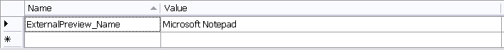
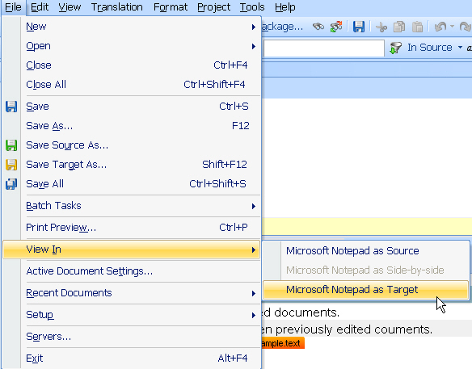

# Implementing an External File Preview

This section explains how to add a simple document preview that uses Windows Notepad.

## Extend the File Type Component Builder

Enable the file type plug-in to generate an ad-hoc preview in an external application. This lets users view the file in its native format.

For example, when users preview DOC files, Var:ProductName launches Microsoft Word as the external preview application. Because this sample uses a simple text format, Notepad works well as the external preview application.

The sample file type plug-in already contains the logic required to generate an external preview. The file writer class that you created in the previous chapter provides that logic. See [Implementing the File Writer](implementing_the_file_writer.md). To enable the preview, register the external preview application in the File Type Component Builder.

First, add the name of the preview application to the resource file in your project properties. Users will see this name when they access the external preview command in Var:ProductName.



Now add the following method to the File Type Component Builder. The example references the external preview application name from resources. It also enables the external preview for both source and target content.

# [C#](#tab/tabid-1)
```cs
IPreviewSet externalPreviewSet = previewFactory.CreatePreviewSet();
externalPreviewSet.Id = new PreviewSetId("ExternalPreview");
externalPreviewSet.Name = new LocalizableString(Resources.ExternalPreview_Name);

IApplicationPreviewType sourceAppPreviewType = previewFactory.CreatePreviewType<IApplicationPreviewType>() as IApplicationPreviewType;

if (sourceAppPreviewType != null)
{
    sourceAppPreviewType.SourceGeneratorId = new GeneratorId("DefaultPreview");
    sourceAppPreviewType.SingleFilePreviewApplicationId = new PreviewApplicationId("ExternalPreview");
    externalPreviewSet.Source = sourceAppPreviewType;
}

IApplicationPreviewType targetAppPreviewType = previewFactory.CreatePreviewType<IApplicationPreviewType>() as IApplicationPreviewType;
if (targetAppPreviewType != null)
{
    targetAppPreviewType.TargetGeneratorId = new GeneratorId("DefaultPreview");
    targetAppPreviewType.SingleFilePreviewApplicationId = new PreviewApplicationId("ExternalPreview");
    externalPreviewSet.Target = targetAppPreviewType;
}

previewFactory.GetPreviewSets(null).Add(externalPreviewSet);
```
***

Now update the File Type Component Builder to include the external preview. In this example, `GenericExteralPreviewApplication` launches Microsoft Notepad.

# [C#](#tab/tabid-2)
```cs
public IAbstractPreviewApplication BuildPreviewApplication(string name)
{
    if (name == "PreviewApplication_ExternalPreview")
    {
        Sdl.FileTypeSupport.Framework.PreviewControls.GenericExteralPreviewApplication genericExteralPreviewApplication = new Sdl.FileTypeSupport.Framework.PreviewControls.GenericExteralPreviewApplication();
        genericExteralPreviewApplication.ApplicationPath = @"c:\Windows\System32\notepad.exe";
        return genericExteralPreviewApplication;
    }
    return null;
}
```
***

Add an assembly reference to `Sdl.FileTypeSupport.Framework.PreviewControls`.

>[!NOTE]
>
> You can also pass an empty string to the `ApplicationPath` property. In that case, the external preview calls the application that the operating system registers for that file type.

When you open **File** > **View In** in Var:ProductName, you should now see the following option:



>[!NOTE]
>
> This content may be out-of-date. To check the latest information on this topic, inspect the libraries using the Visual Studio Object Browser.
