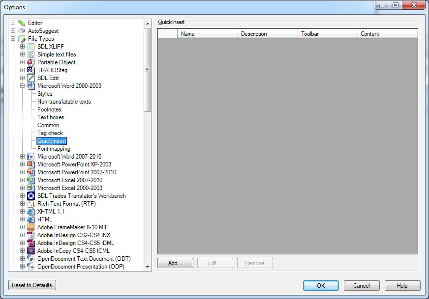
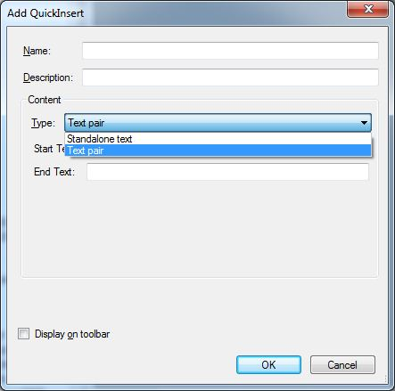
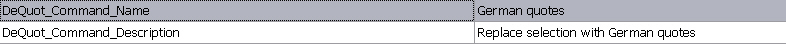
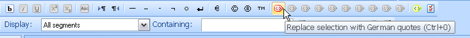

# Implementing QuickInsert functionality

QuickInsert extends your file type plug-in by letting users insert inline tags, placeholders, strings, string pairs, and characters that may be difficult to type on some keyboards, such as ç or ©.

## About QuickInsert

QuickInsert, formerly QuickTag, inserts bilingual content into the localizable document through the **QuickInsert** toolbar in Var:ProductName. This bilingual content can include File Type Support Framework items such as [ITagPair](../../api/filetypesupport/Sdl.FileTypeSupport.Framework.BilingualApi.ITagPair.yml), [IPlaceholderTag](../../api/filetypesupport/Sdl.FileTypeSupport.Framework.BilingualApi.IPlaceholderTag.yml), [IText](../../api/filetypesupport/Sdl.FileTypeSupport.Framework.BilingualApi.IText.yml), [Location](../../api/filetypesupport/Sdl.FileTypeSupport.Framework.BilingualApi.Location.yml), [ICommentMarker](../../api/filetypesupport/Sdl.FileTypeSupport.Framework.BilingualApi.ICommentMarker.yml), and [ILockedContent](../../api/filetypesupport/Sdl.FileTypeSupport.Framework.BilingualApi.ILockedContent.yml).

QuickInsert lets users insert the following items into target segments:

- **Inline tags**: for example, tag pairs that apply bold formatting
- **Text pairs**: start and end text inserted before and after the current selection, for example German smart quotes
- **Standalone text**: simple text such as special characters like ®, which replaces the current selection when inserted

QuickInsert items can be specific to a file type. For example, HTML uses **B** tags to apply bold formatting, while DOC files use **CF** tags. As a result, each file type plug-in can have its own QuickInsert items.

The following example shows the QuickInsert settings page for the standard Microsoft Word 2007 file type plug-in.

>[!NOTE]
>
>In the UI only QuickInserts specified by user are displayed, the default QuickInserts are only displayed on the Var:ProductName toolbar.



When you open a DOC file in Var:ProductName, the QuickInsert toolbar looks like this:


Because the sample file type plug-in does not have any assigned QuickInsert items yet, the toolbar looks like this after you open a **.text** file:


Apart from a few default character assignments that work in any format, such as dash and copyright, all other toolbar buttons are unavailable because they are not assigned.

Some inactive buttons are intended for common character formatting such as bold and underline. Because formats use different tags for this formatting, you must assign the corresponding QuickInsert items for each file type plug-in.


There are also unassigned buttons for custom QuickInsert items such as extra formatting, strings, and string pairs. You can change the generic icons for these buttons programmatically or through the UI.


## Modify the file type component builder

To associate your sample file type plug-in with a settings page that lists the QuickInsert items, add the following code to the **BuildFileTypeInformation** method in the **SimpleTextFilterComponentBuilder** class.

# [C#](#tab/tabid-1)
```cs
info.WinFormSettingsPageIds = new string[]
{
    "SimpleText_Settings",
    "QuickInserts_Settings",
};
```

`WinFormSettingsPageIds` specifies the IDs of the settings pages associated with a file type plug-in. In this example, `QuickInserts_Settings` adds a settings page that lists the QuickInsert items. This code was added in an earlier chapter, so do not add it again.

After you associate the **QuickInsert** settings page, Var:ProductName shows a **QuickInsert** link under your sample file type plug-in in the **Options** dialog box. This is the first UI that you add for the plug-in, but the QuickInsert list is still empty.

You can click **Add** to define your own QuickInsert items. However, this standard UI only supports standalone text and text pairs.



## Define QuickInsert items programmatically

You can add QuickInsert items through the UI and deploy them in the settings export format as a **.sdlfiletype** file. However, that approach has limits. If you generate QuickInsert items programmatically, you get full control over the QuickInsert mechanism.

Assume that you want to assign a **B** tag pair to the corresponding default button in the QuickInsert toolbar and assign German quotes, a text pair, to one of the custom QuickInsert buttons.

Start by adding a class such as **QuickInsertBuilder.cs** to your project. Derive the class from [AbstractQuickTagBuilder](../../api/filetypesupport/Sdl.FileTypeSupport.Framework.Core.Utilities.IntegrationApi.AbstractQuickTagBuilder.yml). The class must reference the **Sdl.FileTypeSupport.Framework.Core.Utilities.IntegrationApi** namespace. The following example assigns the appropriate tag pair to the standard bold formatting button and a text pair, German quotes, to the first custom QuickInsert button.

# [C#](#tab/tabid-2)
```cs
using System.Collections.Generic;
using Sdl.FileTypeSupport.Framework.IntegrationApi;
using Sdl.FileTypeSupport.Framework.Core.Utilities.IntegrationApi;

namespace Sdk.FileTypeSupport.Samples.SimpleText
{
    class QuickInsertBuilder : AbstractQuickTagBuilder
    {
        public static IList<IQuickTag> BuildStandardQuickTags()
        {
            QuickInsertBuilder builder = new QuickInsertBuilder();
            return builder.CreateStandardQuickTags();
        }

        internal IList<IQuickTag> CreateStandardQuickTags()
        {
            IList<IQuickTag> quickTags = new List<IQuickTag>();

            // assign the default tag pair button for
            // applying bold formatting
            quickTags.Add(CreateDefaultTagPair(QuickTagDefaultId.Bold, "<b>", "</b>", "b"));

            // assign a German quotes text pair to 
            // the first custom QuickInsert botton
            quickTags.Add(CreateTextPair("dequot", // command id
                StringResources.DeQuot_Command_Name, // command name
                StringResources.DeQuot_Command_Description, // command description 
                "„", // start string, i.e. opening quote
                "“", // end string, i.e. ending quote
                "", "", "")); // display text, not required for text pairs, therefore left empty


            IList<IQuickTag> bidiTags = CreateDefaultBidiQuickTags();

            foreach (IQuickTag tag in bidiTags)
            {
                quickTags.Add(tag);
            }
            return quickTags;
        }
    }
}
```

Add the QuickInsert builder component to the File Type Component Builder by inserting the following code in your implementation of the [IFileTypeComponentBuilder](../../api/filetypesupport/Sdl.FileTypeSupport.Framework.IntegrationApi.IFileTypeComponentBuilder.yml) interface. If you do not add the QuickInsert builder here, the file type plug-in will never use it, even if the assembly contains the component.

# [C#](#tab/tabid-3)
```cs
public IQuickTagsFactory BuildQuickTagsFactory(string name)
{
    IQuickTagsFactory quickTags = FileTypeManager.BuildQuickTagsFactory();
    quickTags.GetQuickTags(null).SetStandardQuickTags(QuickInsertBuilder.BuildStandardQuickTags());
    return quickTags;
}
```

Add the following names and values to the **StringResources** file:



The QuickInsert toolbar for your file type plug-in should now look like this:



## See also

- [Using QuickInserts](using_quickinserts.md)

>[!NOTE]
>
> This content may be out-of-date. To check the latest information on this topic, inspect the libraries using the Visual Studio Object Browser.
