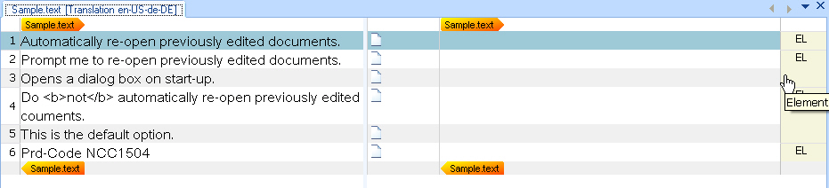
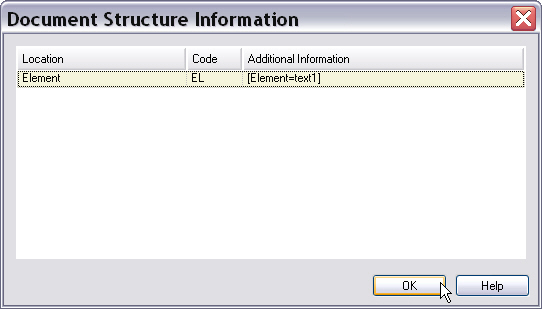

# Implementing the File Parser

This section explains how to process a native file and make its content available in Var:ProductName.

## Add the file parser class

After the file sniffer identifies a valid file, the file parser processes its content. That content then becomes available for interactive translation in the editor of Var:ProductName and for batch operations such as pre-translation, file analysis, and word counting.

Files usually contain translatable text and strings that must remain protected, such as HTML tags. Your parser must decide which content to expose for translation and which content to protect. Complex formats can require a more detailed format analysis.

The following example shows the simple text format that the sample file type plug-in processes:

# [Text](#tab/tabid-1)
```
[Version=0]
[Element=text1]
Automatically re-open previously edited documents. 
[Element=text2]
Prompt me to re-open previously edited documents. Opens a dialog box on start-up.
[Element=text3]
Do <b>not</b> automatically re-open previously edited documents. This is the default option.
[Element=text4]
Prd-Code NCC1504
```
***

For more information about this format and its processing requirements, see the introduction.

Add a class named **SimpleTextParser.cs** to your project. Because the parser reads text files, add the `System.IO` namespace. Add `System.Drawing` if you want to define colors for context information later. Also add `Sdl.FileTypeSupport.Framework.NativeApi` to work with native formats. Derive your parser class from [AbstractNativeFileParser](../../api/filetypesupport/Sdl.FileTypeSupport.Framework.NativeApi.AbstractNativeFileParser.yml) and implement [INativeContentCycleAware](../../api/filetypesupport/Sdl.FileTypeSupport.Framework.NativeApi.INativeContentCycleAware.yml). If your parser uses custom settings, also implement [InitializeSettings](../../api/filetypesupport/Sdl.FileTypeSupport.Framework.IntegrationApi.ISettingsAware.yml#Sdl_FileTypeSupport_Framework_IntegrationApi_ISettingsAware_InitializeSettings_Sdl_Core_Settings_ISettingsBundle_System_String_) from [ISettingsAware](../../api/filetypesupport/Sdl.FileTypeSupport.Framework.IntegrationApi.ISettingsAware.yml).

The class must include the following members from [INativeContentCycleAware](../../api/filetypesupport/Sdl.FileTypeSupport.Framework.NativeApi.INativeContentCycleAware.yml):

1. [SetFileProperties](../../api/filetypesupport/Sdl.FileTypeSupport.Framework.NativeApi.INativeContentCycleAware.yml#Sdl_FileTypeSupport_Framework_NativeApi_INativeContentCycleAware_SetFileProperties_Sdl_FileTypeSupport_Framework_BilingualApi_IFileProperties_) retrieves information about the input file, such as the file name, path, and encoding.
2. [StartOfInput](../../api/filetypesupport/Sdl.FileTypeSupport.Framework.NativeApi.INativeContentCycleAware.yml#Sdl_FileTypeSupport_Framework_NativeApi_INativeContentCycleAware_StartOfInput) runs when the parser starts reading the native input file. You can use it to set the progress indicator to the beginning, for example to 0%.
3. [EndOfInput](../../api/filetypesupport/Sdl.FileTypeSupport.Framework.NativeApi.INativeContentCycleAware.yml#Sdl_FileTypeSupport_Framework_NativeApi_INativeContentCycleAware_EndOfInput) runs when the parser reaches the end of the native input file. You can use it to set a progress indicator to 100%.

The following example shows the minimum code required to create a native file parser:

# [C#](#tab/tabid-2)
```cs
using Sdl.FileTypeSupport.Framework.BilingualApi;
using Sdl.FileTypeSupport.Framework.NativeApi;

namespace Sdk.Snippets.Native
{
    public class SimpleTextParser1 : AbstractNativeFileParser, INativeContentCycleAware
    {
        private IPersistentFileConversionProperties _fileConversionProperties;

        public void SetFileProperties(IFileProperties properties)
        {
            _fileConversionProperties = properties.FileConversionProperties;
        }

        public void StartOfInput()
        {
        }

        public void EndOfInput()
        {
        }
    }
}
```
***

## Open the native input file

Add a [BeforeParsing](../../api/filetypesupport/Sdl.FileTypeSupport.Framework.NativeApi.AbstractNativeFileParser.yml#Sdl_FileTypeSupport_Framework_NativeApi_AbstractNativeFileParser_BeforeParsing) method to open the native input file. Retrieve the input file path through [OriginalFilePath](../../api/filetypesupport/Sdl.FileTypeSupport.Framework.NativeApi.IPersistentFileConversionProperties.yml#Sdl_FileTypeSupport_Framework_NativeApi_IPersistentFileConversionProperties_OriginalFilePath), which the file conversion properties interface provides. You can also call [OnProgress](../../api/filetypesupport/Sdl.FileTypeSupport.Framework.NativeApi.AbstractNativeFileParser.yml#Sdl_FileTypeSupport_Framework_NativeApi_AbstractNativeFileParser_OnProgress_System_Byte_) here to set the parsing progress to 0%.

When Var:ProductName opens a file, it displays a progress bar for the parsing operation. Call [OnProgress](../../api/filetypesupport/Sdl.FileTypeSupport.Framework.NativeApi.AbstractNativeFileParser.yml#Sdl_FileTypeSupport_Framework_NativeApi_AbstractNativeFileParser_OnProgress_System_Byte_) to control that progress bar. For example, after the parser reads half the lines in a text file, you can set the parameter to `50`.

The following example shows how to use [BeforeParsing](../../api/filetypesupport/Sdl.FileTypeSupport.Framework.NativeApi.AbstractNativeFileParser.yml#Sdl_FileTypeSupport_Framework_NativeApi_AbstractNativeFileParser_BeforeParsing):

# [C#](#tab/tabid-3)
```cs
protected override void BeforeParsing()
{
    // Set the progress reporter to the beginning.
    OnProgress(0);

    // Open the native input file for reading.
    _reader = new StreamReader(_fileConversionProperties.OriginalFilePath);
}
```
***

>[!NOTE]
>
> [BeforeParsing](../../api/filetypesupport/Sdl.FileTypeSupport.Framework.NativeApi.AbstractNativeFileParser.yml#Sdl_FileTypeSupport_Framework_NativeApi_AbstractNativeFileParser_BeforeParsing) and [StartOfInput](../../api/filetypesupport/Sdl.FileTypeSupport.Framework.NativeApi.INativeContentCycleAware.yml#Sdl_FileTypeSupport_Framework_NativeApi_INativeContentCycleAware_StartOfInput) serve different purposes. Var:ProductName can merge several files into one master document, including files from different native formats such as DOC and PPT. Use [BeforeParsing](../../api/filetypesupport/Sdl.FileTypeSupport.Framework.NativeApi.AbstractNativeFileParser.yml#Sdl_FileTypeSupport_Framework_NativeApi_AbstractNativeFileParser_BeforeParsing) for logic that runs before the complete parsing process starts, such as writing metadata into the master file header. Use [StartOfInput](../../api/filetypesupport/Sdl.FileTypeSupport.Framework.NativeApi.INativeContentCycleAware.yml#Sdl_FileTypeSupport_Framework_NativeApi_INativeContentCycleAware_StartOfInput) for logic that applies to a specific native file in that merged set. This simple implementation does not cover that scenario. Here, [BeforeParsing](../../api/filetypesupport/Sdl.FileTypeSupport.Framework.NativeApi.AbstractNativeFileParser.yml#Sdl_FileTypeSupport_Framework_NativeApi_AbstractNativeFileParser_BeforeParsing) only sets progress to 0% and creates a `StreamReader` object.

## Parse the input file

Override [DuringParsing](../../api/filetypesupport/Sdl.FileTypeSupport.Framework.NativeApi.AbstractNativeFileParser.yml#Sdl_FileTypeSupport_Framework_NativeApi_AbstractNativeFileParser_DuringParsing) from [AbstractNativeFileParser](../../api/filetypesupport/Sdl.FileTypeSupport.Framework.NativeApi.AbstractNativeFileParser.yml). This method reads the input file from beginning to end.

# [C#](#tab/tabid-4)
```cs
protected override bool DuringParsing()
{
    // Iterate through all lines in the input file.
    while (!_reader.EndOfStream)
    {
        ProcessLine(_reader.ReadLine());
    }
    return false;
}
```
***

For each line of text, call a separate `ProcessLine()` helper method to determine whether the line contains translatable text.

# [C#](#tab/tabid-5)
```cs
private void ProcessLine(string sLine)
{
    if (sLine.StartsWith("[") && sLine.EndsWith("]"))
    {
        WriteStructureTag(sLine);
        WriteContext(sLine);
    }
    else
    {
        WriteText(sLine);
    }
}
```
***

The `ProcessLine()` helper works as follows: if a line starts with an opening bracket and ends with a closing bracket, call separate helper methods named `WriteStructureTag()` and `WriteContext()`.

Use `WriteStructureTag()` to write non-translatable information into a structure tag. The non-translatable text, such as the strings enclosed in brackets, remains in the bilingual SDLXliff file, but the editor does not expose it to the user. Include this information in the SDLXliff file so that the generator can write it back to the native target file later.

Because users cannot see structure tag content in the editor of Var:ProductName, consider adding context information. The editor shows this information in the document structure column on the right side. Your file type plug-in can display a short descriptive code. Users can point to that code or double-click it to view more detail. The `WriteContext()` helper method handles this task.


## Output translatable text

If a line does not start and end with a bracket, treat it as translatable text and expose it for translation. Use the `WriteText()` helper method for this step.

The `WriteText()` helper uses [CreateTextProperties](../../api/filetypesupport/Sdl.FileTypeSupport.Framework.NativeApi.IPropertiesFactory.yml#Sdl_FileTypeSupport_Framework_NativeApi_IPropertiesFactory_CreateTextProperties_System_String_) on the properties factory to create an [ITextProperties](../../api/filetypesupport/Sdl.FileTypeSupport.Framework.NativeApi.ITextProperties.yml) object that contains the localizable text. It then outputs that text through `Output.Text()`.

# [C#](#tab/tabid-6)
```cs
// Output translatable text.
private void WriteText(string textContent)
{
    ITextProperties textProperties = PropertiesFactory.CreateTextProperties(textContent);
    Output.Text(textProperties);
}
```
***

## Output structure tags

In the same way, `WriteStructureTag()` uses [CreateStructureTagProperties](../../api/filetypesupport/Sdl.FileTypeSupport.Framework.NativeApi.IPropertiesFactory.yml#Sdl_FileTypeSupport_Framework_NativeApi_IPropertiesFactory_CreateStructureTagProperties_System_String_) on the properties factory to output non-translatable lines as structure tags in the intermediate SDLXliff file. Pass the tag content to `CreateStructureTagProperties()` and then send the result to the API through `Output.StructureTag()`.

# [C#](#tab/tabid-7)
```cs
// Output non-translatable text as a structure tag.
private void WriteStructureTag(string tagContent)
{
    IStructureTagProperties structureTagProperties = PropertiesFactory.CreateStructureTagProperties(tagContent);
    structureTagProperties.DisplayText = tagContent;
    Output.StructureTag(structureTagProperties);
}
```
***

## Output context information

Context information can help translators work more effectively. For that reason, it is useful, though not required, to output context information from your file type plug-in. The following example shows the `WriteContext()` helper method:

# [C#](#tab/tabid-8)
```cs
// Output context information for the translator.
private void WriteContext(string contextContent)
{
    IContextProperties contextProperties = PropertiesFactory.CreateContextProperties();
    IContextInfo contextInfo = PropertiesFactory.CreateContextInfo(contextContent);
    contextInfo.DisplayCode = "EL";
    contextInfo.DisplayName = "Element";
    contextInfo.Description = contextContent;
    contextInfo.DisplayColor = Color.Beige;
    contextProperties.Contexts.Add(contextInfo);
    Output.ChangeContext(contextProperties);
}
```
***

Use [CreateContextInfo](../../api/filetypesupport/Sdl.FileTypeSupport.Framework.NativeApi.IPropertiesFactory.yml#Sdl_FileTypeSupport_Framework_NativeApi_IPropertiesFactory_CreateContextInfo_System_String_) on the properties factory to generate a context information object, and then output the context properties. These parameters control what the editor displays in the document structure column.

In the editor, users first see the short form, which is the display code. In this example, the display code is **EL**. When users point to the display code, the editor shows the display name, **Element**, in a tooltip. When users double-click the display code, they can open a dialog box that shows the full string, for example **[Element=text3]**. You can also assign a background color to each context element. Different colors make it easier to distinguish between contexts such as headings, paragraphs, and footnotes.

After you implement these methods and build the solution, you can open a sample file in Var:ProductName. The translation editor then looks like this:




At this stage, the inline formatting tags still appear as normal translatable text. The next chapter, [Processing Inline Formatting](processing_inline_formatting.md), explains how to mark up these elements as inline tags and apply the correct formatting to the enclosed strings.

The File Type Support Framework also handles segmentation automatically. As a result, individual sentences appear in separate editor cells, and you do not need to implement segmentation logic yourself.

The following example shows what users see after they double-click a context display code.



## Close and release the input file

After the parser finishes reading the file, override [AfterParsing](../../api/filetypesupport/Sdl.FileTypeSupport.Framework.NativeApi.AbstractNativeFileParser.yml#Sdl_FileTypeSupport_Framework_NativeApi_AbstractNativeFileParser_AfterParsing). In this method, close the original file and release it from memory. You can also call [OnProgress](../../api/filetypesupport/Sdl.FileTypeSupport.Framework.NativeApi.AbstractNativeFileParser.yml#Sdl_FileTypeSupport_Framework_NativeApi_AbstractNativeFileParser_OnProgress_System_Byte_) to set progress to 100%.

# [C#](#tab/tabid-9)
```cs
protected override void AfterParsing()
{
    // Close the original file.
    _reader.Close();
    _reader.Dispose();
    _reader = null;

    // Set the progress report to 100%.
    OnProgress(100);
}
```
***

## Add the component reference to the File Type Component Builder

Reference the file parser component in the File Type Component Builder by adding the following method:

# [C#](#tab/tabid-10)
```cs
/// <summary>
/// Gets the file extractor for this component.
/// </summary>
/// <param name="name">Not used here.</param>
/// <returns>A FileExtractor that contains a Simple Text Parser.</returns>
public virtual IFileExtractor BuildFileExtractor(string name)
{
    var parser = new SimpleTextParser();
    parser.LockPrdCodes = true;
    var extractor = this.FileTypeManager.BuildFileExtractor(this.FileTypeManager.BuildNativeExtractor(parser), this);
    extractor.AddFileTweaker(new SimpleFilePreTweaker { RequireValidEncoding = false });
    return extractor;
}
```
***

## See also

- [Processing Inline Formatting](processing_inline_formatting.md)
- [Enhancing the File Parser to Process the Settings](enhancing_the_file_parser_to_process_the_settings.md)
- [Processing Placeholder Tags](processing_placeholder_tags.md)
- [Handling Tags During Segmentation](handling_tags_during_segmentation.md)
- [Locking Specific Strings](locking_specific_strings.md)
- [Using context information](using_context_information.md)

>[!NOTE]
>
> This content may be out-of-date. To check the latest information on this topic, inspect the libraries using the Visual Studio Object Browser.
