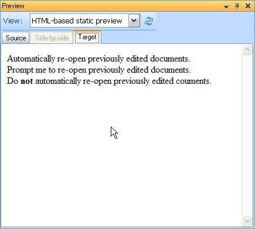

# Implementing the preview writer

This article shows how to implement the writer that generates the HTML displayed in the internal web browser preview control.

## Add the preview writer class

Add a class such as **InternalPreviewWriter.cs** to your project. The class must implement the same interfaces and members as the file writer class that generates native target files. See [Implementing the File Writer](implementing_the_file_writer.md).

The following example shows the minimum code required for an internal preview writer:

# [C#](#tab/tabid-1)
```cs
using System.IO;
using Sdl.FileTypeSupport.Framework.BilingualApi;
using Sdl.FileTypeSupport.Framework.NativeApi;

namespace Sdk.Snippets.Native
{
    class InternalPreviewWriter : AbstractNativeFileWriter, INativeContentCycleAware
    {
        StreamWriter _preview = null;

        public void SetFileProperties(IFileProperties properties)
        {
        }

        public void StartOfInput()
        {
        }

        public void EndOfInput()
        {
        }
    }
}
```

## Start the preview output

Generate a simplified HTML document for the preview output. Start by writing the opening HTML markup:

# [C#](#tab/tabid-2)
```cs
// start the preview output
public void StartOfInput()
{
    _preview = new StreamWriter(OutputProperties.OutputFilePath);
    _preview.WriteLine("<html><body>");
}
```

## Output text and tags

Override the `Text()` method to write translatable strings:

# [C#](#tab/tabid-3)
```cs
// output the translatable strings
public override void Text(ITextProperties textInfo)
{
    _preview.Write(textInfo.Text);
}
```

If you want to insert a line break after each paragraph unit, override the following methods and wrap each paragraph in a **DIV** tag pair:

# [C#](#tab/tabid-4)
```cs
// each paragraph unit should appear in a new line
// therefore use a DIV element
public override void ParagraphUnitStart(IParagraphUnitProperties properties)
{
    _preview.WriteLine("<div>");
}

public override void ParagraphUnitEnd()
{
    _preview.Write("</div>");
}
```

Wrap each segment in a **SPAN** tag pair. This step is not required yet, but this structure becomes useful later when you implement the real-time preview. See [Enhancing the Preview File Writer](enhancing_the_preview_file_writer.md).

# [C#](#tab/tabid-5)
```cs
// enclose each segment in a SPAN tag pair
public override void SegmentStart(ISegmentPairProperties properties)
{
    _preview.Write("<span>");
}

public override void SegmentEnd()
{
    _preview.Write("</span>");
}
```

Next, override the following methods to write inline tag content. When you emit the HTML tags, the web browser preview control also applies the corresponding character formatting.

# [C#](#tab/tabid-6)
```cs
// output any inline tags,
// which will also apply the corresponding character formatting
public override void InlineStartTag(IStartTagProperties tagInfo)
{
    _preview.Write(tagInfo.TagContent);
}

public override void InlineEndTag(IEndTagProperties tagInfo)
{
    _preview.Write(tagInfo.TagContent);
}
```

This preview does not write any structure tag content.

## Close the preview output

Finally, close the preview output:

# [C#](#tab/tabid-7)
```cs
// end the preview output
public void EndOfInput()
{
    _preview.WriteLine("</body></html>");
    _preview.Close();
}
```

The static HTML preview looks like this:



## Put it all together

The complete preview writer class looks like this:

# [C#](#tab/tabid-8)
```cs
using System.IO;
using Sdl.FileTypeSupport.Framework.BilingualApi;
using Sdl.FileTypeSupport.Framework.NativeApi;

namespace Sdk.Snippets.Native
{
    class InternalPreviewWriter1 : AbstractNativeFileWriter, INativeContentCycleAware
    {
        StreamWriter _preview = null;

        public void SetFileProperties(IFileProperties properties)
        {
            // not used in this implementation
        }

        // start the preview output
        public void StartOfInput()
        {
            _preview = new StreamWriter(OutputProperties.OutputFilePath);
            _preview.WriteLine("<html><body>");
        }

        // output the translatable strings
        public override void Text(ITextProperties textInfo)
        {
            _preview.Write(textInfo.Text);
        }

        // each paragraph unit should appear in a new line
        // therefore use a DIV element
        public override void ParagraphUnitStart(IParagraphUnitProperties properties)
        {
            _preview.WriteLine("<div>");
        }

        public override void ParagraphUnitEnd()
        {
            _preview.Write("</div>");
        }

        // enclose each segment in a SPAN tag pair
        public override void SegmentStart(ISegmentPairProperties properties)
        {
            _preview.Write("<span>");
        }

        public override void SegmentEnd()
        {
            _preview.Write("</span>");
        }

        // output any inline tags,
        // which will also apply the corresponding character formatting
        public override void InlineStartTag(IStartTagProperties tagInfo)
        {
            _preview.Write(tagInfo.TagContent);
        }

        public override void InlineEndTag(IEndTagProperties tagInfo)
        {
            _preview.Write(tagInfo.TagContent);
        }

        // end the preview output
        public void EndOfInput()
        {
            _preview.WriteLine("</body></html>");
            _preview.Close();
        }
    }
}
```

## See also

- [Enhancing the Preview File Writer](enhancing_the_preview_file_writer.md)

>[!NOTE]
>
> This content may be out-of-date. To check the latest information on this topic, inspect the libraries using the Visual Studio Object Browser.
