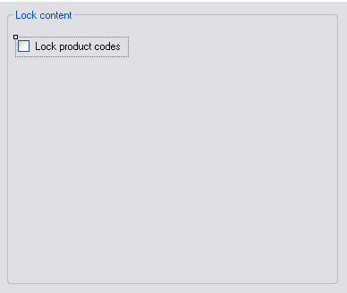

# Implementing the Settings UI

Expose file type plug-in configuration settings through a user interface.

## Add an Option to Lock Product Codes

Start by adding a user control element to your WinUI project, for example **SettingsUI.cs**. Add a group box and a check box named `cb_LockPrdCodes` to the control:



Set the **Checked** property to True, since product codes should be locked by default.

Your **SettingsUI** class needs the following namespace:

- `Sdl.FileTypeSupport.Framework.Core.Settings`

## The Settings Bundle

Each plug-in uses a settings bundle to store and retrieve settings. A separate class called `UserSettings` handles this mechanism (see [Loading and Saving the Settings](loading_and_saving_settings.md)). Create an object based on the `UserSettings` class:

# [C#](#tab/tabid-1)
```cs
private UserSettings _userSettings;
```

To obtain the correct user settings for this settings page from the Filter Framework, implement [IFileTypeSettingsAware](../../api/filetypesupport/Sdl.FileTypeSupport.Framework.Core.Settings.IFileTypeSettingsAware-1.yml):

# [C#](#tab/tabid-2)
```cs
public partial class SettingsUI : UserControl, IFileTypeSettingsAware<UserSettings>
```

## Initialize the Plug-in User Interface Settings

When the user opens the plug-in user interface, set the control element according to what is stored in the settings bundle. Do this by setting the `_userSettings` object and implementing the Settings property from [IFileTypeSettingsAware](../../api/filetypesupport/Sdl.FileTypeSupport.Framework.Core.Settings.IFileTypeSettingsAware-1.yml):

# [C#](#tab/tabid-3)
```cs
public UserSettings Settings
{
    get
    {
        return _userSettings;
    }
    set
    {
        _userSettings = value;
        UpdateControl();
    }
}
```

During initialization, the `UpdateControl` method is invoked. It sets the check box state (checked or unchecked) to the value of the `LockPrdCodes` member in the `UserSettings` class:

# [C#](#tab/tabid-4)
```cs
public void UpdateControl()
{
    cb_LockPrdCodes.Checked = _userSettings.LockPrdCodes;
}
```

## Save the Settings to the Settings Bundle

When the user opens the plug-in UI, changes the check box setting, and clicks **OK**, save the setting to the settings bundle:

# [C#](#tab/tabid-5)
```cs
private void cb_LockPrdCodes_CheckedChanged(object sender, EventArgs e)
{
    _userSettings.LockPrdCodes = cb_LockPrdCodes.Checked;
}
```

## Putting It All Together

The full code of your user control:

# [C#](#tab/tabid-6)
```cs
using System;
using System.Collections.Generic;
using System.ComponentModel;
using System.Drawing;
using System.Data;
using System.Linq;
using System.Text;
using System.Windows.Forms;
using Sdl.FileTypeSupport.Framework.Core.Settings;

namespace Sdk.FileTypeSupport.Samples.SimpleText.WinUI
{
    /// <summary>
    /// Implements the user interface for the file type definition.
    /// </summary>
    public partial class SettingsUI : UserControl, IFileTypeSettingsAware<UserSettings>
    {
        /// <summary>
        /// Create a settings object based on the UserSettings class. 
        /// </summary>
        private UserSettings _userSettings;

        /// <summary>
        /// Initialize the user interface control by setting it to the
        /// setting value stored in the settings bundle.
        /// </summary>
        public SettingsUI()
        {
            InitializeComponent();
        }

        /// <summary>
        /// Reset the user interface control to its default value: checked,
        /// which enables the product lock option by default.
        /// </summary>
        public void UpdateControl()
        {
            cb_LockPrdCodes.Checked = _userSettings.LockPrdCodes;
        }

        /// <summary>
        /// Save the settings based on the check box value.
        /// The setting is saved through the UserSettings class, which
        /// handles the plug-in settings bundle.
        /// </summary>
        /// <param name="sender"></param>
        /// <param name="e"></param>
        private void cb_LockPrdCodes_CheckedChanged(object sender, EventArgs e)
        {
            _userSettings.LockPrdCodes = cb_LockPrdCodes.Checked;
        }

        /// <summary>
        /// Implementation of IFileTypeSettingsAware allowing the Filter Framework
        /// to pass through the user settings so that we can initialize the UI.
        /// </summary>
        public UserSettings Settings
        {
            get
            {
                return _userSettings;
            }
            set
            {
                _userSettings = value;
                UpdateControl();
            }
        }
    }
}
```

## See Also

- [Creating a New Assembly for the Settings UI](creating_a_new_assembly_for_the_settings_ui.md)
- [Implementing the UI Controller Class](implementing_the_ui_controller_class.md)
- [File type settings](file_type_settings.md)
- [Loading and Saving the Settings](loading_and_saving_settings.md)

> [!NOTE]
> This content may be out-of-date. To check the latest information on this topic, inspect the libraries using the Visual Studio Object Browser.
