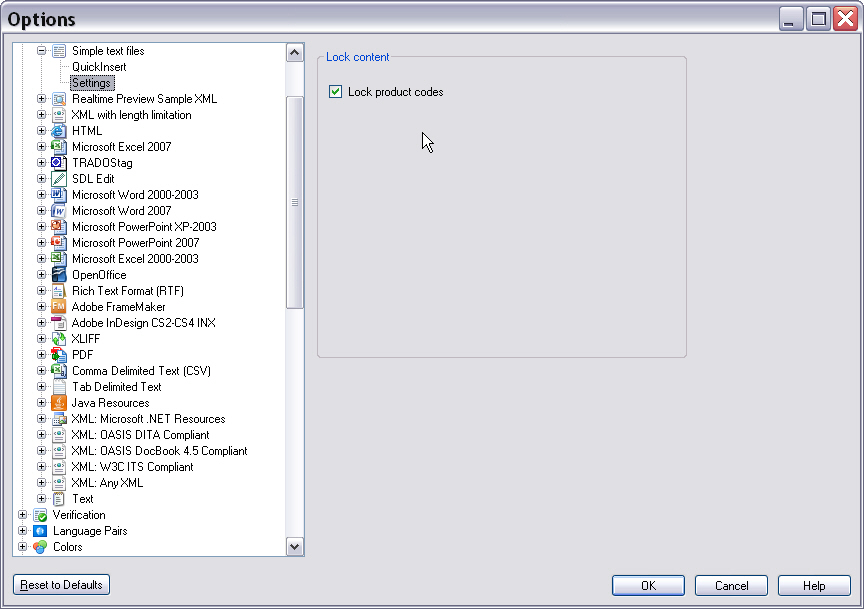

# Implementing the UI Controller Class

Implement the class that manages the relationship between the host application, user settings, and the user interface.

## Settings Page Scenarios

A settings page for the plug-in user interface must handle these scenarios:

- The user clicks **Reset to Defaults**, restoring all control elements to their default settings
- The user clicks **OK**, saving the settings
- The user navigates to another settings page, which should save changes to form control elements
- The user clicks **Cancel**, discarding all changes to control settings

The settings page does not implement its own **OK**, **Cancel**, or **Reset** buttons. Instead, it uses the control elements provided by the framework's dialog box.

Below is an example of a settings page as implemented for a default file type in `Var:ProductName`:


## Add the Settings Page

Add another class, for example **SettingsPage.cs**, to your project. This class manages the user control UI functions, such as triggering the reset function when a user clicks **Reset**. This class is registered as a plug-in UI page in the File Type Component Builder, not the actual user control.

Reference this namespace in your class:

- `Sdl.FileTypeSupport.Framework.Core.Settings`

Your `SettingsPage` class must derive from the [AbstractFileTypeSettingsPage< SettingsControlType, SettingsType>](../../api/filetypesupport/Sdl.FileTypeSupport.Framework.Core.Settings.AbstractFileTypeSettingsPage-2.yml) class, providing the types of the settings and the UI control:

# [C#](#tab/tabid-1)
```cs
class SettingsPage : AbstractFileTypeSettingsPage<SettingsUI, UserSettings>
```

## Declare the Page as a Plug-In

The plugin framework requires all plug-in pages to be marked with a C# attribute. The framework generates a plug-in definition for the assembly based on these attributes, which other applications can use.

For a Filter Settings Page, use the `FileTypeSettingsPage` attribute. This attribute requires:

- A unique ID to identify the plug-in page at runtime
- A name
- A description

If you need to localize the name and description into other languages, use key mappings to the **PluginResources.resx** file in your assembly:

# [C#](#tab/tabid-2)
```cs
[FileTypeSettingsPage(Id="SimpleText_Settings", Name="Settings_Name", Description="Settings_Description")]
```

## Implement the Base Class

The `FileTypeSettingsPage` base class handles much of the plumbing to ensure objects load correctly and update at the right points. However, since our control does not use data binding, you must manually inform the UI when settings change. Override the `ResetToDefaults` and `Refresh` methods and call `UpdateControl` on the UI to notify it that the underlying settings data has changed:

# [C#](#tab/tabid-3)
```cs
public override void ResetToDefaults()
{
    base.ResetToDefaults();
    Control.UpdateControl();
}
```

# [C#](#tab/tabid-4)
```cs
public override void Refresh()
{
    base.Refresh();
    Control.UpdateControl();
}
```

## Add the File Type Settings Page to the File Type Plug-In

To associate your sample file type plug-in with this settings page, use the following code in the `SimpleTextFilterComponentBuilder` class within the `BuildFileTypeInformation` method:

# [C#](#tab/tabid-5)
```cs
info.WinFormSettingsPageIds = new string[]
{
    "SimpleText_Settings",
    "QuickInserts_Settings",
};
```

`WinFormSettingsPageIds` specifies the IDs of the settings pages to associate with a file type plug-in. Here, `SimpleText_Settings` associates this settings page with this file type plug-in. (This code was added in an earlier section and should not be repeated.)

After adding this file type settings page, the file type plug-in UI becomes available in the File Type Manager:



## Putting It All Together

Your user interface controller class should now look as follows:

# [C#](#tab/tabid-6)
```cs
using Sdl.FileTypeSupport.Framework.Core.Settings;

namespace Sdk.FileTypeSupport.Samples.SimpleText.WinUI
{
    /// <summary>
    /// This class controls the plug-in user interface. It controls what happens when the user
    /// clicks the button to reset control elements to their default values. This class is referenced
    /// in the file type definition. Without this reference in the SDLFILETYPE file, the plug-in
    /// user interface would not be available to the end user.
    /// </summary>
    [FileTypeSettingsPage(Id="SimpleText_Settings", Name="Settings_Name", Description="Settings_Description")]
    class SettingsPage : AbstractFileTypeSettingsPage<SettingsUI, UserSettings>
    {
        /// <summary>
        /// Triggered when the user clicks the Reset to Defaults button in Trados Studio.
        /// Restores the default check box state, which should be checked (product code
        /// strings should be locked by default).
        /// </summary>
        public override void ResetToDefaults()
        {
            base.ResetToDefaults();
            Control.UpdateControl();
        }

        /// <summary>
        /// Triggered when the user opens the plug-in UI. The controls (in this case, the check box
        /// for locking product code strings) are set according to the values stored in the
        /// settings bundle.
        /// </summary>
        public override void Refresh()
        {
            base.Refresh();
            Control.UpdateControl();
        }
    }
}
```

> [!NOTE]
> This content may be out-of-date. To check the latest information on this topic, inspect the libraries using the Visual Studio Object Browser.
