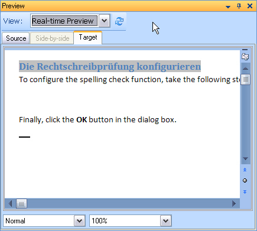

Introduction
==
In this chapter you will learn how to develop a document preview, which goes beyond the features a simple preview document that is shown in an external application.

Enhance your File Type Plug-in by Adding Internal Preview Functionality
--

Instead of launching an external application such as Microsoft Word or Notepad, you can also generate a preview in a window that is embedded in <Var:ProductName>. You can implement a static (internal) preview. This means that the source or target text is displayed within <Var:ProductName>. With this preview type there is no interaction between the side-by-side translation editor and the preview document.

You may also implement a dynamic real-time preview, which is somewhat more sophisticated, because it interacts with the side-by-side editor of <Var:ProductName>. This means that when the user selects a segment in the editor, the corresponding segment in the preview will be highlighted and vice versa.

Example of an internal, real-time preview of a DOC file in <Var:ProductName>:

Since our project will require a number of new items, we recommend that you add a new **Preview** folder to your Visual Studio project. Within this folder we will later create an internal preview control and additional classes.

See Also
--
**Other Resources**

[Previewing files](previewing_files.md)

>**NOTE**
>
> This content may be out-of-date. To check the latest information on this topic, inspect the libraries using the Visual Studio Object Browser.