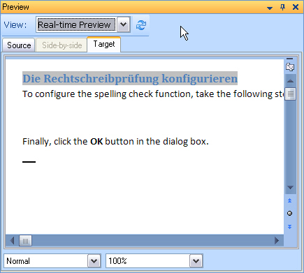
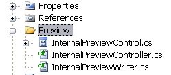

# Introduction

This section explains how to develop a document preview that offers more functionality than a simple external preview.

## Add internal preview functionality to your file type plug-in

Instead of launching an external application such as Microsoft Word or Notepad, you can generate a preview in a window that Var:ProductName embeds. You can implement a static internal preview, which displays the source or target text inside Var:ProductName. With this preview type, the side-by-side translation editor does not interact with the preview document.

You can also implement a dynamic real-time preview. This preview type is more advanced because it interacts with the side-by-side editor in Var:ProductName. When users select a segment in the editor, the corresponding segment in the preview is highlighted, and the reverse also applies.

The following example shows an internal real-time preview of a DOC file in Var:ProductName:

This project requires several new items, so add a **Preview** folder to your Visual Studio project. You will use this folder later for the internal preview control and related classes.

## See also

- [Previewing files](previewing_files.md)

>[!NOTE]
>
> This content may be out-of-date. To check the latest information on this topic, inspect the libraries using the Visual Studio Object Browser.
