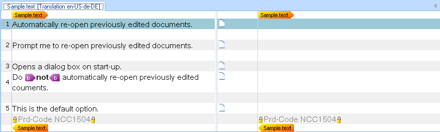

# Locking Specific Strings

Protect text against editing by locking strings.

## Locking Particular Strings During Parsing

Create locked segments, text selections, or paragraph units to prevent user editing. Lock strings containing script code that should not be altered or modified during translation. Translators can still view locked content, which provides relevant information during the translation process.

For example, your text files might contain lines starting with a product code prefix, such as *Prd-Code NCC1504*. Lock these strings during parsing to prevent localization.

Enhance your file parser by adding a `WriteLockedContent()` helper function:

# [C#](#tab/tabid-1)
```cs
private void WriteLockedContent(string LockedContent)
{
    ILockedContentProperties Lockedprops = PropertiesFactory.CreateLockedContentProperties(LockTypeFlags.Manual);
    Output.LockedContentStart(Lockedprops);

    ITextProperties textProps = PropertiesFactory.CreateTextProperties(LockedContent);
    Output.Text(textProps);

    Output.LockedContentEnd();
}
```
***

The [CreateLockedContent](../../api/filetypesupport/Sdl.FileTypeSupport.Framework.BilingualApi.IDocumentItemFactory.yml#Sdl_FileTypeSupport_Framework_BilingualApi_IDocumentItemFactory_CreateLockedContent_Sdl_FileTypeSupport_Framework_NativeApi_ILockedContentProperties_) method creates a mark-up container that wraps all other containers and mark-up of a target paragraph in a paragraph unit. First, create an [ILockedContentProperties](../../api/filetypesupport/Sdl.FileTypeSupport.Framework.NativeApi.ILockedContentProperties.yml) object by calling [CreateLockedContentProperties](../../api/filetypesupport/Sdl.FileTypeSupport.Framework.NativeApi.IPropertiesFactory.yml#Sdl_FileTypeSupport_Framework_NativeApi_IPropertiesFactory_CreateLockedContentProperties_Sdl_FileTypeSupport_Framework_NativeApi_LockTypeFlags_) with a [LockTypeFlags](../../api/filetypesupport/Sdl.FileTypeSupport.Framework.NativeApi.LockTypeFlags.yml) parameter. Pass the resulting locked content properties to use for wrapping all mark-up in the target paragraph.

Extend the `ProcessLine()` helper function to call `WriteLockedContent()` whenever a line starts with a product code prefix:

# [C#](#tab/tabid-2)
```cs
private void ProcessLine(string sLine)
{
    if (sLine.StartsWith("[") && sLine.EndsWith("]"))
    {
        WriteStructureTag(sLine);
        WriteContext(sLine);
    }
    else if (sLine.StartsWith("Prd-Code"))
    {
        WriteLockedContent(sLine);
    } 
    else
    {
        WriteText(ProcessFormatting(sLine));
    }
}
```
***

After making this enhancement to the file parser, the lines that contain product code strings will be locked as shown below:



If you do not see the locked content, activate the **Display Filter** toolbar in Var:ProductName through **View** > **Toolbars** > **Display Filter**, then select **All content** from the **Display** dropdown.

## Putting It All Together

Your enhanced file parser now includes all the required functionality:

# [C#](#tab/tabid-3)
```cs
using System.Drawing;
using System.IO;
using System.Text.RegularExpressions;
using Sdl.FileTypeSupport.Framework.BilingualApi;
using Sdl.FileTypeSupport.Framework.NativeApi;
using Sdl.FileTypeSupport.Framework.Formatting;
using Sdl.FileTypeSupport.Framework.Core.Utilities.Formatting;

namespace Sdk.Snippets.Native
{
    public class SimpleTextParser3 : AbstractNativeFileParser, INativeContentCycleAware
    {
        IPersistentFileConversionProperties _fileConversionProperties;
        StreamReader _reader = null;
        FormattingGroup _fBold;

        public void SetFileProperties(IFileProperties properties)
        {
            _fileConversionProperties = properties.FileConversionProperties;
        }

        public void StartOfInput()
        {

        }

        public void EndOfInput()
        {

        }

        protected override void BeforeParsing()
        {
            OnProgress(0);
            _reader = new StreamReader(_fileConversionProperties.OriginalFilePath);
        }

        protected override bool DuringParsing()
        {
            while (!_reader.EndOfStream)
            {
                ProcessLine(_reader.ReadLine());
            }
            return false;
        }

        protected override void AfterParsing()
        {
            _reader.Close();
            _reader.Dispose();
            _reader = null;
            OnProgress(100);
        }

        private void ProcessLine(string sLine)
        {
            if (sLine.StartsWith("[") && sLine.EndsWith("]"))
            {
                WriteStructureTag(sLine);
                WriteContext(sLine);
            }
            else if (sLine.StartsWith("Prd-Code"))
            {
                WriteLockedContent(sLine);
            } 
            else
            {
                WriteText(ProcessFormatting(sLine));
            }
        }

        private void WriteText(string TextContent)
        {
            ITextProperties textProperties = PropertiesFactory.CreateTextProperties(TextContent);
            Output.Text(textProperties);
        }

        private void WriteLockedContent(string LockedContent)
        {
            ILockedContentProperties Lockedprops = PropertiesFactory.CreateLockedContentProperties(LockTypeFlags.Manual);
            Output.LockedContentStart(Lockedprops);

            ITextProperties textProps = PropertiesFactory.CreateTextProperties(LockedContent);
            Output.Text(textProps);

            Output.LockedContentEnd();
        }

        private void WriteStructureTag(string TagContent)
        {
            IStructureTagProperties structureTagProperties = PropertiesFactory.CreateStructureTagProperties(TagContent);
            structureTagProperties.DisplayText = TagContent;
            Output.StructureTag(structureTagProperties);
        }

        private void WriteContext(string ContextContent)
        {
            IContextProperties contextProperties = PropertiesFactory.CreateContextProperties();
            IContextInfo contextInfo = PropertiesFactory.CreateContextInfo(ContextContent);
            contextInfo.DisplayCode = "EL";
            contextInfo.DisplayName = "Element";
            contextInfo.Description = ContextContent;
            contextInfo.DisplayColor = Color.Beige;
            contextProperties.Contexts.Add(contextInfo);
            Output.ChangeContext(contextProperties);
        }

        private string ProcessFormatting(string sLine)
        {
            int LastPosition = 0;
            // search for opening and closing <b> tags
            Regex rx = new Regex(@"\<.*?\>", RegexOptions.Compiled);
            MatchCollection rxMatches = rx.Matches(sLine);

            foreach (Match rxMatch in rxMatches)
            {
                if (LastPosition != rxMatch.Index)
                {
                    WriteText(sLine.Substring(LastPosition, rxMatch.Index - LastPosition));
                }

                bool IsOpening = rxMatch.Value.Contains("/") ? false : true;
                WriteInlineTag(rxMatch.Value, IsOpening);

                LastPosition = rxMatch.Index + rxMatch.Length;
            }
            return sLine.Substring(LastPosition, sLine.Length - LastPosition);
        }

        private void WriteInlineTag(string tagContent, bool isStart)
        {
            _fBold = new FormattingGroup();
            _fBold.Add(new Bold(true));

            if (isStart)
            {
                IStartTagProperties startTag = PropertiesFactory.CreateStartTagProperties(tagContent);
                startTag.DisplayText = "b";
                startTag.TagContent = tagContent;
                startTag.Formatting = _fBold;
                startTag.CanHide = true;
                Output.InlineStartTag(startTag);
            }
            else
            {
                IEndTagProperties endTag = PropertiesFactory.CreateEndTagProperties(tagContent);
                endTag.DisplayText = "b";
                endTag.TagContent = tagContent;
                endTag.CanHide = true;
                Output.InlineEndTag(endTag);
            }
        }
    }
}
```
***


>[!NOTE]
>
> This content may be out-of-date. To check the latest information on this topic, inspect the libraries using the Visual Studio Object Browser.
