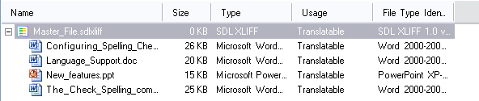
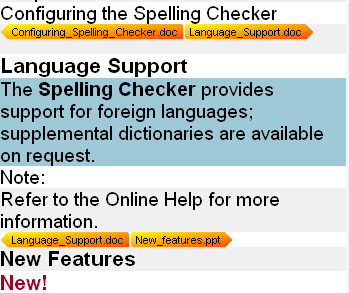

# Merging files

When you create a project with multiple source files, you can merge them into one intermediary SDLXliff document. This approach simplifies common tasks such as find and replace, verification, and QA checks.

For example, instead of handling 100 small XML files separately, you can generate one intermediary document and run these tasks once on a single file.

Merging several native files of different formats into one intermediary SDLXliff document

## Merge different native formats

Var:ProductName also lets you merge different native file formats into one intermediary document (for example, PPT, XLS, DOC, and XML). In the Var:ProductName editor, markers show where one file ends and the next begins. The editor generates a native preview for the document at the current cursor position, as long as that file type plug-in supports preview generation.

Delimiters indicate where one file ends and where the next one begins

## Generate native target documents

When you generate native documents, Var:ProductName splits the merged intermediary file into individual native target files. For example, if you merge 10 PPT files, you work with one SDLXliff document during translation and generate 10 separate PPT target documents.

## See also

- [Creating projects](creating_projects.md)
