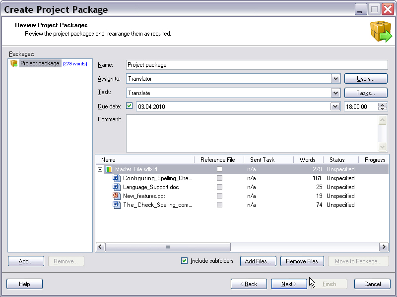

Moving files between machines
=====
More often than not, files are not translated, edited or proofread on the machine on which a project was originally created. For example, a project manager will usually send files to another user (e.g. a translator or proofreader) and then receive back the translated or edited file.

Files can be moved between machines primarily in the two following ways:

* A package is created from a project. A package is basically a ZIP file that contains the intermediary (SDL XLIFF) documents, file type settings, and optionally, additional resources such as reference files, TMs, termbases, AutoSuggest dictionaries, etc. The recipient of a package opens the package file, thus extracting its content to an empty folder on his/her disk. After opening the package, the package content can be processed in <Var:ProductName>, e.g. the translatable files are translated, edited, etc. After finishing the task, the recipent of the package creates a return package. The return package is also a ZIP file that contains the edited/translated intermediary documents. The return package is then sent to the person who created the project package, usually the project manager.

**Wizard-based creation of a project package**

* Files may also be passed to another user/machine simply by passing the intermediary (SDL XLIFF) file, e.g. by sending it as an email attachment. In this case, you need to observe that simply passing the intermediary file will not include the file type setting file on which this particular intermediary document is based.