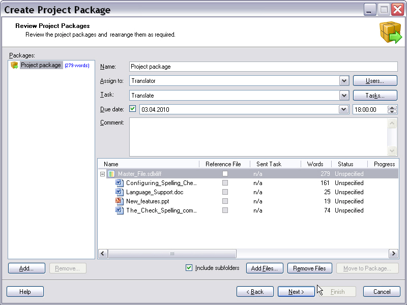

# Moving files between machines

Files are often translated, edited, or proofread on a different machine than the one where the project started. For example, a project manager may send files to a translator or proofreader and then receive the completed files back.

You can move files between machines in two ways:

## Use a project package

A project package is a ZIP file that contains the intermediary SDLXliff files, file type settings, and optional resources such as reference files, translation memories, termbases, and AutoSuggest dictionaries.

1. Create a package from the project.
2. The recipient opens the package and extracts its contents to an empty folder.
3. The recipient processes the package content in Var:ProductName.
4. After completing the task, the recipient creates a return package.
5. The return package, which also contains the edited or translated intermediary files, goes back to the person who created the project package.

**Wizard-based creation of a project package**

## Send the intermediary file directly

You can also send the intermediary SDLXliff file directly, for example as an email attachment.

This approach does not include the file type settings that were used to create the intermediary document. Use it only when you do not need to preserve those settings separately.
