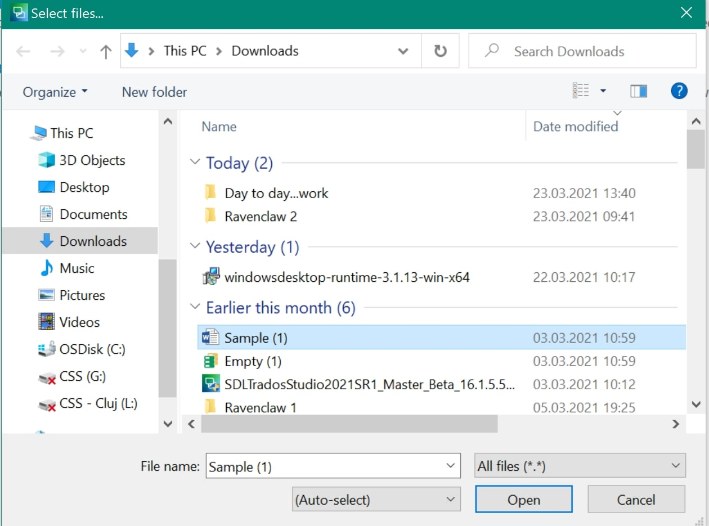
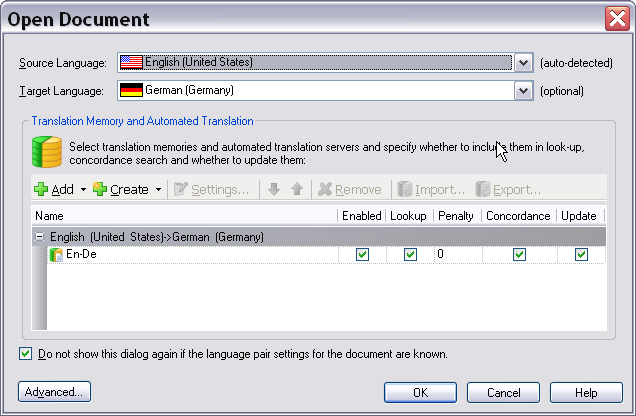
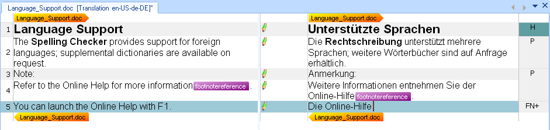
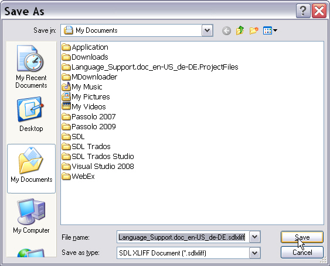
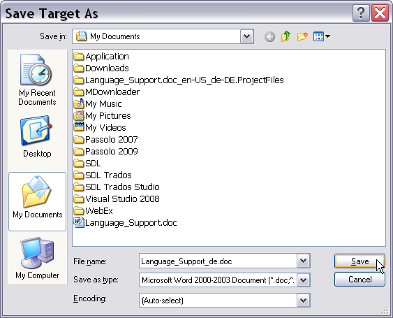

# Opening a document for translation

In Var:ProductName, translators open a single document for translation and editing.

When they open a document, such as a Microsoft Word (*.doc) file, the File Type Support Framework selects the file type plug-in that best matches the format.

The translator then selects the source and target languages. They can also select one or more translation memories (TM). If they do not need a TM, they can work directly in the Var:ProductName editor.

# Convert the document to an intermediary format

In the background, Var:ProductName creates an intermediary bilingual file, such as SDLXliff, from the native document. This step is called **extraction** because Var:ProductName pulls the translatable content out for translation.

Var:ProductName can embed the original native file as a dependency inside the intermediary file. It may need that dependency later to generate the native target document, especially when the document contains images or diagrams that must appear in the final file.

The source and target content appears in a side-by-side editor. Translators enter the target text segment by segment in the right-hand column. The last column shows document structure information, which identifies headings (**H**) and footnotes (**FN**) (see [Using Context Information](using_context_information.md)).

The file type plug-in also extracts localizable content and displays special elements as inline placeholder tags, such as footnote references, fields, and index markers (see [Tag display modes](tag_display_modes.md)). Translators must insert those elements into the target text so the final document keeps the correct references and structure.

During translation, Var:ProductName saves all changes in the intermediary bilingual file, such as SDLXliff. The native document remains unchanged until generation.

# Generate the native target file

At the end of translation, the translator uses a command such as **Save Target As** to generate the target-language version in the native document format. This last step is called **generation**.

# See also

- [Creating projects](creating_projects.md)

- [File type settings](file_type_settings.md)

- [Using context information](using_context_information.md)

- [Tag display modes](tag_display_modes.md)

- [Saving to different file types](saving_to_different_file_types.md)

- [Implementing the File Parser](implementing_the_file_parser.md)
